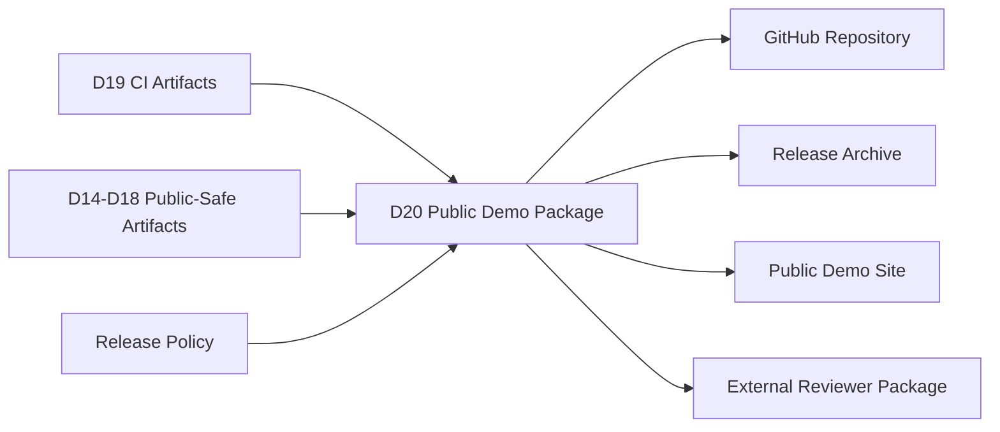
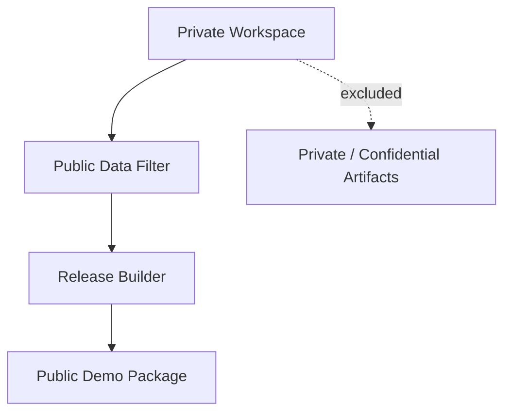
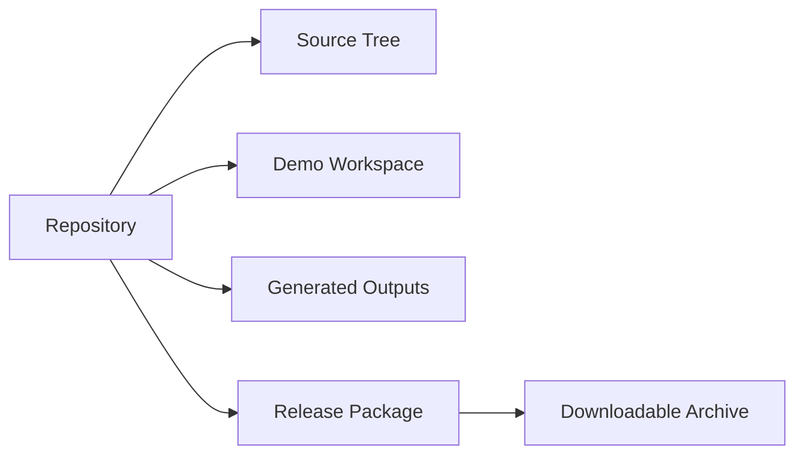
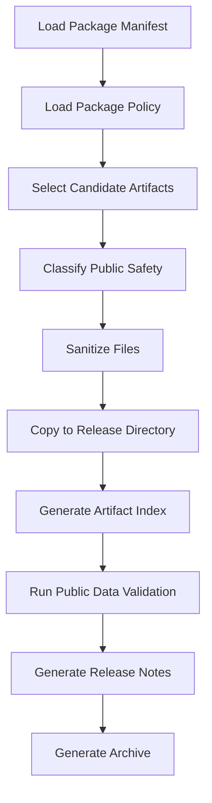
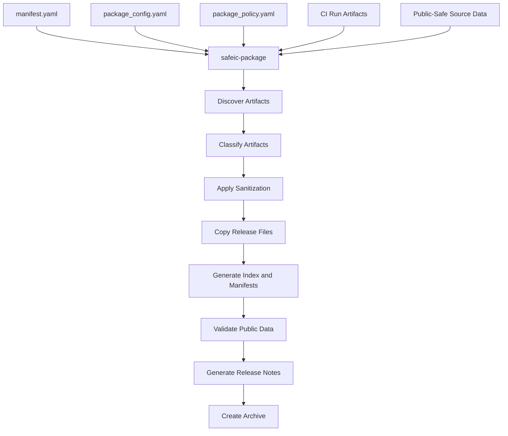
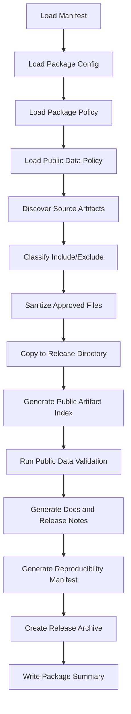
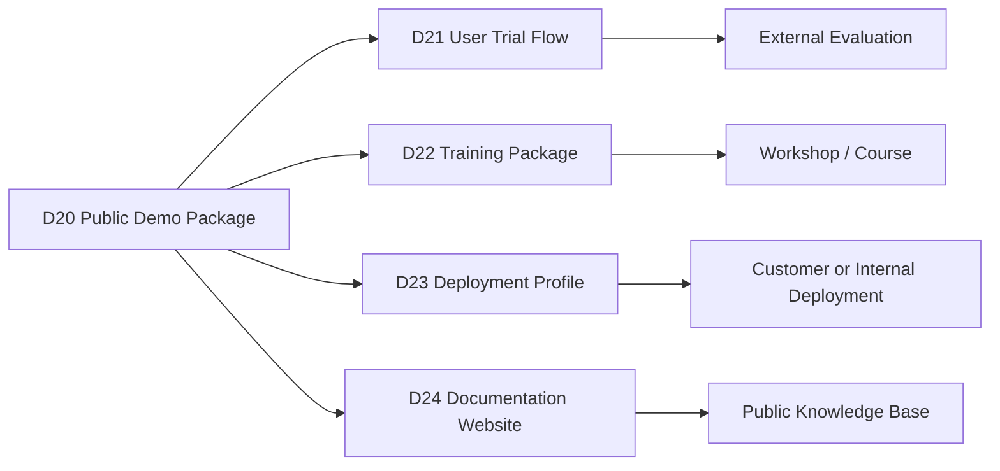

# [Automotive Safe-IC Practice 20] Public Demo Package: From CI Artifacts to a Shareable GitHub Release

**Author**: Darren H. Chen  
**Direction**: Automotive Chip Functional Safety Analysis and Fault Injection Practice  
**Demo**: D20_public_demo_package  
**Tags**: Automotive Chip, Functional Safety, Public Demo Package, GitHub Release, Evidence Package, Fault Injection, FMEDA, Diagnostic Coverage, CI Automation, Dashboard, Open Engineering Practice

---

## 1. Why This Article Matters

In the previous article, we introduced CI automation for the safety-analysis workflow.

D19 generated outputs such as:

```text
ci_summary.md
ci_status.csv
ci_gate_result.json
ci_stage_status.csv
ci_artifact_index.csv
ci_warnings.csv
ci_failure_reasons.csv
ci_run_manifest.yaml
```

That CI layer makes the workflow repeatable.

However, repeatability inside a local workspace is not enough if the goal is to communicate methodology, publish engineering demos, build credibility, or prepare external collaboration.

The next question is:

> How do we package the safety workflow into a public-safe, reproducible, shareable GitHub demo release?

The twentieth demo in this repository is:

```text
D20_public_demo_package
```

The generic tool introduced in this article is:

```text
safeic-package
```

The purpose of `safeic-package` is to collect selected public-safe artifacts from the CI run, evidence package, safety report, regression results, dashboard site, and demo scripts into a release-ready package:

```text
source demo files
sanitized input data
sample outputs
evidence package summaries
safety reports
dashboard site
CI summaries
release manifest
artifact index
public-data validation
license and disclaimer files
reproduction scripts
```

and generate:

```text
release/
  README.md
  RELEASE_NOTES.md
  QUICKSTART.md
  DEMO_SCOPE.md
  DISCLAIMER.md
  public_artifact_index.csv
  public_data_validation.csv
  reproducibility_manifest.yaml
  demos/
  reports/
  dashboard/
  data/
  scripts/
  docs/
```

The central idea is:

> A public demo package is not a random upload of scripts and reports. It is a curated, sanitized, reproducible release that explains what is included, what is excluded, how to run it, and what claims it does not make.

---

## 2. Where D20 Fits in the Flow

D20 is the release packaging layer.



**Figure 1. D20 turns CI-generated artifacts and public-safe demo data into a shareable release package.**

D19 answered:

```text
Did the automated flow run?
Which artifacts were generated?
What did the CI gate decide?
```

D20 answers:

```text
Which artifacts are safe to publish?
Which scripts should be included?
Which reports should be included?
How can another user reproduce the demo?
What assumptions and limitations must be stated?
What should be excluded from public release?
How should the package be structured for GitHub?
```

This is the transition from internal automation to external communication.

---

## 3. Public Demo Package Is a Product Boundary

A public package is a boundary.

Inside the private workspace, there may be:

```text
private experiments
temporary scripts
raw logs
absolute paths
license-related environment
commercial tool exports
internal notes
customer-like data
```

A public package should contain only:

```text
sanitized sample data
generic scripts
public-safe outputs
methodology reports
reproducible demo commands
clear disclaimers
source-visible examples
```



**Figure 2. D20 acts as a release boundary between private workspace artifacts and public demo assets.**

This boundary is important because public demos become part of your professional identity.

A careless public package can leak information or overclaim results.

A clean public package can demonstrate strong engineering discipline.

---

## 4. What a Public Demo Package Should Prove

A public demo package should prove:

```text
the workflow is structured
the demo can be run or inspected
the artifact chain is understandable
the data is public-safe
the methodology is reproducible at sample scale
the reports and dashboard are generated from known inputs
the limitations are explicit
```

It should not claim:

```text
production safety signoff
ISO 26262 certification
commercial tool equivalence
customer project validation
complete automotive SoC coverage
proprietary tool replacement
```

This distinction protects credibility.

A public demo can be impressive without pretending to be final product signoff.

---

## 5. Demo Package vs Source Repository

A GitHub repository can contain multiple layers:

```text
source code
demo input data
demo output data
documentation
reports
dashboard site
release archives
```

A public demo package is a curated subset.



**Figure 3. The release package is a curated, reproducible subset of the repository.**

Do not put every local file into the release.

Instead, define what belongs in the public artifact set.

---

## 6. Suggested Repository Layout

A good repository layout for this topic can be:

```text
automotive-safeic-fault-injection-practice/
  README.md
  LICENSE
  DISCLAIMER.md
  QUICKSTART.md
  DEMO_SCOPE.md
  RELEASE_NOTES.md

  docs/
    articles/
    methodology/
    figures/

  demos/
    D01_safa_sa_bfr_input_package/
    D02_safety_assumption_setup/
    ...
    D20_public_demo_package/

  tools/
    safeic_input/
    safeic_fit/
    safeic_faultgen/
    safeic_classify/
    safeic_measdc/
    safeic_fmeda/
    safeic_evidence/
    safeic_report/
    safeic_regress/
    safeic_compare/
    safeic_dashboard/
    safeic_package/

  examples/
    toy_counter/
      rtl/
      policies/
      manifests/

  releases/
    D20_public_demo_package/
      release/
```

This structure separates:

```text
methodology documentation
demo implementations
tool code
sample design
release outputs
```

---

## 7. Public Release Package Structure

The D20 release package can be organized as:

```text
release/
  README.md
  QUICKSTART.md
  RELEASE_NOTES.md
  DEMO_SCOPE.md
  DISCLAIMER.md

  reproducibility_manifest.yaml
  public_artifact_index.csv
  public_data_validation.csv
  package_warnings.csv

  demos/
    D01/
    D11/
    D12/
    D13/
    D14/
    D15/
    D16/
    D18/
    D19/

  data/
    toy_counter/
      rtl/
      policies/
      sample_faults/
      sample_results/

  reports/
    safety_report.md
    evidence_package_summary.md
    regression_summary.md
    ci_summary.md

  dashboard/
    index.html
    assets/
    data/

  scripts/
    run_quickstart.sh
    run_quickstart.csh
    validate_public_package.sh
    validate_public_package.csh

  docs/
    methodology_notes.md
    artifact_map.md
    limitations.md
```

This release package should be readable even without the full development workspace.

---

## 8. Public Artifact Classes

D20 should classify artifacts before release.

Suggested classes:

```text
include_public
include_sanitized
include_generated_summary
include_sample_only
exclude_private
exclude_license_restricted
exclude_temporary
exclude_unknown
```

Example:

```csv
artifact,file_path,classification,reason
toy_counter.v,examples/toy_counter/rtl/toy_counter.v,include_public,synthetic demo RTL
safety_report.md,reports/safety_report.md,include_generated_summary,public methodology report
commercial_raw.log,private/commercial_raw.log,exclude_license_restricted,raw tool output
/tmp/run123.log,tmp/run123.log,exclude_temporary,temporary local run log
```

The release builder should not include unknown artifacts by default.

Default-deny is safer than default-include.

---

## 9. Public Data Validation

Public release must validate data safety.

Validation checks may include:

```text
no absolute private paths
no license server strings
no customer names
no internal usernames
no private hostnames
no raw commercial tool outputs
no confidential labels
no unsupported file extensions
no oversized binary dumps
no temporary files
```

Example output:

```csv
check,status,details
absolute_path_scan,PASS,no private absolute paths found
license_string_scan,PASS,no license strings found
customer_name_scan,PASS,no customer names found
raw_commercial_output_scan,PASS,no raw commercial reports included
unknown_file_scan,WARN,2 files require manual review
binary_file_scan,PASS,no unexpected binary files
```

This output should be included in the release.

It demonstrates responsible publication discipline.

---

## 10. Sanitization Is Not an Afterthought

Public packaging should include a sanitization layer.

Sanitization examples:

```text
replace private paths with relative paths
remove usernames and hostnames
remove license environment variables
replace raw commercial tool references with normalized sample references
replace project-specific IDs with demo IDs
truncate large logs
remove timestamps if they reveal private workflow details
```

Example mapping:

```yaml
sanitize:
  path_replacements:
    "/home/private/project": "<DEMO_ROOT>"
    "/tools/vendor/license": "<LICENSE_PATH_REDACTED>"

  string_replacements:
    "LM_LICENSE_FILE": "LICENSE_ENV_REDACTED"
    "customer_alpha": "demo_customer"
```

For public release, it is better to generate clean data from the start than to clean risky data later.

---

## 11. Reproducibility Manifest

The release should include a reproducibility manifest.

Example:

```yaml
release:
  name: D20_public_demo_package
  version: 0.1.0
  profile: public_methodology_demo
  design: toy_counter

source:
  generated_from_ci_run: ci_demo_latest
  generated_by: safeic-package
  generation_mode: sanitized_public_release

included:
  demos:
    - D01_safa_sa_bfr_input_package
    - D11_fault_outcome_classification
    - D12_measured_diagnostic_coverage
    - D13_fmeda_update
    - D14_safety_evidence_package
    - D15_safety_report_generation
    - D16_regression_and_trend_tracking
    - D18_dashboard_and_website_demo
    - D19_ci_automation

reproduce:
  quickstart_csh: scripts/run_quickstart.csh
  quickstart_bash: scripts/run_quickstart.sh
```

This tells users how the package was built.

---

## 12. Artifact Index

The public package should include `public_artifact_index.csv`.

Example:

```csv
artifact_id,path,type,source_stage,public_classification,sha256,description
P001,data/toy_counter/rtl/toy_counter.v,rtl,D01,include_public,abc123,synthetic demo RTL
P002,reports/safety_report.md,report,D15,include_generated_summary,def456,safety report
P003,dashboard/index.html,dashboard,D18,include_public,789abc,static dashboard entry
P004,outputs/ci_summary.md,ci_summary,D19,include_generated_summary,555aaa,CI run summary
```

This index makes the release auditable.

A public package should not be a black box.

---

## 13. Quickstart Is Critical

A public demo package must have a simple quickstart.

Example `QUICKSTART.md`:

```md
# Quickstart

## 1. Check Python

```bash
python3 --version
```

## 2. Run the public demo

```bash
bash scripts/run_quickstart.sh
```

or:

```csh
csh scripts/run_quickstart.csh
```

## 3. Inspect outputs

- `reports/safety_report.md`
- `reports/regression_summary.md`
- `dashboard/index.html`
- `public_data_validation.csv`

## 4. Open dashboard

Open:

```text
dashboard/index.html
```

in a browser.
```

The first successful experience matters.

If a user cannot run or inspect the demo in five minutes, the package loses impact.

---

## 14. csh Compatibility

For this series, csh scripts are important because many legacy EDA environments still use csh-style setup and execution.

D20 should provide:

```text
scripts/run_quickstart.csh
scripts/validate_public_package.csh
```

Example:

```csh
#!/bin/csh -f

set ROOT = `cd "$0:h/.." && pwd`
echo "[INFO] Demo root: $ROOT"

cd "$ROOT"

echo "[INFO] Validating public package..."
python3 tools/safeic_package/validate_public_package.py \
  --manifest reproducibility_manifest.yaml \
  --policy docs/public_data_policy.yaml

echo "[INFO] Quickstart completed."
```

Providing both bash and csh improves portability.

But for older EDA environments, csh should be treated as a first-class path.

---

## 15. What to Include in Public Demo

Include:

```text
small synthetic RTL
small sample filelists
public-safe policy files
sample fault lists
sample fault outcomes
sample measured DC tables
sample FMEDA tables
sample evidence package
sample safety report
sample regression output
sample dashboard
scripts to validate and inspect package
README and quickstart
```

The goal is to show methodology, not to expose full private tool capability.

A small and clean demo is better than a large risky demo.

---

## 16. What to Exclude

Exclude:

```text
raw commercial tool reports
license-protected logs
real customer RTL
real supplier FIT data
private absolute paths
internal project scripts that reveal proprietary flows
large waveform dumps
private screenshots
temporary run directories
unreviewed experimental files
```

When unsure, exclude or replace with sanitized synthetic data.

The public package should be boring from a confidentiality perspective.

Its value should come from structure and clarity.

---

## 17. Release Notes

`RELEASE_NOTES.md` should describe:

```text
release version
date
included demos
included reports
known limitations
known warnings
changes since previous release
validation status
```

Example:

```md
# Release Notes

Version: 0.1.0  
Demo: D20_public_demo_package  

## Included

- D01 input package preflight
- D11-D13 fault outcome, measured DC, and FMEDA sample outputs
- D14 evidence package summary
- D15 safety report
- D16 regression summary
- D18 dashboard static site
- D19 CI summary

## Known Limitations

- Synthetic toy design only
- Small sample fault campaign
- No production safety signoff claim
- Commercial comparison uses normalized sample data

## Validation

Public data validation: PASS with warnings
```

Release notes help external readers understand maturity.

---

## 18. Demo Scope Document

`DEMO_SCOPE.md` should be explicit.

It should answer:

```text
What is demonstrated?
What is not demonstrated?
Which design is used?
Which fault models are included?
Which metrics are computed?
Which outputs are synthetic?
Which outputs are generated?
Which outputs are manually provided?
```

Example scope statement:

```md
This package demonstrates a methodology for functional safety analysis and fault injection workflow organization using a synthetic `toy_counter` design.

It demonstrates artifact structure, evidence traceability, measured DC calculation, FMEDA update, regression tracking, CI orchestration, and dashboard presentation.

It does not claim production readiness, ISO 26262 compliance, or equivalence with any commercial tool.
```

A clear scope document prevents misunderstanding.

---

## 19. Disclaimer

`DISCLAIMER.md` should clearly state:

```text
methodology demo only
not safety certification
not legal or compliance advice
not production signoff
not a replacement for certified tools or qualified process
sample data may be synthetic or simplified
commercial tool comparison data may be normalized examples
```

Example:

```md
# Disclaimer

This repository is a functional safety methodology and engineering workflow demonstration.

The included examples, metrics, reports, and dashboards are not production safety signoff evidence and do not constitute ISO 26262 compliance certification.

Users must perform their own safety analysis, tool qualification, process review, and independent verification for real projects.
```

This protects both credibility and safety.

---

## 20. License and Usage

The release should include a license file.

The appropriate license depends on your publication strategy.

Common choices:

```text
MIT
Apache-2.0
BSD-3-Clause
custom evaluation license
```

For a public demo intended to show methodology and encourage adoption, a permissive license can work.

For a tool that may become commercial, you may choose:

```text
open documentation
restricted tool code
binary-only demo tool
evaluation license
```

D20 should not decide the legal strategy.

But it should create placeholders:

```text
LICENSE
NOTICE
THIRD_PARTY_NOTICES.md
```

Do not include third-party files unless their license allows redistribution.

---

## 21. Third-Party and Commercial Tool Boundaries

If the public demo references commercial tools, keep the boundary clear.

Allowed public-safe approach:

```text
describe the comparison methodology
provide normalized synthetic sample tables
provide adapter interface
avoid raw report redistribution
avoid vendor-specific confidential content
avoid license-protected screenshots
```

Example note:

```md
Commercial-tool comparison examples in this package use normalized sample data for methodology demonstration. Raw commercial reports are not included.
```

This avoids creating unnecessary legal and licensing risk.

---

## 22. Package Build Policy

D20 should be controlled by a release policy.

Example `package_policy.yaml`:

```yaml
package_policy:
  default_action: exclude_unknown

  include:
    - README.md
    - QUICKSTART.md
    - DEMO_SCOPE.md
    - DISCLAIMER.md
    - reports/*.md
    - dashboard/**
    - data/toy_counter/**
    - scripts/run_quickstart.*

  exclude:
    - "**/*.log.raw"
    - "**/private/**"
    - "**/commercial_raw/**"
    - "**/license/**"
    - "**/*.fsdb"
    - "**/*.vcd"
    - "**/tmp/**"

  validation:
    scan_private_paths: true
    scan_license_strings: true
    scan_customer_names: true
    require_disclaimer: true
    require_quickstart: true
```

A policy-driven package builder reduces accidental mistakes.

---

## 23. Package Build Flow

D20 build flow:



**Figure 4. D20 builds a public demo package by selecting, sanitizing, validating, indexing, and archiving artifacts.**

The release builder should not simply copy a folder.

It should make release decisions explicit.

---

## 24. Validation Gate for Public Package

A public package should pass a release gate.

Suggested statuses:

```text
RELEASE_READY
RELEASE_READY_WITH_WARNINGS
BLOCKED
MANUAL_REVIEW_REQUIRED
```

Examples:

```text
RELEASE_READY:
  all required files exist and validation passes

RELEASE_READY_WITH_WARNINGS:
  minor warnings exist, but no privacy or required-file issue

MANUAL_REVIEW_REQUIRED:
  unknown files or policy exceptions exist

BLOCKED:
  private data, license strings, or missing disclaimer detected
```

Example `public_release_status.json`:

```json
{
  "release_status": "RELEASE_READY_WITH_WARNINGS",
  "required_files_present": true,
  "privacy_scan": "PASS",
  "unknown_files": 2,
  "manual_review_required": false,
  "warnings": [
    "sample commercial comparison data is synthetic",
    "dashboard includes demo-only limitations"
  ]
}
```

This makes release decisions auditable.

---

## 25. GitHub README Structure

The repository README should be clear.

Recommended sections:

```text
Project Overview
What This Repository Demonstrates
Quickstart
Demo Flow
Repository Structure
Key Outputs
Dashboard
Public Data Policy
Limitations
License
Citation / Contact
```

Example opening:

```md
# Automotive Safe-IC Functional Safety and Fault Injection Practice

This repository demonstrates an engineering workflow for automotive chip functional safety analysis and fault injection practice using public-safe demo data.

It covers input packaging, fault outcome classification, measured diagnostic coverage, FMEDA update, evidence packaging, report generation, regression tracking, dashboard presentation, and CI-style automation.
```

This README should communicate the value within the first screen.

---

## 26. Documentation Map

D20 should provide a documentation map.

Example:

```text
README.md:
  repository overview

QUICKSTART.md:
  how to run or inspect the demo

DEMO_SCOPE.md:
  what is and is not demonstrated

DISCLAIMER.md:
  safety and compliance disclaimer

docs/methodology_notes.md:
  flow-level explanation

docs/artifact_map.md:
  mapping from artifacts to demos

reports/safety_report.md:
  generated safety report

dashboard/index.html:
  static dashboard entry
```

A public demo package should be easy to navigate.

A reader should not need to guess where to start.

---

## 27. Artifact Map

`docs/artifact_map.md` can connect artifacts to demos.

Example:

```md
# Artifact Map

| Demo | Artifact | Purpose |
|---|---|---|
| D11 | `data/sample_fault_outcomes.csv` | classified fault outcomes |
| D12 | `data/measured_dc_by_failure_mode.csv` | measured diagnostic coverage |
| D13 | `data/fmeda_table.csv` | FMEDA update |
| D14 | `reports/evidence_package_summary.md` | evidence summary |
| D15 | `reports/safety_report.md` | review-ready report |
| D16 | `reports/regression_summary.md` | trend and regression result |
| D18 | `dashboard/index.html` | interactive dashboard |
| D19 | `reports/ci_summary.md` | CI run summary |
```

Artifact maps help users understand the package quickly.

---

## 28. Release Archive

D20 can generate a release archive:

```text
automotive_safeic_practice_D20_public_demo_package_v0.1.0.zip
```

Archive contents should match `release/`.

Do not archive:

```text
.git/
__pycache__/
temporary logs
private folders
license files from third-party tools
raw commercial reports
large waveform dumps
```

The archive should be small enough to download and inspect.

For public GitHub, keep it lightweight.

---

## 29. The `safeic-package` Tool Architecture

The generic tool `safeic-package` can be implemented as a staged release builder.



**Figure 5. `safeic-package` discovers, classifies, sanitizes, indexes, validates, and archives public demo artifacts.**

Suggested internal modules:

```text
safeic_package/
  cli.py
  manifest.py
  load_config.py
  artifact_discovery.py
  classification.py
  sanitizer.py
  copy_release.py
  artifact_index.py
  validation.py
  release_notes.py
  archive.py
  summary.py
```

Responsibilities:

| Module | Responsibility |
|---|---|
| `artifact_discovery.py` | Find candidate release artifacts |
| `classification.py` | Classify include/exclude/public-safe status |
| `sanitizer.py` | Remove private paths and forbidden strings |
| `copy_release.py` | Copy approved artifacts into release directory |
| `artifact_index.py` | Generate public artifact index |
| `validation.py` | Run public data checks |
| `release_notes.py` | Generate release notes and scope docs |
| `archive.py` | Create release archive |
| `summary.py` | Generate packaging summary |

---

## 30. D20 Directory Structure

Suggested directory:

```text
D20_public_demo_package/
  README.md
  run_demo.sh
  run_demo.csh
  manifest.yaml

  inputs/
    package_config.yaml
    package_policy.yaml
    public_data_policy.yaml
    release_notes_template.md
    demo_scope_template.md
    disclaimer_template.md

  source_artifacts/
    ci_run/
      ci_summary.md
      ci_status.csv
      ci_gate_result.json
    reports/
      safety_report.md
      regression_summary.md
    dashboard/
      index.html
      assets/
      data/
    sample_data/
      toy_counter/
      fmeda/
      campaign/
      metrics/

  tools/
    safeic_package.py

  scripts/
    run_package.csh
    run_package.sh
    validate_release.csh
    validate_release.sh

  release/
    README.md
    QUICKSTART.md
    RELEASE_NOTES.md
    DEMO_SCOPE.md
    DISCLAIMER.md
    reproducibility_manifest.yaml
    public_artifact_index.csv
    public_data_validation.csv
    package_warnings.csv
    demos/
    data/
    reports/
    dashboard/
    scripts/
    docs/

  outputs/
    package_summary.md
    public_release_status.json
    package_validation.csv
    package_warnings.csv
    release_archive_manifest.csv
```

This structure separates inputs, candidate artifacts, generated release, and packaging outputs.

---

## 31. D20 Manifest

Example:

```yaml
project:
  name: automotive_safeic_practice
  demo: D20_public_demo_package
  top_module: toy_counter

inputs:
  package_config: inputs/package_config.yaml
  package_policy: inputs/package_policy.yaml
  public_data_policy: inputs/public_data_policy.yaml
  source_artifacts: source_artifacts

outputs:
  release_dir: release
  package_summary: outputs/package_summary.md
  release_status: outputs/public_release_status.json
  validation: outputs/package_validation.csv
  warnings: outputs/package_warnings.csv
  archive_manifest: outputs/release_archive_manifest.csv
```

The manifest defines the release build.

---

## 32. D20 Execution Flow



**Figure 6. D20 execution flow: load policy, discover artifacts, classify, sanitize, copy, validate, document, archive, and summarize.**

Example bash script:

```bash
#!/usr/bin/env bash
set -euo pipefail

safeic-package \
  --manifest manifest.yaml \
  --output-dir outputs
```

Example csh script:

```csh
#!/bin/csh -f

set DEMO = D20_public_demo_package
echo "Running $DEMO"

safeic-package \
  --manifest manifest.yaml \
  --output-dir outputs
```

Expected outputs:

```text
release/README.md
release/QUICKSTART.md
release/RELEASE_NOTES.md
release/DEMO_SCOPE.md
release/DISCLAIMER.md
release/reproducibility_manifest.yaml
release/public_artifact_index.csv
release/public_data_validation.csv
release/package_warnings.csv
outputs/package_summary.md
outputs/public_release_status.json
outputs/package_validation.csv
outputs/package_warnings.csv
outputs/release_archive_manifest.csv
```

---

## 33. Example `public_artifact_index.csv`

```csv
artifact_id,path,type,source,classification,sha256
P001,README.md,doc,generated,include_public,abc001
P002,QUICKSTART.md,doc,generated,include_public,abc002
P003,data/toy_counter/rtl/toy_counter.v,rtl,D01,include_public,abc003
P004,reports/safety_report.md,report,D15,include_generated_summary,abc004
P005,reports/regression_summary.md,report,D16,include_generated_summary,abc005
P006,dashboard/index.html,dashboard,D18,include_public,abc006
P007,reports/ci_summary.md,ci_report,D19,include_generated_summary,abc007
```

This file makes the public release transparent.

---

## 34. Example `public_data_validation.csv`

```csv
check,status,details
required_docs_present,PASS,README/QUICKSTART/DEMO_SCOPE/DISCLAIMER found
absolute_private_path_scan,PASS,no private paths found
license_string_scan,PASS,no license strings found
raw_commercial_report_scan,PASS,no raw commercial reports found
large_binary_scan,PASS,no unexpected binary files
unknown_artifact_scan,WARN,2 files require manual review
dashboard_links,PASS,site/index.html and data files found
```

This validation result should be included in the release package.

---

## 35. Example `package_summary.md`

```md
# D20 Public Demo Package Summary

Release: D20_public_demo_package  
Profile: public_methodology_demo  
Design: toy_counter  

## Package Status

Status: RELEASE_READY_WITH_WARNINGS

## Included

- Public-safe toy counter demo data
- Safety report
- Evidence package summary
- Regression summary
- CI summary
- Static dashboard
- Quickstart scripts
- Public data validation report

## Warnings

- Two unknown files require manual review before final publication.
- Commercial comparison uses normalized sample data.
- Demo data is not production safety signoff evidence.

## Next Step

Review warnings, then publish the release folder or archive to GitHub.
```

A packaging summary helps decide whether the release is ready.

---

## 36. Validation Rules

`safeic-package` should validate:

```text
manifest.yaml exists
package_config.yaml exists
package_policy.yaml exists
public_data_policy.yaml exists
required docs exist or are generated
release directory is writable
unknown files are not included by default
excluded patterns are honored
public artifact index is generated
public data validation is generated
disclaimer exists
quickstart exists
release notes exist
dashboard entry exists if dashboard is enabled
archive generation succeeds if enabled
```

Example messages:

```text
[PASS] package config loaded
[PASS] package policy loaded
[PASS] public data policy loaded
[PASS] 42 artifacts classified
[PASS] 35 artifacts included
[PASS] 7 artifacts excluded
[WARN] 2 unknown artifacts require manual review
[PASS] no private paths detected
[PASS] release README generated
[PASS] release archive generated
```

The package builder should stop if private data is detected.

---

## 37. Common Mistakes

### 37.1 Uploading the Whole Workspace

A workspace is not a release package.

It may contain private paths, temporary files, and unnecessary artifacts.

### 37.2 Publishing Raw Commercial Tool Outputs

Do not publish raw commercial reports unless redistribution is explicitly allowed.

Use normalized sample data for public methodology demos.

### 37.3 Missing Disclaimer

A functional safety demo must clearly state that it is not production safety signoff.

### 37.4 No Quickstart

If users cannot run or inspect the demo quickly, the package loses value.

### 37.5 No Artifact Index

Without an index, users do not know what files are included and why.

### 37.6 Mixing Estimated and Measured Outputs Without Explanation

Public readers need clear labels.

### 37.7 Leaving Private Paths in Generated Files

Private paths reduce professionalism and may leak information.

---

## 38. How D20 Connects to Later Demos

D20 creates the public release boundary.

Later demos can build user trials, training packages, and deployment profiles.



**Figure 7. D20 provides the release package foundation for user trials, training, deployment, and documentation.**

A clean public package makes later outreach much easier.

---

## 39. Recommended Implementation Stages

D20 can be implemented in stages.

### Stage 1: Manual Release Folder

Create a curated release folder manually.

Deliverables:

```text
release/README.md
release/QUICKSTART.md
release/DEMO_SCOPE.md
release/DISCLAIMER.md
```

### Stage 2: Artifact Index and Validation

Generate artifact index and public data validation.

Deliverables:

```text
public_artifact_index.csv
public_data_validation.csv
```

### Stage 3: Policy-Based Packaging

Use `package_policy.yaml` to select and exclude files.

Deliverables:

```text
safeic-package
package_summary.md
```

### Stage 4: Sanitization and Archive

Sanitize files and generate release archive.

Deliverables:

```text
release_archive.zip
release_archive_manifest.csv
```

### Stage 5: GitHub Release Workflow

Add release tagging, release notes, and publication checklist.

Deliverables:

```text
RELEASE_NOTES.md
github_release_checklist.md
```

This staged approach makes D20 useful immediately and safe to automate later.

---

## 40. Summary

Public demo packaging turns internal CI artifacts into a shareable GitHub-ready release.

The D20 demo:

```text
D20_public_demo_package
```

introduces the generic tool:

```text
safeic-package
```

The tool consumes:

```text
CI run artifacts
safety reports
dashboard site
sample data
package_config.yaml
package_policy.yaml
public_data_policy.yaml
```

and generates:

```text
release/README.md
release/QUICKSTART.md
release/RELEASE_NOTES.md
release/DEMO_SCOPE.md
release/DISCLAIMER.md
release/reproducibility_manifest.yaml
release/public_artifact_index.csv
release/public_data_validation.csv
release/package_warnings.csv
outputs/package_summary.md
outputs/public_release_status.json
outputs/package_validation.csv
outputs/package_warnings.csv
outputs/release_archive_manifest.csv
```

The central lesson is:

> A public demo package is a release artifact, not a folder dump. It must be curated, sanitized, indexed, documented, reproducible, and honest about scope and limitations.

D20 makes the methodology suitable for GitHub publication, company website demos, external review, and future user trial workflows.

---

## 41. D20 Demo Checklist

For `D20_public_demo_package`, the expected deliverables are:

```text
[ ] README.md
[ ] run_demo.sh
[ ] run_demo.csh
[ ] manifest.yaml

[ ] inputs/package_config.yaml
[ ] inputs/package_policy.yaml
[ ] inputs/public_data_policy.yaml
[ ] inputs/release_notes_template.md
[ ] inputs/demo_scope_template.md
[ ] inputs/disclaimer_template.md

[ ] source_artifacts/ci_run/ci_summary.md
[ ] source_artifacts/ci_run/ci_status.csv
[ ] source_artifacts/ci_run/ci_gate_result.json
[ ] source_artifacts/reports/safety_report.md
[ ] source_artifacts/reports/regression_summary.md
[ ] source_artifacts/dashboard/index.html
[ ] source_artifacts/sample_data/toy_counter/
[ ] source_artifacts/sample_data/fmeda/
[ ] source_artifacts/sample_data/campaign/
[ ] source_artifacts/sample_data/metrics/

[ ] tools/safeic_package.py

[ ] scripts/run_package.csh
[ ] scripts/run_package.sh
[ ] scripts/validate_release.csh
[ ] scripts/validate_release.sh

[ ] release/README.md
[ ] release/QUICKSTART.md
[ ] release/RELEASE_NOTES.md
[ ] release/DEMO_SCOPE.md
[ ] release/DISCLAIMER.md
[ ] release/reproducibility_manifest.yaml
[ ] release/public_artifact_index.csv
[ ] release/public_data_validation.csv
[ ] release/package_warnings.csv
[ ] release/demos/
[ ] release/data/
[ ] release/reports/
[ ] release/dashboard/
[ ] release/scripts/
[ ] release/docs/

[ ] outputs/package_summary.md
[ ] outputs/public_release_status.json
[ ] outputs/package_validation.csv
[ ] outputs/package_warnings.csv
[ ] outputs/release_archive_manifest.csv
```

A successful D20 run should answer:

```text
Which artifacts are included in the public package?
Which artifacts were excluded and why?
Does the package contain any private paths or license strings?
Are all required public documents present?
Can another user run or inspect the demo quickly?
Is the dashboard included and valid?
Are generated reports included?
Are limitations and disclaimers clear?
Is the release package reproducible?
Is the package ready for GitHub release or manual review?
```
