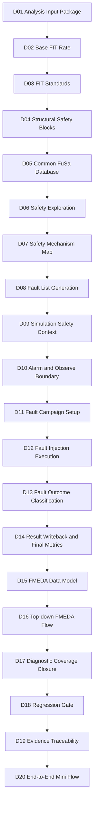
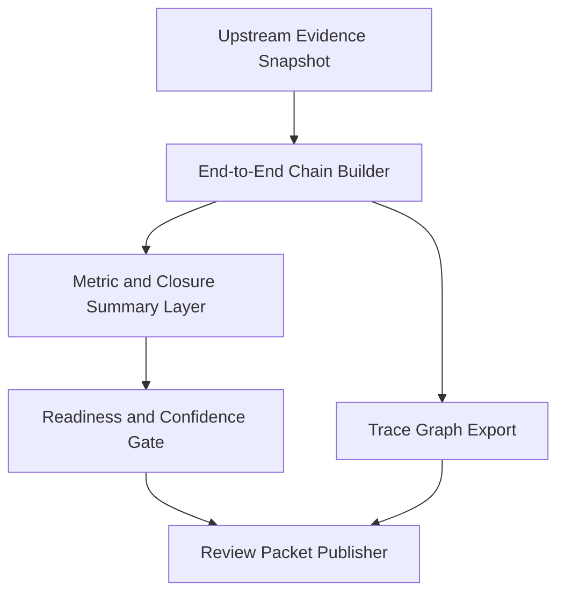

# Automotive Safe-IC Practice 20: End-to-End Mini Flow — BFR → Safety Mechanism → Fault Campaign → Final Metrics

**Author**: Darren H. Chen  
**Direction**: Automotive Chip Functional Safety Analysis and Fault Injection Practice  
**Demo**: `D20_end_to_end_mini_flow_bfr_sm_fault_campaign_final_metrics`  
**Tags**: Automotive Chip, Functional Safety, ISO 26262, BFR, FIT, Diagnostic Coverage, Safety Mechanism, Fault Campaign, FMEDA, Common FuSa Database, Evidence Traceability, Regression Gate, End-to-End Flow

---

## 1. The Moment a Safety Flow Becomes a System

A functional safety flow does not become convincing because one report looks good.

It becomes convincing when the same safety intent can be traced through every engineering layer:

```text
initial failure-rate assumptions
  -> base FIT estimate
  -> endpoint and safety mechanism mapping
  -> fault list preparation
  -> simulation context
  -> fault campaign execution
  -> outcome classification
  -> final metric writeback
  -> FMEDA interpretation
  -> closure actions
  -> regression gate
  -> evidence traceability
```

That is the purpose of D20.

The previous stages built individual capabilities. D01 prepared input packages. D02 and D03 handled base FIT and FIT standards. D04-D08 connected structure, endpoints, safety mechanisms, and fault-list generation. D09-D12 prepared and executed fault campaigns. D13-D17 converted raw fault outcomes into classified safety evidence and closure actions. D18 made the safety state CI-aware. D19 built a unified evidence index.

D20 now asks a different question:

```text
Can all of these pieces be connected into one small, reviewable, reproducible safety flow?
```

This is not a full signoff flow. It is not a production SoC campaign. It is a mini flow designed to demonstrate the complete shape of a safety engineering platform.

A good D20 demo should show that the platform has a coherent internal logic:

```text
BFR and FIT are not isolated numbers.
Safety mechanisms are not isolated design notes.
Fault campaigns are not isolated simulations.
Final metrics are not isolated reports.
Regression gates are not isolated scripts.
Evidence traceability is not an afterthought.
```

They are parts of the same safety evidence chain.

---

## 2. D20 Position in the Twenty-Part Practice Series

D20 is the stage summary and end-to-end integration point.

It sits after evidence traceability because the final mini flow must not merely run a sequence. It must explain what each sequence step produced, which artifacts were consumed, which database sessions were referenced, which metrics were trusted, which warnings remain, and which downstream review decisions are still open.



D20 should read D19 as its immediate upstream index, but it must still understand the whole chain.

D19 says:

```text
Here are the indexed artifacts, hashes, logs, database sessions, rule traces, and evidence edges.
```

D20 says:

```text
Here is the end-to-end safety story assembled from those artifacts.
```

The difference matters. An evidence index is a map. An end-to-end mini flow is a guided path through the map.

---

## 3. What “End-to-End” Means in This Context

The phrase end-to-end is often overused. In D20, it has a precise meaning.

It does not mean that every real SoC-level safety campaign has been completed. It means that a representative design can be taken through the entire safety evidence path:

```text
BFR setup
FIT standard selection
structural endpoint extraction
safety mechanism mapping
fault list generation
simulation context construction
alarm and observe boundary definition
fault campaign input packaging
fault campaign execution or execution evidence ingestion
outcome classification
final metric preparation
FMEDA interpretation
closure management
regression gate decision
evidence traceability packaging
```

D20 should demonstrate integration across four major tool/documentation streams:

```text
safety analysis inputs and FIT criteria
structural diagnostic coverage and safety mechanism modeling
fault campaign setup, execution, and result classification
FMEDA, database, GUI-review, and evidence-management concepts
```

A D20 mini flow is therefore a stitched safety argument.

It starts with failure-rate assumptions and ends with a final package that a reviewer can inspect.

The key word is not “large”. The key word is “connected”.

---

## 4. BFR: The Root of Quantitative Safety Evidence

BFR means Base Failure Rate.

In the safety flow, BFR is the starting quantitative estimate of how frequently a hardware element may fail before safety mechanisms are credited. Depending on the methodology and standard, the base failure rate may depend on:

```text
device type
technology node
mission profile
temperature profile
year of manufacture
package or environment assumptions
transistor or cell counts
permanent and transient failure models
```

D20 should not treat BFR as a magic number. It should show that BFR is an input assumption with traceability.

A good mini flow records:

```text
which FIT standard or reliability model was used
which mission profile was selected
which FIT setup file was used
which design boundary was included
which scope was excluded
which output report contains the base FIT contribution
```

In a simplified demo, the design may be small. The BFR may not be meaningful as a production number. That is acceptable. The point of D20 is to show that the platform can carry BFR assumptions forward into later metrics.

The important trace is:

```text
BFR source
  -> base FIT contribution
  -> endpoint or cone contribution
  -> failure mode allocation
  -> residual FIT after safety mechanism credit
  -> FMEDA row
  -> final review status
```

Without that trace, final metrics become unreviewable.

---

## 5. FIT, Residual FIT, and PMHF-Like Thinking

FIT means failures in time, usually expressed as failures per billion operating hours.

A safety flow often distinguishes several failure-rate quantities:

```text
base FIT: failure-rate estimate before safety mechanism credit
safe FIT: fault portion that does not violate the safety goal
single-point FIT: fault portion that can directly violate a safety goal
residual FIT: remaining dangerous contribution after diagnostic credit
multi-point FIT: fault contribution involving latent multiple-fault scenarios
PMHF-like value: top-level probabilistic hardware failure metric summary
```

Different methodologies and tool flows may name these buckets differently, but the engineering idea is the same: not all hardware failures have the same safety consequence.

D20 should make the bucket movement visible:

```text
before safety mechanism mapping:
  more contribution remains uncovered

after safety mechanism mapping:
  some contribution receives diagnostic credit

after fault campaign validation:
  detected / safe / unsafe / unresolved classification refines the credit

after final metric writeback:
  the remaining contribution becomes FMEDA-ready residual evidence
```

This prevents a common mistake: treating final diagnostic coverage as if it came from a single calculation.

In reality, final metrics depend on both structural estimation and dynamic validation.

---

## 6. Safety Mechanism: More Than a Signal Name

A safety mechanism is a technical means to detect, control, correct, or tolerate a fault so that the system can reach or maintain a safe state.

Examples include:

```text
parity checking
ECC
lockstep comparison
duplication with comparison
range check
timeout watchdog
control-flow monitor
protocol consistency check
end-to-end data protection
alarm generation
safe-state transition logic
```

In D20, a safety mechanism should be modeled as an object with relationships:

```text
safety_mechanism_id
mechanism_type
covered_failure_mode
covered_endpoint_or_cone
alarm_signal
observe_point
expected_detection_window
credit_source
validation_status
```

The important point is that a safety mechanism is not just “present in RTL”. It must be tied to a failure mode and supported by evidence.

A signal called `alarm` is not automatically a valid safety mechanism.

D20 should show the chain:

```text
failure mode
  -> endpoint / cone
  -> safety mechanism map
  -> alarm and observe boundary
  -> fault campaign outcome
  -> diagnostic coverage credit
  -> FMEDA residual FIT
```

That is the difference between design intent and safety evidence.

---

## 7. Endpoint, Startpoint, and Diagnostic Coverage Element

Structural safety analysis often starts by identifying where data or control originates, where it is consumed, and what logic lies between these points.

Three useful concepts are:

```text
startpoint: a source of data or control propagation
endpoint: a destination where the propagated value affects observable or safety-relevant behavior
DCE: diagnostic coverage element, a structural object or cone used to evaluate whether faults are covered by a safety mechanism
```

The exact naming may vary between tools, but the method is stable.

D20 should not bury these concepts. It should show that safety mechanisms are attached to structure.

For example:

```text
counter register bit
  -> endpoint candidate
  -> covered by range / alarm logic
  -> included in fault list
  -> evaluated during campaign
  -> linked to FMEDA row
```

Without this structural layer, a fault campaign may run, but its result cannot easily be mapped back to FMEDA.

D20 should therefore include a structural map in its output package:

```text
endpoint inventory
startpoint or source inventory
DCE or cone map
EP-to-SM map
fault-to-endpoint map
fault-to-failure-mode map
```

The value of the mini flow is that every object has a place in the chain.

---

## 8. End-to-End Data Path Safety Mechanisms

Some safety mechanisms do not protect only a local signal. They protect a data path from generation to checking.

This is commonly seen in:

```text
end-to-end CRC
transaction tag checking
packet parity
source-to-sink duplication
data path consistency checking
control/data correlation checking
```

An end-to-end mechanism has two important points:

```text
generation point: where protection information or checked data originates
check point: where the data is validated or alarmed
```

D20 should explain this because it connects structural analysis with fault campaign behavior.

A local safety mechanism may only cover a small cone. An end-to-end safety mechanism may cover a longer propagation path. Its diagnostic credit depends on:

```text
whether the data path is structurally connected
whether faults along the path can propagate
whether the check point is active in the simulation context
whether the alarm signal is included in the observe boundary
whether timing is within the allowed FTTI window
```

If any of these are missing, the mechanism may exist in RTL but fail to receive credible diagnostic credit.

---

## 9. Common FuSa Database as an Evidence Center

A functional safety flow produces many intermediate objects. Storing them only as loose files is fragile.

A common safety database provides a shared evidence center. A database session can represent different stages:

```text
fault list session
fault campaign result session
final metrics session
review or model mirror session
```

A session-style reference is useful because it expresses both the database file and the logical partition:

```text
common_database_file::session_name
```

D20 should treat the database as evidence infrastructure, not as a hidden black box.

The end-to-end package should record:

```text
which database file was used
which sessions were written
which sessions were read
which sessions are execution-backed
which sessions are review-only mirrors
which native reports were exported
which downstream metrics depend on each session
```

This distinction is important.

A real execution-backed session may support native report extraction. A review-only session may support traceability but not direct execution report generation.

D20 should not confuse the two.

---

## 10. Fault List Generation as the Bridge from Analysis to Campaign

A fault campaign cannot start from a vague safety goal.

It needs a concrete fault population:

```text
fault_id
fault_site
fault_type
fault_value
permanent_or_transient
mapped_endpoint
mapped_failure_mode
safety_mechanism_context
campaign_priority
sampling_policy
```

D20 should show that fault list generation is the bridge between safety analysis and fault campaign execution.

A good mini flow keeps several layers visible:

```text
candidate fault population
primary fault list
campaign-ready fault list
sampled or reduced list
fault-to-FMEDA mapping
fault-to-endpoint mapping
fault-to-safety-mechanism mapping
```

The fault list is not just an execution input. It is an evidence contract.

If a fault is excluded, the reason should be recorded. If a fault is sampled, the sampling policy should be recorded. If a fault is collapsed or represented by an equivalent fault, the equivalence rule should be recorded.

D20 should show that campaign evidence is anchored to this contract.

---

## 11. Simulation Safety Context: Good Machine, VCD, and Timing Window

Fault campaign results are only meaningful relative to a simulation context.

A typical context includes:

```text
good-machine waveform
clock definition
reset behavior
input stimulus
state trajectory
alarm signal behavior
observe point activity
fault injection window
observation window
FTTI assumption
```

Good Machine means the design behavior without fault injection. It is the baseline against which faulty behavior is compared.

VCD, or Value Change Dump, is a common waveform format used to record signal transitions over time. For a safety campaign, the VCD is not merely debug data. It is the temporal contract that tells the fault campaign engine when signals are active and when faults can be meaningfully injected or observed.

D20 should connect:

```text
Good Machine VCD
  -> signal catalog
  -> activity windows
  -> fault injection schedule
  -> observe point comparison
  -> detected / safe / unsafe / unresolved outcome
```

If the VCD does not activate a relevant cone, an unresolved result may reflect insufficient stimulus rather than a real design weakness.

That distinction must be visible in the end-to-end story.

---

## 12. Alarm and Observe Boundary

A fault can be present in the design but invisible at the chosen outputs.

Therefore, D20 must distinguish two concepts:

```text
alarm signal: a signal that indicates a safety mechanism detected or controlled a fault
observe point: a signal used to compare good and faulty behavior
```

A fault outcome depends heavily on these boundaries.

For example:

```text
if an alarm toggles within the allowed window:
  the fault may be classified as detected

if the alarm does not toggle but the functional output deviates:
  the fault may be unsafe

if neither alarm nor observable deviation appears:
  the fault may be safe or unresolved depending on propagation and activity context
```

D20 should show that alarm and observe point lists are not arbitrary. They must be derived from safety mechanism design intent and top-level safety goals.

The mini flow should record:

```text
alarm list
observe point list
FTTI window
fault outcome boundary policy
alarm-to-safety-mechanism mapping
observe-to-failure-mode mapping
```

Without this layer, campaign results are easy to misinterpret.

---

## 13. Fault Campaign Setup as an Execution Contract

The setup stage binds together design, fault list, simulation context, alarms, observe points, and database sessions.

A campaign setup package should include:

```text
filelist
clock definition
top module
fault list or database session
VCD list
alarm list
observe point list
output directory
campaign mode
resource plan
result database session
```

D20 should treat the setup package as an execution contract.

If a later stage quietly changes one of these inputs, the final metrics may no longer correspond to the intended campaign.

The mini flow should therefore store:

```text
campaign setup manifest
campaign command template
configuration snapshot
input hash summary
planned result session
handoff to execution layer
```

This is where methodology becomes engineering control.

---

## 14. Fault Injection Execution: Controlled Perturbation

Fault injection is not random chaos. It is controlled perturbation.

Each fault injection should have a structured definition:

```text
fault site
fault type
fault value
injection time
injection duration
expected observation window
alarm boundary
observe boundary
classification rule
```

D20 does not need to run a massive campaign. It needs to demonstrate that the execution evidence is carried forward.

The execution layer should produce or reference:

```text
execution plan
partition map
resource plan
execution status
raw result index
campaign result database session
native report artifacts
known diagnostics
```

Even in a mini flow, this structure matters because final metrics depend on execution quality.

A fault campaign with missing or ambiguous execution evidence should not become final safety evidence.

---

## 15. Fault Outcome Classification

After execution, raw campaign results must be classified.

D20 should preserve four core outcome categories:

```text
detected: the safety mechanism detected or controlled the fault within the expected boundary
safe: the fault did not cause a safety-relevant violation under the defined context
unsafe: the fault caused an unacceptable deviation without valid detection or control
unresolved: the evidence is insufficient to classify the fault confidently
```

The unresolved category is especially important.

It should not be hidden or treated as safe. It may represent:

```text
insufficient VCD activity
fault not introduced
no observable deviation
missing simulation data
insufficient observation window
black-box boundary
campaign setup mismatch
unknown tool diagnostic
```

D20 should show how unresolved results flow into closure and regression gate decisions.

A mature end-to-end flow is not one where every row magically passes. It is one where every problematic row is visible and actionable.

---

## 16. Final Metrics Are a Reconciliation Layer

Final metrics are not simply a report pasted at the end.

They are a reconciliation layer between structural analysis, campaign outcome, diagnostic credit, FIT allocation, and FMEDA interpretation.

D20 should show that final metrics consume:

```text
base FIT or FIT contribution evidence
safety mechanism map
fault campaign result session
classification outcome
safe / detected / unsafe / unresolved counts
failure mode allocation
```

Final metrics should produce:

```text
diagnostic coverage
residual FIT
safe contribution
single-point contribution
multi-point or latent contribution
SPFM-like summary
LFM-like summary
PMHF-like summary
FMEDA-ready metric seeds
```

The key principle is that final metrics must be linked backward.

A residual FIT value without source evidence is not reviewable.

D20 should therefore report final metrics together with:

```text
source database session
source campaign result
source fault list
source FIT setup
source safety mechanism mapping
confidence level
remaining open issues
```

---

## 17. FMEDA Interpretation

FMEDA stands for Failure Modes, Effects, and Diagnostic Analysis.

In D20, FMEDA is not an external spreadsheet exercise. It is the point where safety evidence becomes architecture review.

A row in the FMEDA model should connect:

```text
part
sub-part
failure mode
failure effect
safety mechanism
diagnostic coverage
FIT contribution
residual FIT
fault outcome evidence
review status
```

D20 should show that final metrics can be interpreted in a part/sub-part context.

The mini flow does not need a large part hierarchy. It needs a correct chain.

Example chain:

```text
sub-part: counter control logic
failure mode: counter value corruption
safety mechanism: alarm boundary for invalid counter state
fault evidence: injected faults in counter cone
outcome evidence: detected / safe / unresolved classification
metric evidence: residual FIT and diagnostic coverage
review evidence: closure action if unresolved remains
```

This makes FMEDA more than a table. It becomes a view of the evidence graph.

---

## 18. Top-down FMEDA and Safety Architecture Review

Bottom-up fault evidence is not enough. A safety review also needs top-down intent.

Top-down FMEDA starts from:

```text
item boundary
part and sub-part hierarchy
safety goal
failure mode
safety mechanism allocation
expected diagnostic behavior
```

It then asks whether the evidence supports the intent.

D20 should connect bottom-up evidence to top-down review:

```text
fault outcome evidence
  -> FMEDA row
  -> part/sub-part rollup
  -> safety goal view
  -> closure queue
```

This is where many safety flows become weak. They can run fault simulation, but they cannot explain which failure mode was covered and which review action remains.

D20 should explicitly preserve:

```text
top-down review workbook
metric rollup
affected failure modes
review queue
open assumptions
handoff to closure
```

The end-to-end flow should not skip this layer.

---

## 19. Closure: The Safety Flow’s Risk Management Layer

Closure is where unresolved evidence becomes an engineering decision.

A closure issue may come from:

```text
unresolved fault
unsafe outcome
missing safety mechanism binding
metric rollup review
residual FIT gap
FMEDA row without evidence
stale or incomplete artifact
```

D20 should show closure outputs as part of the final story:

```text
closure issue register
closure action plan
closure disposition
root cause matrix
residual FIT gap analysis
handoff to regression gate
```

Closure does not mean everything is fixed. It means every open issue has a status, owner, scope, expected evidence, and next action.

For a mini flow, this is critical.

A demo that hides unresolved results is less credible than a demo that exposes them and carries them into closure.

---

## 20. Regression Gate: Turning the Flow into a CI Decision

D18 introduced the regression gate. D20 should integrate that result.

A regression gate consumes normalized metrics and evidence state, then produces:

```text
PASS
WARN
FAIL
BLOCK
```

In an end-to-end mini flow, the gate decision should not be the only conclusion, but it should be visible.

D20 should report:

```text
which rules were evaluated
which metrics were consumed
which rules passed
which rules warned
which rules failed
which evidence supported each rule
which waiver status was applied
which open closure actions remain
```

This makes the mini flow CI-ready.

The important principle is:

```text
a safety flow is not complete because scripts exited successfully;
it is complete when the evidence satisfies a declared gate policy or produces an explicit review decision.
```

D20 should preserve this distinction.

---

## 21. Evidence Traceability: From File Collection to Safety Case Skeleton

D19 builds the evidence traceability index. D20 should consume it as the evidence backbone.

A useful evidence traceability layer contains:

```text
artifact catalog
hash manifest
CSV schema inventory
log index
database session index
native report index
gate decision traceability
trace graph edges
D20 handoff package
```

D20 should not re-discover everything from scratch. It should read D19 and construct the final narrative from indexed artifacts.

The traceability layer answers:

```text
Which file supports this metric?
Which database session supports this report?
Which gate rule consumed this metric?
Which closure action came from this unresolved fault?
Which evidence is tool-generated, review-level, or synthetic?
Which artifact hash identifies this result?
```

In a real organization, this is the difference between “we have a report” and “we have a reviewable safety evidence package”.

---

## 22. D20 Architecture

D20 can be implemented as a five-layer mini-flow architecture.



The layers are:

```text
snapshot layer:
  collect D19 index and key D01-D18 artifacts

chain builder:
  build BFR -> SM -> campaign -> final metrics trace

summary layer:
  summarize metrics, outcomes, closure state, and CI gate result

readiness layer:
  determine whether the mini flow is complete, warning-only, failed, or blocked

publisher layer:
  emit human-readable and machine-readable final packages
```

D20 should not be a monolithic script.

It should be a small integration platform.

---

## 23. Suggested D20 Project Structure

A clean D20 demo can be organized as follows:

```text
D20_end_to_end_mini_flow_bfr_sm_fault_campaign_final_metrics/
  README.md
  configs/
    end_to_end_policy.yaml
    evidence_confidence_policy.csv
    readiness_rules.csv
  inputs/
    from_D19/
    from_D18/
    from_D17/
    from_D16/
    from_D14/
    from_D13/
    from_D08/
  scripts/
    run_demo.csh
    run_demo.sh
  tools/
    build_d20_end_to_end_flow.py
  outputs/
    end_to_end_stage_map.csv
    end_to_end_artifact_flow.csv
    bfr_to_final_metric_trace.csv
    sm_to_fault_campaign_trace.csv
    campaign_to_fmeda_trace.csv
    final_metric_readiness.csv
    end_to_end_readiness_gate.csv
    end_to_end_dashboard.md
    final_review_packet.md
    d20_quality_gate.csv
    demo_summary.md
```

The directory structure should communicate the method.

D20 is not merely copying outputs. It is building a traceable flow summary.

---

## 24. Input Contract from D19

D20 should treat D19 as its primary evidence index.

Core inputs from D19 include:

```text
evidence_artifact_catalog.csv
evidence_hash_manifest.csv
common_fusa_db_session_index.csv
safa_db_session_enabled_for_report.csv
native_report_index.csv
gate_decision_traceability.csv
evidence_trace_edges.csv
d19_handoff_to_d20.csv
evidence_traceability_dashboard.md
```

D20 should also read selected upstream artifacts directly when needed:

```text
D18 ci_status.json
D17 closure_action_plan.csv
D16 topdown_metric_rollup.csv
D14 final_metrics_summary.csv
D13 fault_outcome_classified.csv
D08 Common FuSa database reference
```

But the direct reads should not bypass traceability. D20 should record that these artifacts were referenced through the D19 index.

---

## 25. End-to-End Stage Map

One of D20’s most useful outputs is an end-to-end stage map.

A stage map answers:

```text
what each stage contributes
which artifact represents the contribution
which downstream stage consumes it
whether the artifact exists
whether it is tool-generated or review-level
whether it is required for the final readiness gate
```

Example fields:

```text
stage_id
stage_name
main_contribution
primary_artifact
artifact_hash
confidence_level
consumer_stage
readiness_status
```

This table is valuable because reviewers often lose context when faced with hundreds of files.

The stage map provides the minimal path through the evidence tree.

---

## 26. BFR-to-Final-Metric Trace

D20 should explicitly build a BFR-to-final-metric trace.

Suggested columns:

```text
trace_id
bfr_source
fit_standard
mission_profile
base_fit_artifact
sm_map_artifact
campaign_result_session
final_metric_artifact
residual_fit_metric
spfm_metric
lfm_metric
pmhf_metric
confidence_level
review_status
```

This trace is the quantitative backbone of the flow.

It helps answer:

```text
Which base failure-rate assumption produced the final metric?
Which safety mechanism map influenced diagnostic coverage?
Which campaign result session was used for writeback?
Which FMEDA row consumed the final metric?
```

Without this table, D20 would be only a folder-level summary.

---

## 27. Safety-Mechanism-to-Campaign Trace

Another key table is the safety-mechanism-to-campaign trace.

Suggested columns:

```text
trace_id
failure_mode_id
safety_mechanism_id
endpoint_or_cone
alarm_signal
observe_point
fault_list_artifact
fault_count
campaign_result_session
detected_count
safe_count
unsafe_count
unresolved_count
closure_action_ref
```

This table connects design intent to campaign evidence.

It should make visible whether a safety mechanism was:

```text
mapped structurally
included in the fault campaign boundary
observed through alarm or observe point
validated by detected outcomes
reviewed when unresolved outcomes remain
```

This is one of the most important engineering outputs of D20.

---

## 28. Campaign-to-FMEDA Trace

Fault campaign results must eventually become FMEDA evidence.

A campaign-to-FMEDA trace can include:

```text
failure_mode_id
part_id
subpart_id
fault_population
campaign_detected
campaign_safe
campaign_unsafe
campaign_unresolved
diagnostic_coverage
residual_fit
fmeda_row_id
review_status
closure_status
```

This table helps prevent a common disconnect:

```text
campaign teams produce fault results;
safety teams maintain FMEDA rows;
the mapping between them is unclear.
```

D20 should show that the mapping is explicit.

---

## 29. Readiness Gate for the Mini Flow

D20 should have its own readiness gate.

It is not the same as the D18 regression gate.

D18 asks:

```text
Is the safety state acceptable under the CI policy?
```

D20 asks:

```text
Is the end-to-end mini flow complete and reviewable?
```

A D20 readiness gate may check:

```text
required stage artifacts exist
BFR-to-final-metric trace exists
SM-to-campaign trace exists
campaign-to-FMEDA trace exists
D18 gate decision is imported
D19 evidence index is complete
Common FuSa DB canonical sessions are indexed
native report status is recorded
closure backlog is visible
final review packet is generated
```

Possible decisions:

```text
PASS: complete and clean
WARN: complete but open review items remain
FAIL: required safety evidence is inconsistent or gate failed
BLOCK: required artifacts are missing
```

---

## 30. Confidence Levels

D20 should not overstate evidence quality.

Each artifact should carry a confidence label such as:

```text
synthetic
review_level
tool_parsed
tool_generated
database_backed
signoff_candidate
```

A mini flow may mix these levels.

For example:

```text
fault outcome classification: tool-parsed from upstream result
final metric summary: database-backed or review-level depending on run mode
FMEDA table: review-level model
Common database session: tool database
regression gate: script-generated control evidence
evidence catalog: hash-backed traceability evidence
```

This honesty improves credibility.

A demo does not have to claim signoff quality. It has to show that evidence confidence is visible.

---

## 31. Handling Remaining Warnings

An end-to-end mini flow may finish with warnings.

Warnings can be acceptable if they are structured.

Examples:

```text
unresolved detail faults remain but all have closure actions
high-priority actions remain but none are critical
native report extraction is optional and not enabled
FMEDA row requires manual safety review
release policy would fail but development policy warns
```

D20 should distinguish:

```text
expected review warnings
policy warnings
execution warnings
evidence completeness warnings
blocking errors
```

This prevents the final flow from being judged by a single noisy word.

A warning with owner, scope, evidence, and action is part of engineering control.

A warning with no owner or evidence is a process weakness.

---

## 32. The Final Review Packet

D20 should produce a final review packet.

This is a human-readable Markdown artifact that summarizes:

```text
flow scope
design boundary
FIT setup and BFR source
safety mechanism summary
fault campaign summary
final metric summary
FMEDA summary
closure state
regression gate result
evidence traceability result
remaining risks
next recommended action
```

The review packet should not contain raw tool logs. It should link to indexed evidence.

A good review packet answers:

```text
What was analyzed?
What safety mechanisms were credited?
What campaign evidence was used?
What final metrics were produced?
What remains open?
Can the evidence be reproduced?
Which artifacts support the conclusion?
```

This makes D20 useful not only for demo execution, but also for technical communication.

---

## 33. Machine-Readable End-to-End Status

Besides Markdown, D20 should emit machine-readable status.

A compact JSON status can include:

```json
{
  "demo": "D20_end_to_end_mini_flow_bfr_sm_fault_campaign_final_metrics",
  "flow": "end_to_end_safety_mini_flow",
  "readiness": "WARN",
  "stages_total": 20,
  "stages_indexed": 20,
  "required_artifacts_missing": 0,
  "regression_gate_status": "WARN",
  "traceability_status": "PASS",
  "review_required": true
}
```

A CI system or dashboard can consume this without parsing a long report.

D20 should therefore publish both:

```text
end_to_end_dashboard.md
end_to_end_status.json
```

The Markdown explains. The JSON integrates.

---

## 34. Native Tool Usage in D20

D20 should not rerun the entire toolchain by default.

That would make the mini flow heavy and fragile.

Instead, D20 should use native tool integration in a focused way:

```text
read canonical database session references
optionally export native reports from enabled database sessions
optionally validate that expected sessions are accessible
optionally verify that native report artifacts match the traceability index
```

The canonical execution sessions typically include:

```text
fault list session
final metrics session
fault campaign result session
```

Review-only sessions should remain indexed but should not be treated as executable native-report targets.

This distinction keeps D20 stable.

---

## 35. What D20 Should Not Do

D20 should avoid several mistakes.

It should not:

```text
rerun all previous stages by default
hide unresolved faults
claim certification signoff
merge review-only sessions with execution-backed sessions
count aggregate unresolved rows as new detail faults
judge quality only by script exit code
copy raw logs into the article or review packet
ignore evidence confidence labels
ignore regression gate warnings
ignore closure backlog
```

D20 is a summary and integration demo. Its strength is clarity, not brute force.

A clean D20 flow should be reproducible, inspectable, and honest about what remains open.

---

## 36. Example D20 Output Set

A practical D20 demo can produce:

```text
outputs/end_to_end_stage_map.csv
outputs/end_to_end_artifact_flow.csv
outputs/bfr_to_final_metric_trace.csv
outputs/sm_to_fault_campaign_trace.csv
outputs/campaign_to_fmeda_trace.csv
outputs/closure_and_gate_summary.csv
outputs/end_to_end_readiness_gate.csv
outputs/end_to_end_status.json
outputs/end_to_end_dashboard.md
outputs/final_review_packet.md
outputs/native_report_bridge.csv
outputs/d20_quality_gate.csv
outputs/evidence_index.csv
outputs/demo_summary.md
```

These outputs should support both machine review and human review.

The CSV files expose the evidence graph. The JSON exposes the final status. The Markdown files explain the story.

---

## 37. D20 Review Checklist

A reviewer should be able to answer:

```text
What design boundary was used?
Which BFR and FIT setup drove the flow?
Which safety mechanisms were mapped?
Which endpoints and failure modes were covered?
Which fault list was used?
Which VCD and observe boundary defined the campaign context?
Which campaign result session was used?
Which final metrics were produced?
Which FMEDA rows consumed those metrics?
Which unresolved or warning items remain?
Which regression gate rules warned or failed?
Which evidence artifacts support the conclusion?
Which database sessions are execution-backed?
Can the entire result be reproduced from indexed artifacts?
```

If D20 can answer these questions, the mini flow has succeeded.

---

## 38. From Demo Platform to Engineering Platform

D20 is a demo, but its architecture points toward a real platform.

A production platform would add:

```text
larger RTL designs
formalized safety requirements
ASIL-specific policy
multi-IP hierarchy
real regression scheduler integration
waiver approval workflow
versioned database repository
artifact storage service
review dashboard
signoff candidate packaging
```

However, the core flow remains the same:

```text
BFR
  -> safety mechanism
  -> fault campaign
  -> final metrics
  -> FMEDA
  -> closure
  -> regression gate
  -> traceability
  -> end-to-end review
```

That is why the mini flow matters.

It demonstrates the skeleton of a safety platform without requiring a production-scale SoC.

---

## 39. Summary

D20 is the stage where the previous nineteen practices become one coherent safety engineering story.

It connects:

```text
BFR and FIT assumptions
structural endpoint analysis
safety mechanism mapping
fault list generation
simulation safety context
fault campaign execution evidence
fault outcome classification
final metric writeback
FMEDA modeling
top-down review
closure actions
regression gate decisions
evidence traceability
```

The core idea is simple:

```text
A safety flow is not a collection of reports.
It is a chain of justified transformations.
```

D20 should show each transformation:

```text
assumption -> input package
input package -> structural model
structural model -> safety mechanism map
safety mechanism map -> fault list
fault list -> campaign setup
campaign setup -> campaign result
campaign result -> outcome classification
outcome classification -> final metrics
final metrics -> FMEDA evidence
FMEDA evidence -> closure action
closure action -> regression gate
gate result -> traceability package
traceability package -> final review packet
```

This is the difference between a one-time tool run and an automotive chip safety engineering platform.

The mini flow does not claim that every risk is closed. It shows whether the evidence chain is complete, which metrics are supported, which warnings remain, and where the next engineering action should occur.

That is exactly what an end-to-end safety demo should do.
