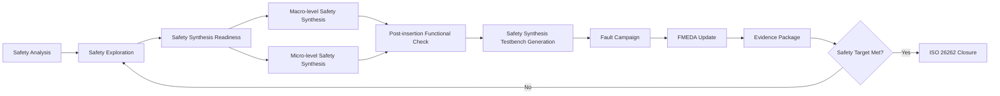
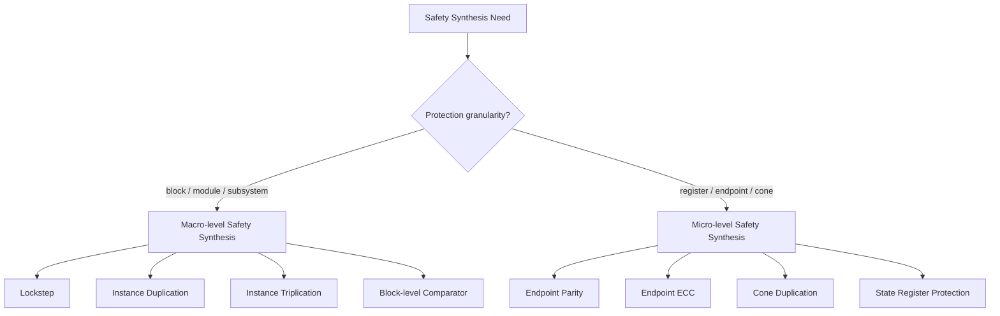
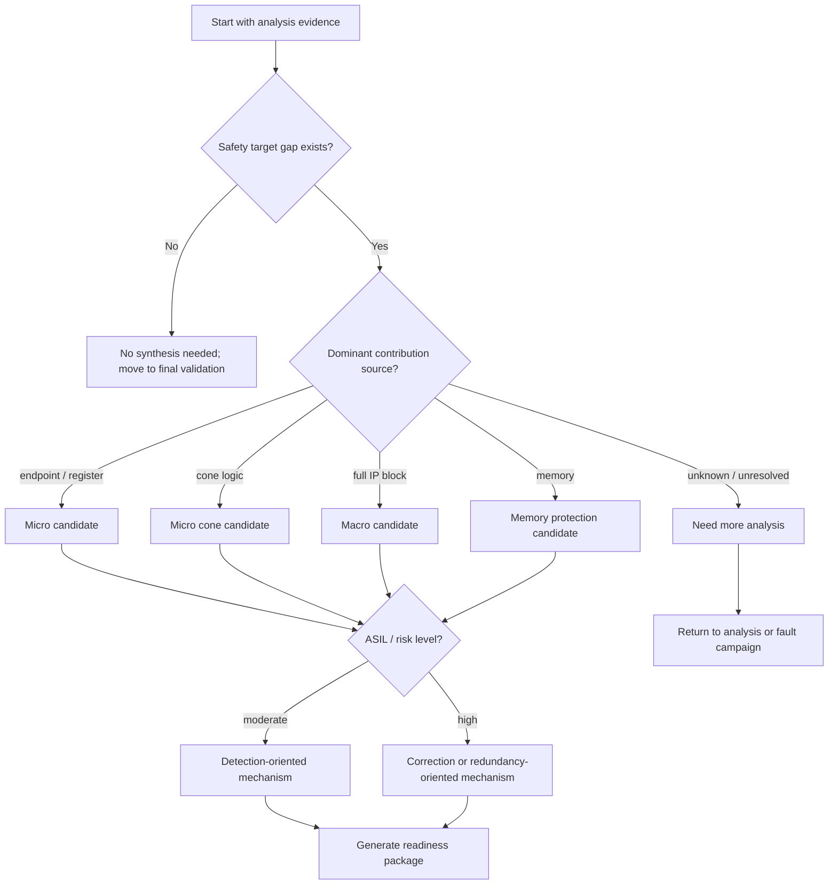
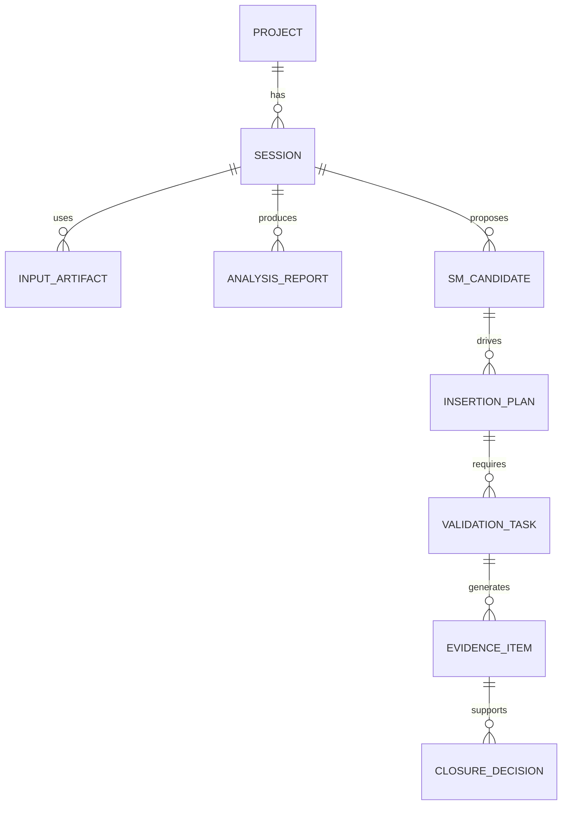

# D21 — Safety Synthesis Readiness: From Analysis Evidence to Protected RTL Planning

> Series: **Automotive Safe-IC Practice**  
> Track: **Safety Synthesis + Post-Insertion Validation + Final Closure**  
> Demo ID: `D21_safety_synthesis_readiness`  
> Public tool naming: `Safety Analysis Engine`, `Macro Safety Synthesis Engine`, `Micro Safety Synthesis Engine`, `Fault Campaign Engine`, `FuSa Evidence Database`, `Safe-IC Flow Scripts`

---

## 1. Why D21 Starts a New Phase

The first twenty demos in this Safe-IC series focus on **safety analysis**, **fault campaign preparation**, **FMEDA data modeling**, and **evidence management**.

D21 starts the second major phase:

```text
D21-D32:
Safety Synthesis
Post-insertion Validation
Final ISO 26262 Closure
```

The purpose of D21 is not to insert a specific protection mechanism yet. That will be handled by D22 and D23. Instead, D21 defines the **readiness checkpoint** between analysis and synthesis.

A professional Safe-IC flow should never jump directly from “we found risky logic” to “insert redundancy everywhere”. Safety synthesis must be driven by evidence:

```text
Safety metrics
FIT contribution
Diagnostic coverage gap
Fault classification
Safety mechanism map
Design hierarchy
Clock/reset context
Memory context
Validation plan
Evidence traceability
```

D21 is the bridge.

---

## 2. Position of D21 in the Full Safe-IC Flow

The full flow can be viewed as a closure loop.



D21 corresponds to the highlighted stage:

```text
Safety Exploration
      ↓
Safety Synthesis Readiness
      ↓
Macro / Micro Safety Synthesis
```

---

## 3. What “Safety Synthesis Readiness” Means

Safety synthesis readiness means the project has enough structured information to decide:

1. **Where** safety mechanisms should be inserted.
2. **Which** class of safety mechanism is appropriate.
3. **Why** the selected mechanism is justified by safety analysis.
4. **How** the inserted design will be validated.
5. **What** evidence will be collected for ISO 26262-oriented closure.

In other words, D21 converts safety analysis output into a synthesis planning package.

---

## 4. Why This Step Matters

A common engineering mistake is to treat safety synthesis as a simple RTL transformation problem.

That is incomplete.

Safety synthesis is a safety-driven EDA automation problem. The inserted RTL is only one result. The more important output is the traceable relationship:

```text
Safety requirement
  -> failure mode
    -> vulnerable design structure
      -> selected safety mechanism
        -> inserted RTL change
          -> validation result
            -> final evidence package
```

Without this traceability, the RTL may look protected, but the safety case remains weak.

---

## 5. D21 Scope

D21 covers:

- safety synthesis entry criteria;
- input package structure;
- safety mechanism selection logic;
- macro versus micro insertion decision model;
- design hierarchy preparation;
- evidence database schema;
- demo directory planning;
- automation scripts;
- expected reports;
- next-step handoff to D22 and D23.

D21 does **not** perform real safety mechanism insertion. It prepares the engineering package that controls insertion in later demos.

---

## 6. Public Tool Naming Policy

This repository intentionally uses neutral tool names.

| Public name | Role |
|---|---|
| `Safety Analysis Engine` | FIT, DC, structural safety analysis, safety exploration |
| `Macro Safety Synthesis Engine` | block-level or instance-level safety mechanism insertion |
| `Micro Safety Synthesis Engine` | register-level, endpoint-level, or fine-grained safety mechanism insertion |
| `Safety Synthesis Testbench Generator` | testbench generation for post-insertion validation |
| `Fault Campaign Engine` | fault injection and fault classification |
| `FuSa Evidence Database` | persistent evidence and traceability storage |
| `Safe-IC Flow Scripts` | shell/Python automation wrapper layer |

The public demos are designed so that the underlying engines are configurable through environment variables.

---

## 7. Input Artifacts Required Before Safety Synthesis

A synthesis readiness package should not start from raw RTL only.

It should start from a **safety-analyzed design context**.

| Input artifact | Purpose |
|---|---|
| RTL / netlist filelist | Defines the unsafe or pre-protected design |
| Top module name | Anchors hierarchy analysis |
| Clock definition | Identifies synchronous domains |
| Reset definition | Prevents incorrect protection around reset logic |
| Black-box list | Controls memories, analog macros, encrypted IP, third-party blocks |
| Memory definition | Enables memory-aware protection planning |
| FIT report | Identifies failure-rate contribution |
| DC report | Identifies diagnostic coverage gap |
| Endpoint contribution report | Locates safety-critical state/control points |
| Startpoint usage report | Helps classify fanout and propagation criticality |
| Safety mechanism candidate map | Captures planned protection mechanisms |
| FMEDA mapping | Connects design structures to failure modes |
| Fault campaign history | Avoids repeating known ineffective protection choices |
| Evidence database session | Preserves traceability across iterations |

---

## 8. Output Artifacts Produced by D21

D21 generates a **readiness package**, not a final protected design.

| Output artifact | Meaning |
|---|---|
| `synthesis_readiness_report.md` | Human-readable readiness summary |
| `synthesis_readiness.json` | Machine-readable readiness database |
| `sm_candidate_map.csv` | Candidate safety mechanism allocation |
| `macro_insertion_plan.csv` | Block-level insertion candidates |
| `micro_insertion_plan.csv` | Register/endpoint-level insertion candidates |
| `validation_plan.md` | Post-insertion validation strategy |
| `evidence_manifest.yaml` | Traceability manifest for evidence packaging |
| `flow_handoff.md` | Handoff document for D22/D23 |

---

## 9. Macro-Level versus Micro-Level Synthesis

Safety synthesis can be separated into two engineering modes.



Macro-level synthesis protects a larger design region. Micro-level synthesis targets the most safety-critical state elements or endpoint cones.

---

## 10. When Macro-Level Protection Is a Better Fit

Macro-level safety synthesis is usually appropriate when:

- the block implements a complete safety-related function;
- the block is third-party IP and internal structure is hard to modify;
- the design requires high diagnostic coverage or fail-operational behavior;
- logic-level localization is too risky or time-consuming;
- the safety architecture already assumes channel redundancy.

Typical macro-level mechanisms include:

```text
instance duplication
instance triplication
lockstep execution
block-level compare
error voting
safe-state request generation
```

This is the focus of D22.

---

## 11. When Micro-Level Protection Is a Better Fit

Micro-level safety synthesis is usually appropriate when:

- only a small number of endpoints dominate FIT contribution;
- control FSM state registers need protection;
- datapath registers need parity or ECC;
- full block duplication is too expensive;
- area/power/timing budget is tight;
- the project needs targeted improvement rather than broad redundancy.

Typical micro-level mechanisms include:

```text
endpoint parity
endpoint ECC
cone duplication
startpoint-cone protection
state transition checking
register-level compare
```

This is the focus of D23.

---

## 12. Safety Mechanism Selection Is Not a Style Choice

A safety mechanism should not be selected because it is easy to insert.

It should be selected because it matches the failure behavior.

| Observed analysis pattern | Typical mechanism direction |
|---|---|
| High endpoint contribution, low fan-in complexity | Endpoint parity or endpoint ECC |
| High fan-in cone contribution | Cone duplication or cone triplication |
| High startpoint fanout | Register-level protection or replicated channel |
| Safety-critical FSM state | State encoding protection, transition checking, parity |
| Third-party IP with limited observability | Macro-level duplication or wrapper-level monitoring |
| Memory-dominated contribution | Memory ECC or memory wrapper protection |
| Severe ASIL target gap | Combined macro + micro protection |

D21 converts such rules into a structured candidate map.

---

## 13. The Readiness Decision Tree



The key engineering message is simple:

```text
Safety synthesis is evidence-driven.
```

---

## 14. What Makes an Insertion Plan Reviewable

A safety synthesis insertion plan should be reviewable by:

- design engineers;
- verification engineers;
- functional safety engineers;
- project leads;
- tool-flow owners;
- assessors or audit reviewers.

A reviewable plan must answer:

```text
What will be changed?
Where will it be changed?
Why is the change needed?
Which failure mode does it address?
Which safety metric is expected to improve?
What is the validation strategy?
What evidence will prove the result?
```

---

## 15. Minimum Readiness Checks

The D21 demo models these checks:

| Check ID | Check |
|---|---|
| `R001` | Top module is defined |
| `R002` | RTL filelist exists |
| `R003` | Clock definition exists |
| `R004` | Reset definition exists or is intentionally waived |
| `R005` | Black-box list exists |
| `R006` | Memory definition exists or is intentionally waived |
| `R007` | FIT report exists |
| `R008` | DC report exists |
| `R009` | Endpoint contribution data exists |
| `R010` | Startpoint usage data exists |
| `R011` | FMEDA mapping exists |
| `R012` | Safety mechanism candidate map exists |
| `R013` | Evidence database session is defined |
| `R014` | Validation strategy is defined |
| `R015` | Tool environment variables are configured |

---

## 16. Readiness Is a Gate, Not a Document

A document can be written after the fact.

A readiness gate must block unsafe automation.

In a real Safe-IC platform, D21 should be implemented as a regression gate:

```text
If readiness checks fail:
    do not run macro synthesis
    do not run micro synthesis
    do not generate final safety evidence
```

The flow should fail early with a clear explanation.

---

## 17. Evidence Database Role

The FuSa Evidence Database is the backbone of traceability.

It should store:

- project metadata;
- tool versions;
- input hashes;
- report hashes;
- safety mechanism mapping;
- synthesis plans;
- validation results;
- waivers;
- unresolved items;
- closure decisions.

D21 treats the evidence database as a first-class artifact, even if the demo implementation is a lightweight JSON/YAML structure.

---

## 18. Evidence Database Conceptual Schema



This schema is intentionally simple. The point is not database complexity. The point is traceable engineering.

---

## 19. What D21 Should Prove

D21 should prove that the platform can:

1. Load a safety analysis evidence bundle.
2. Normalize it into structured data.
3. Classify synthesis candidates.
4. Split candidates into macro and micro plans.
5. Generate human-readable and machine-readable reports.
6. Produce a clean handoff to D22 and D23.
7. Preserve evidence traceability.

This is exactly the capability expected from a Safe-IC Flow Owner or EDA Automation Platform Builder.

---

## 20. Demo Philosophy

The demo should be runnable without proprietary tools.

Therefore, D21 uses a two-layer execution model:

```text
Layer 1: public demo mode
  - parse mock analysis reports
  - generate readiness reports
  - generate insertion plans
  - generate evidence manifest

Layer 2: real engine mode
  - optional
  - controlled by environment variables
  - uses neutral command wrappers
  - not required for GitHub demonstration
```

This keeps the demo reproducible while still showing how it can be connected to real EDA engines.

---

## 21. Proposed Demo Directory

```text
D21_safety_synthesis_readiness/
├── README.md
├── Makefile
├── scripts/
│   ├── run_demo.csh
│   ├── run_preflight.py
│   ├── build_readiness_package.py
│   ├── classify_synthesis_candidates.py
│   ├── generate_insertion_plan.py
│   ├── generate_evidence_manifest.py
│   └── safeic_env_example.csh
├── config/
│   ├── project.yaml
│   ├── readiness_rules.yaml
│   ├── mechanism_policy.yaml
│   ├── evidence_schema.yaml
│   └── tool_bindings.yaml
├── inputs/
│   ├── rtl/
│   │   ├── toy_safe_ctrl.v
│   │   ├── toy_datapath.v
│   │   └── toy_top.v
│   ├── filelist/
│   │   └── filelist.f
│   ├── clocks/
│   │   └── toy_top.clk
│   ├── resets/
│   │   └── toy_top.rst
│   ├── blackbox/
│   │   └── blackbox.list
│   ├── memory/
│   │   └── memory_info.csv
│   ├── analysis_reports/
│   │   ├── fit_summary.csv
│   │   ├── dc_summary.csv
│   │   ├── endpoint_contribution.csv
│   │   ├── startpoint_usage.csv
│   │   └── unresolved_items.csv
│   └── fmeda/
│       ├── fmeda_map.csv
│       └── safety_requirements.csv
├── outputs/
│   ├── README.md
│   ├── preflight_report.md
│   ├── synthesis_readiness_report.md
│   ├── synthesis_readiness.json
│   ├── sm_candidate_map.csv
│   ├── macro_insertion_plan.csv
│   ├── micro_insertion_plan.csv
│   ├── validation_plan.md
│   ├── evidence_manifest.yaml
│   └── flow_handoff.md
└── docs/
    ├── methodology_notes.md
    ├── decision_tree.md
    └── data_dictionary.md
```

---

## 22. README Structure for the Demo

The demo `README.md` should include:

```text
1. Purpose
2. What this demo proves
3. Public tool naming convention
4. Directory structure
5. Environment variables
6. Public demo mode
7. Optional real-engine mode
8. Inputs
9. Outputs
10. Readiness checks
11. Macro/micro candidate classification
12. Evidence manifest
13. How D21 feeds D22 and D23
14. Limitations
```

---

## 23. Environment Variables

The demo should use neutral environment variables.

```csh
setenv SAFEIC_FLOW_ROOT          /path/to/automotive-safeic-practice
setenv SAFEIC_DEMO_ROOT          ${SAFEIC_FLOW_ROOT}/demos/D21_safety_synthesis_readiness

setenv SAFETY_ANALYSIS_ENGINE    /path/to/safety-analysis-engine
setenv MACRO_SAFETY_SYN_ENGINE   /path/to/macro-safety-synthesis-engine
setenv MICRO_SAFETY_SYN_ENGINE   /path/to/micro-safety-synthesis-engine
setenv FAULT_CAMPAIGN_ENGINE     /path/to/fault-campaign-engine

setenv FUSA_EVIDENCE_DB          ${SAFEIC_DEMO_ROOT}/outputs/evidence_manifest.yaml
setenv SAFEIC_PROJECT            toy_safeic_project
setenv SAFEIC_TOP                toy_top
```

No real proprietary command name is required in the public repository.

---

## 24. Main Demo Runner

The runner should be simple.

```csh
#!/bin/csh -f

set DEMO_ROOT = `pwd`

python3 scripts/run_preflight.py \
    --project config/project.yaml \
    --rules config/readiness_rules.yaml \
    --out outputs/preflight_report.md

python3 scripts/build_readiness_package.py \
    --project config/project.yaml \
    --analysis inputs/analysis_reports \
    --fmeda inputs/fmeda \
    --out-json outputs/synthesis_readiness.json \
    --out-md outputs/synthesis_readiness_report.md

python3 scripts/classify_synthesis_candidates.py \
    --readiness outputs/synthesis_readiness.json \
    --policy config/mechanism_policy.yaml \
    --out outputs/sm_candidate_map.csv

python3 scripts/generate_insertion_plan.py \
    --candidates outputs/sm_candidate_map.csv \
    --macro-out outputs/macro_insertion_plan.csv \
    --micro-out outputs/micro_insertion_plan.csv

python3 scripts/generate_evidence_manifest.py \
    --project config/project.yaml \
    --outputs outputs \
    --out outputs/evidence_manifest.yaml

echo "[D21] Safety synthesis readiness package generated."
```

The script uses `csh` because many legacy EDA environments still rely on C shell-based setup scripts.

---

## 25. Readiness Rule Example

`config/readiness_rules.yaml` can be structured like this:

```yaml
required_inputs:
  - id: R001
    name: top_module
    source: config/project.yaml
    severity: error

  - id: R002
    name: rtl_filelist
    source: inputs/filelist/filelist.f
    severity: error

  - id: R003
    name: clock_definition
    source: inputs/clocks/toy_top.clk
    severity: error

  - id: R007
    name: fit_summary
    source: inputs/analysis_reports/fit_summary.csv
    severity: error

  - id: R008
    name: dc_summary
    source: inputs/analysis_reports/dc_summary.csv
    severity: error

  - id: R014
    name: validation_strategy
    source: config/project.yaml
    severity: warning
```

This keeps the readiness gate configurable.

---

## 26. Safety Mechanism Policy Example

`config/mechanism_policy.yaml` can encode selection heuristics.

```yaml
rules:
  - name: endpoint_dominated
    condition:
      endpoint_contribution: high
      cone_contribution: low
    recommend:
      level: micro
      mechanism: endpoint_parity
      rationale: "Endpoint contribution dominates and localized protection is sufficient."

  - name: cone_dominated
    condition:
      cone_contribution: high
    recommend:
      level: micro
      mechanism: cone_duplication
      rationale: "Fan-in cone contribution dominates."

  - name: block_level_high_asil
    condition:
      asil: ["C", "D"]
      block_criticality: high
    recommend:
      level: macro
      mechanism: instance_duplication_or_triplication
      rationale: "High ASIL target and block-level criticality justify redundancy."

  - name: memory_dominated
    condition:
      memory_contribution: high
    recommend:
      level: micro
      mechanism: memory_ecc
      rationale: "Memory contribution requires memory-aware protection."
```

The policy file makes the flow auditable and tunable.

---

## 27. Candidate Map Format

`sm_candidate_map.csv` should be easy to inspect.

```csv
candidate_id,design_object,object_type,failure_mode,asil,fit_contribution,dc_gap,recommended_level,recommended_mechanism,rationale
SMC_0001,toy_top.u_ctrl.state_q,register,control_state_corruption,D,high,high,micro,endpoint_parity,High endpoint contribution in safety-critical FSM
SMC_0002,toy_top.u_datapath,instance,datapath_corruption,C,medium,medium,macro,instance_duplication,Block-level datapath safety requirement
SMC_0003,toy_top.u_mem,mem_instance,memory_bit_error,D,high,high,micro,memory_ecc,Memory contribution dominates residual risk
```

This file becomes the input bridge to D22 and D23.

---

## 28. Macro Insertion Plan Format

`macro_insertion_plan.csv` should focus on instance-level actions.

```csv
plan_id,candidate_id,instance_path,mechanism,compare_signal,error_signal,validation_required,status
MACRO_0001,SMC_0002,toy_top.u_datapath,instance_duplication,datapath_cmp,datapath_error,functional_equivalence_and_fault_campaign,planned
```

D22 will consume this file.

---

## 29. Micro Insertion Plan Format

`micro_insertion_plan.csv` should focus on endpoint/register/memory-level actions.

```csv
plan_id,candidate_id,object_path,mechanism,clock_domain,reset_domain,error_signal,validation_required,status
MICRO_0001,SMC_0001,toy_top.u_ctrl.state_q,endpoint_parity,clk,rst_n,ctrl_state_error,post_insertion_simulation,planned
MICRO_0002,SMC_0003,toy_top.u_mem,memory_ecc,clk,rst_n,mem_ecc_error,ecc_injection_test,planned
```

D23 will consume this file.

---

## 30. Validation Plan

D21 should also generate a validation plan.

```text
Validation objective:
  Prove that planned safety synthesis does not break the original hardware function
  and that inserted safety mechanisms are observable in downstream verification.

Validation categories:
  1. RTL compile check
  2. Functional smoke simulation
  3. Equivalence or behavior preservation check
  4. Safety error signal observability check
  5. Testbench generation readiness
  6. Fault campaign readiness
  7. Evidence traceability check
```

Safety synthesis without validation planning is only code transformation. Safety synthesis with validation planning becomes an ISO 26262-oriented engineering flow.

---

## 31. Evidence Manifest Example

`evidence_manifest.yaml` can look like this:

```yaml
project:
  name: toy_safeic_project
  demo: D21_safety_synthesis_readiness
  top: toy_top

session:
  id: D21_001
  purpose: safety_synthesis_readiness
  status: generated

inputs:
  rtl_filelist:
    path: inputs/filelist/filelist.f
    required: true
  fit_summary:
    path: inputs/analysis_reports/fit_summary.csv
    required: true
  dc_summary:
    path: inputs/analysis_reports/dc_summary.csv
    required: true
  fmeda_map:
    path: inputs/fmeda/fmeda_map.csv
    required: true

outputs:
  readiness_report:
    path: outputs/synthesis_readiness_report.md
  candidate_map:
    path: outputs/sm_candidate_map.csv
  macro_plan:
    path: outputs/macro_insertion_plan.csv
  micro_plan:
    path: outputs/micro_insertion_plan.csv
  validation_plan:
    path: outputs/validation_plan.md

handoff:
  next_demos:
    - D22_macro_level_safety_synthesis
    - D23_micro_level_safety_synthesis
```

---

## 32. Handoff to D22

D22 will take:

```text
macro_insertion_plan.csv
synthesis_readiness.json
evidence_manifest.yaml
RTL filelist
tool_bindings.yaml
```

and produce:

```text
macro-protected RTL
macro insertion report
macro compare/error signal map
macro validation checklist
updated evidence manifest
```

---

## 33. Handoff to D23

D23 will take:

```text
micro_insertion_plan.csv
synthesis_readiness.json
endpoint contribution data
startpoint usage data
memory info
evidence_manifest.yaml
```

and produce:

```text
micro-protected RTL
endpoint/register protection report
memory protection report
error signal map
updated evidence manifest
```

---

## 34. Why This Demonstrates Platform Capability

D21 is valuable because it shows platform-level thinking.

A tool user only runs a command.

A flow owner builds a controlled process:

```text
input normalization
readiness gating
policy-driven decision
traceability
engine abstraction
evidence collection
handoff contract
closure loop
```

This is the difference between using a safety tool and owning a Safe-IC automation platform.

---

## 35. Engineering Value

The D21 flow provides several practical benefits:

| Value | Explanation |
|---|---|
| Fewer wasted synthesis runs | Bad inputs are detected before insertion |
| Reviewable safety decisions | Candidate maps explain mechanism choices |
| Better D22/D23 automation | Macro and micro plans are cleanly separated |
| Stronger evidence chain | Every output is tied to input evidence |
| Easier ISO 26262 closure | Validation and documentation are built into the flow |
| Better customer communication | Reports can be reviewed without exposing proprietary engines |
| Better team collaboration | Safety, design, and verification teams share the same package |

---

## 36. Common Failure Modes in Real Projects

D21 should catch these issues early:

| Failure mode | Example |
|---|---|
| Missing clock context | Register protection inserted without correct clock grouping |
| Ambiguous reset behavior | Safety state cannot be validated after reset |
| Missing black-box policy | Memory or encrypted IP is incorrectly transformed |
| Weak FMEDA mapping | Mechanism exists but cannot be connected to failure mode |
| No evidence session | Later reports cannot be traced back to inputs |
| Overuse of macro redundancy | Area/power/timing explode |
| Overuse of micro protection | Safety goal remains unmet |
| No validation plan | Protected RTL is generated but not safety-validated |

---

## 37. Recommended Commit Structure

A clean GitHub commit for D21 should include:

```text
articles/
└── D21_safety_synthesis_readiness.md

demos/
└── D21_safety_synthesis_readiness/
    ├── README.md
    ├── scripts/
    ├── config/
    ├── inputs/
    ├── outputs/
    └── docs/
```

Recommended commit message:

```text
Add D21 safety synthesis readiness flow and demo plan
```

---

## 38. Limitations of D21

D21 is intentionally not a full safety synthesis run.

Limitations:

- it uses synthetic analysis reports;
- it does not insert real safety logic;
- it does not prove final diagnostic coverage;
- it does not replace FMEDA review;
- it does not qualify any tool;
- it does not claim compliance by itself.

Its purpose is to demonstrate the automation interface and methodology required before insertion.

---

## 39. How D21 Connects to ISO 26262 Closure

ISO 26262-oriented semiconductor safety work is not just about creating protected RTL.

The closure problem is broader:

```text
Are safety requirements allocated?
Are safety mechanisms justified?
Are random hardware faults addressed?
Are metrics calculated?
Are fault campaigns executed?
Are unresolved faults reviewed?
Are results documented?
Are tool outputs traceable?
```

D21 contributes to closure by ensuring that safety synthesis is driven by documented and reviewable evidence.

---

## 40. Summary

D21 introduces the safety synthesis readiness layer of the Safe-IC flow.

It turns analysis outputs into controlled synthesis plans:

```text
analysis evidence
  -> readiness gate
    -> safety mechanism candidate map
      -> macro insertion plan
      -> micro insertion plan
        -> validation plan
          -> evidence manifest
```

This article and demo are designed to show that a modern Safe-IC platform is not a collection of disconnected EDA commands. It is an evidence-driven automation system that connects analysis, synthesis, verification, FMEDA, and final closure.

D22 will continue with **Macro-level Safety Synthesis**.

D23 will continue with **Micro-level Safety Synthesis**.
