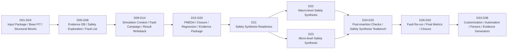
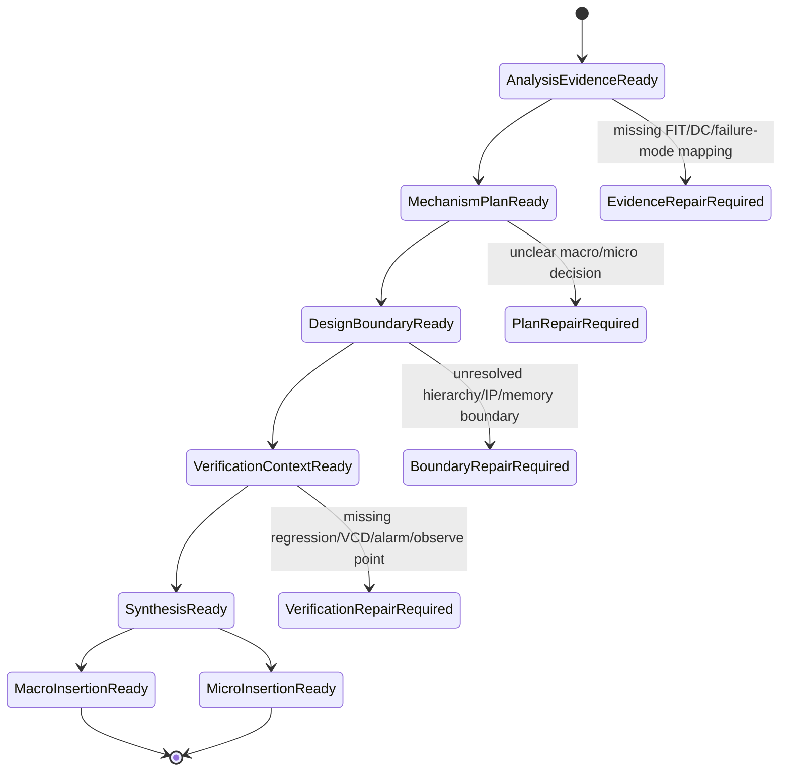
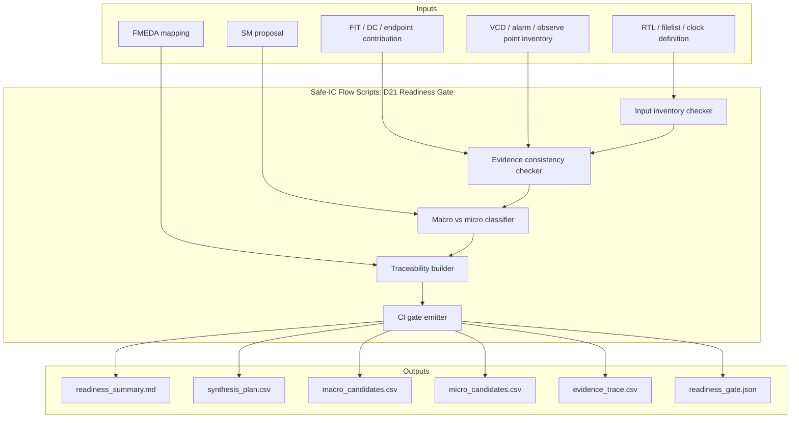
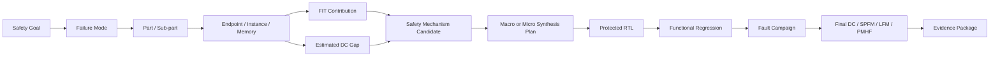
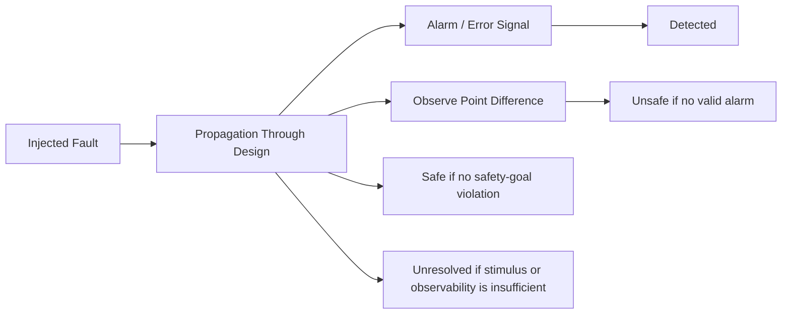
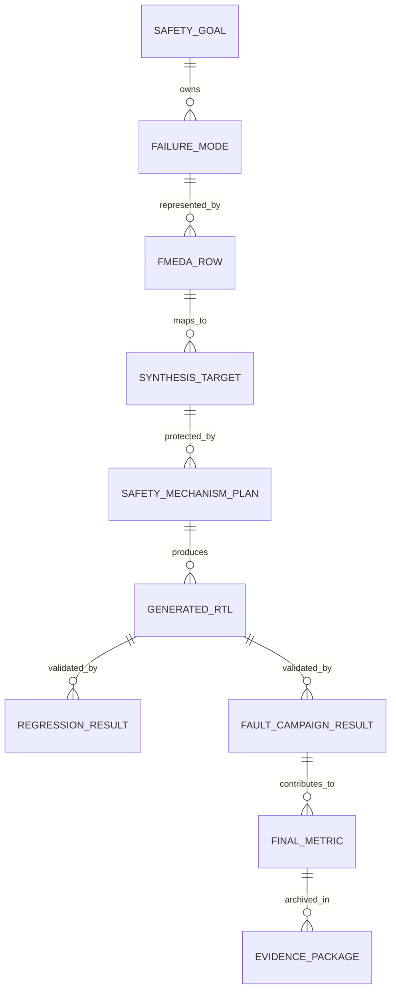
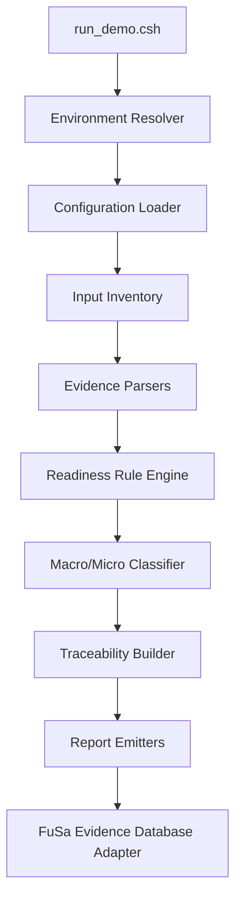
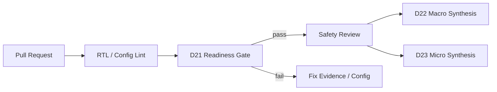
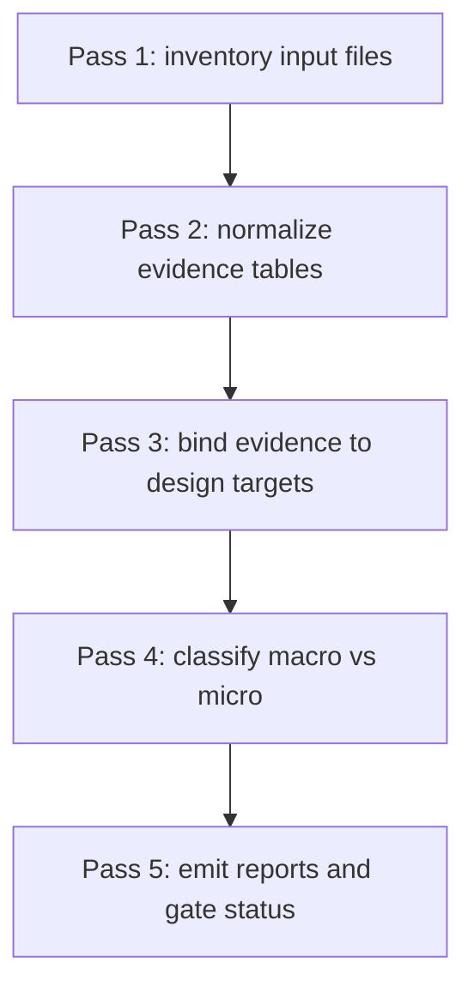
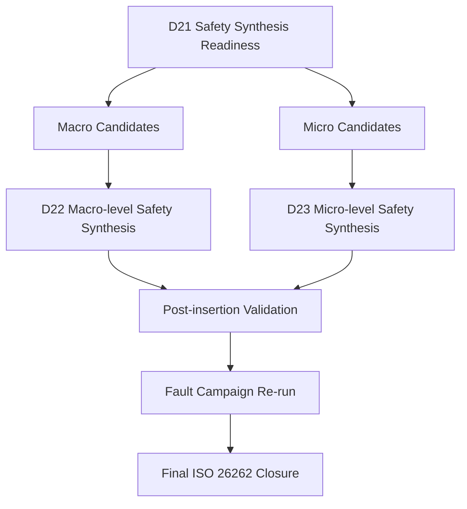

# [Automotive Safe-IC Practice 21] Safety Synthesis Readiness: From Safety Analysis Evidence to Protected RTL Planning

**Author**: Darren H. Chen  
**Direction**: Automotive Safe-IC Flow / Functional Safety EDA Automation / Safety Synthesis Readiness  
**Demo**: `D21_safety_synthesis_readiness`  
**Tags**: `ISO 26262` `Safe-IC` `Functional Safety` `FMEDA` `Safety Synthesis` `Fault Campaign` `Evidence Closure` `EDA Automation`

---

## 1. Scope of D21

D21 is the transition point between the first half of the Safe-IC practice series and the safety synthesis implementation stage.

D01-D20 focus on safety analysis, base FIT computation, safety exploration, fault list preparation, fault campaign execution, FMEDA modeling, diagnostic coverage closure, regression gates, and evidence packaging. D21 does not insert safety mechanisms yet. Its role is to determine whether the project has enough structured evidence, design context, safety intent, and verification readiness to enter macro-level or micro-level safety synthesis.

In an engineering team, this step is often skipped. Designers move directly from a safety analysis report to RTL modification. That creates several practical problems:

- safety mechanisms are inserted without a clear evidence trail;
- macro-level redundancy is used where micro-level protection would be cheaper;
- micro-level protection is applied where lockstep or triplication would be safer;
- safe RTL cannot be traced back to failure modes and diagnostic coverage assumptions;
- fault campaign results cannot be cleanly connected to the original safety target;
- ISO 26262 closure becomes document-heavy but weak in data consistency.

D21 treats safety synthesis as a controlled engineering handoff rather than a manual RTL-editing activity.

---

## 2. Position in the Full Safe-IC Flow

The full flow can be viewed as a sequence of data contracts.



D21 answers one central engineering question:

> Is the design, evidence database, safety mechanism plan, and verification context mature enough for controlled safety synthesis?

The output is not protected RTL. The output is a readiness package that tells the next stages what to protect, how to protect it, which engine should perform the insertion, which assumptions must be preserved, and which evidence artifacts must be regenerated after insertion.

---

## 3. Safety Synthesis as an Engineering Contract

Safety synthesis should not be treated as a simple source-to-source RTL transformation. It is a contract among five domains:

| Domain | Responsibility | Typical Artifact |
|---|---|---|
| Safety analysis | identify FIT contribution, diagnostic coverage gap, failure mode impact | FIT report, DC report, endpoint contribution, startpoint usage |
| Safety architecture | select protection strategy | safety mechanism plan, macro/micro decision table |
| RTL implementation | preserve design semantics while adding protection | protected RTL, synthesis constraints, wrapper mapping |
| Verification | prove functional equivalence and validate fault behavior | regression VCD, alarms, observe points, fault campaign result |
| Evidence management | preserve traceability for audit and review | FuSa Evidence Database, manifest, closure report |

D21 formalizes this contract before any safety insertion is attempted.

---

## 4. Key Terms Used in This Article

| Term | Engineering Meaning |
|---|---|
| Unsafe design | RTL or netlist before the selected safety mechanisms are inserted. It may already contain some protection, but it is not yet the target safe implementation for the current closure cycle. |
| Safe design | RTL or netlist after safety mechanisms are inserted or integrated. This design must be used for functional regression and fault campaign validation. |
| Safety mechanism | A hardware or software mechanism that detects, corrects, masks, or controls random hardware faults. Examples include parity, ECC, duplication, triplication, protocol checks, lockstep, and memory protection. |
| Macro-level synthesis | Safety insertion at module, instance, subsystem, or wrapper level. Typical examples include lockstep, instance duplication, and TMR-style protection. |
| Micro-level synthesis | Safety insertion at fine-grained register, endpoint, cone, or memory level. Typical examples include endpoint parity, endpoint ECC, register duplication, and state-machine protocol checks. |
| Endpoint | A state element, register boundary, interface boundary, or observable safety-relevant point where fault impact can be accumulated, protected, or checked. |
| Startpoint | A source-side state element or input driver that contributes to logic feeding one or more endpoints. |
| DCE | Diagnostic Coverage Element. A reusable block-level analysis artifact that allows hierarchical closure instead of repeatedly analyzing the same sub-blocks. |
| Fault campaign | A validation phase that injects stuck-at, transient, memory, or other modeled faults to evaluate whether safety mechanisms detect or control fault effects. |
| Evidence package | A structured set of reports, manifests, logs, configuration files, metrics, and review notes that supports ISO 26262 safety argumentation. |

---

## 5. Readiness Instead of Direct Insertion

A disciplined safety synthesis flow separates readiness from insertion.



This model prevents a common Safe-IC failure pattern: safety mechanisms are inserted, but the verification and evidence teams cannot prove which original safety problem the inserted logic was supposed to solve.

---

## 6. Input Contract of D21

D21 consumes artifacts from previous stages and converts them into a synthesis readiness package.

| Input Category | Required Content | Main Consumer |
|---|---|---|
| Design package | RTL filelist, include paths, top module, clock definition, black-box policy, memory map | Safe-IC Flow Scripts |
| Safety analysis evidence | base FIT, FIT contribution, diagnostic coverage estimate, endpoint contribution, startpoint usage | Safety Analysis Engine |
| Safety mechanism plan | proposed SM type, target endpoint, target instance, expected DC, ASIL relevance | Macro/Micro Safety Synthesis Engines |
| FMEDA mapping | part, sub-part, failure mode, safety goal, safety mechanism association | FuSa Evidence Database |
| Verification context | regression scenario list, VCD inventory, alarm list, observe point list, reset/clock policy | Fault Campaign Engine |
| Project policy | naming convention, generated RTL location, review rules, signoff thresholds | Safe-IC Flow Scripts |

A readiness gate should fail fast if any of these inputs are missing or inconsistent.

---

## 7. Output Contract of D21

D21 does not produce final safety metrics. It produces the controlled handoff package for D22 and D23.

| Output Artifact | Purpose |
|---|---|
| `readiness_summary.md` | human-readable summary of readiness state, missing inputs, risk items, and next action |
| `synthesis_plan.csv` | normalized table of targets and selected safety mechanisms |
| `macro_candidates.csv` | targets recommended for macro-level safety synthesis |
| `micro_candidates.csv` | targets recommended for micro-level safety synthesis |
| `evidence_trace.csv` | traceability from failure mode to endpoint, safety mechanism, expected diagnostic coverage, and evidence source |
| `readiness_gate.json` | machine-readable pass/fail status for CI and automation |
| `demo_manifest.json` | reproducibility manifest for scripts, input files, generated reports, and environment variables |
| `next_steps.md` | recommended D22/D23 execution path |

The generated files are intentionally simple: CSV, JSON, Markdown. This makes them reviewable, diff-friendly, and suitable for GitHub-based engineering workflows.

---

## 8. Readiness Gate Architecture

D21 is best implemented as a small automation layer around existing functional safety engines and evidence files.



The architecture is intentionally lightweight. A Safe-IC flow owner should be able to replace internal parsers, report readers, rule engines, or database adapters without rewriting the methodology.

---

## 9. Macro-level Safety Synthesis Readiness

Macro-level safety synthesis protects a design at a coarse structural boundary. The target is usually a module, subsystem, interface wrapper, controller, or IP instance.

Typical macro-level protection patterns include:

| Pattern | Application Scenario | Engineering Trade-off |
|---|---|---|
| Instance duplication | fault detection by comparing two equivalent implementations | moderate area overhead, strong control for selected blocks |
| Instance triplication | fault masking or correction using majority vote | high area overhead, stronger availability target |
| Lockstep wrapper | redundant execution with comparator and alarm | useful for processors, controllers, and safety-critical FSM-heavy blocks |
| Interface protection wrapper | parity/ECC/checker at input or output boundary | useful for third-party IP or hard-to-modify internal RTL |

Macro-level readiness requires clean hierarchy, stable instance names, defined reset behavior, comparator insertion policy, and an alarm-routing strategy.

---

## 10. Micro-level Safety Synthesis Readiness

Micro-level safety synthesis protects selected fine-grained structures: endpoints, register groups, state machines, memories, or fan-in cones.

Typical micro-level protection patterns include:

| Pattern | Application Scenario | Engineering Trade-off |
|---|---|---|
| Endpoint parity | low-cost detection for selected registers or endpoint groups | low overhead, detection only |
| Endpoint ECC | stronger protection for multi-bit state | more logic than parity, can support correction depending on architecture |
| Endpoint cone duplication | detects faults in logic feeding selected endpoints | targeted overhead, better cone-level coverage |
| Endpoint cone triplication | supports stronger reliability or fail-operational behavior | high overhead, suitable for high-criticality logic |
| State-machine protocol check | detects illegal state or transition behavior | efficient for control logic, requires correct FSM abstraction |
| Memory ECC or parity | protects memory arrays and register files | depends on memory macro integration and access pattern |

Micro-level readiness requires endpoint extraction, cone boundary definition, clock/reset grouping, synthesis-safe insertion points, and a post-insertion validation plan.

---

## 11. Macro vs Micro Decision Matrix

D21 classifies each proposed protection target.

| Evidence Pattern | Recommended Direction | Rationale |
|---|---|---|
| High FIT concentration in one complete instance | Macro-level | protecting the whole instance may be simpler and more traceable |
| High endpoint contribution with localized register group | Micro-level | endpoint protection avoids unnecessary duplication of unrelated logic |
| High fan-in cone contribution feeding few safety-critical endpoints | Micro-level | cone duplication or triplication can target the actual risk source |
| Third-party IP with limited internal visibility | Macro-level | wrapper or instance-level protection may be more practical |
| Safety-critical state machine with compact state space | Micro-level | protocol/transition checks can be more efficient than full duplication |
| Processor or controller requiring availability | Macro-level | lockstep or triplication may align better with fail-operational goals |
| Memory-dominant risk | Micro-level or wrapper-level | ECC/parity may be inserted at memory or interface boundary |
| Ambiguous failure mode mapping | Not ready | the target must be clarified before insertion |

This matrix is not a replacement for engineering judgment. It is a repeatable starting point for synthesis planning.

---

## 12. Evidence Traceability Model

Every synthesis target should be traceable.



The most important point is that protected RTL must not be an isolated implementation artifact. It must remain connected to the safety goal and failure mode that justified its creation.

---

## 13. ISO 26262 Closure View

ISO 26262 closure is not achieved by running one tool. It is achieved by connecting requirements, assumptions, design changes, validation results, and review evidence.

D21 contributes to closure in four ways:

1. It preserves the link between safety analysis and safety synthesis.
2. It prevents safety mechanism insertion without defined evidence ownership.
3. It defines which post-insertion verification artifacts must be regenerated.
4. It creates machine-readable gates that can be used in CI and review workflows.

From a closure perspective, D21 is a readiness audit checkpoint.

---

## 14. Safety Analysis Evidence Required Before D21

A readiness gate should check that safety analysis evidence is not only present but usable.

| Evidence | Required Check |
|---|---|
| Base FIT summary | design name, top module, standard, mission profile, permanent/transient split |
| FIT contribution report | endpoint or block contribution available for synthesis planning |
| Startpoint usage report | fan-in/fan-out relevance available for cone-level decisions |
| Diagnostic coverage estimate | expected DC before insertion or under proposed SM assumptions |
| Safety mechanism proposal | target object, SM type, expected coverage, source evidence |
| DCE files | block-level reusable evidence available where hierarchical closure is used |
| FMEDA table | failure mode and safety mechanism mapping available |

D21 should not accept a PDF screenshot as the only evidence source. Human-readable reports are useful, but automation needs structured CSV, JSON, YAML, XML, or parseable text.

---

## 15. Design Readiness Checks

Safety synthesis modifies design structure. Therefore, D21 must examine whether the design package is stable enough.

| Check | Failure Example | Impact |
|---|---|---|
| Filelist completeness | missing included RTL file | synthesis engine may protect an incomplete design |
| Top module consistency | report top differs from RTL top | evidence cannot be mapped to implementation |
| Clock definition | endpoint belongs to unknown clock domain | parity/ECC/checker insertion may be invalid |
| Reset policy | async reset not described | post-insertion equivalence may fail |
| Black-box policy | memory or third-party IP not declared | micro-level insertion may enter unsupported logic |
| Generated RTL location | output overwrites source RTL | reproducibility and reviewability are damaged |
| Naming rule | generated instances collide with existing names | integration becomes fragile |

Readiness is not only a safety concept. It is also a design hygiene concept.

---

## 16. Verification Context Readiness

After safety synthesis, the safe RTL must be validated. D21 checks whether validation can start immediately after D22 or D23.

| Verification Input | Purpose |
|---|---|
| regression test list | proves inserted safety logic does not break intended behavior |
| VCD inventory | provides safety context for fault campaign grading and injection |
| alarm list | defines which error indicators count as detection |
| observe point list | defines which outputs or states are used to classify fault effects |
| reset and initialization policy | prevents false unresolved results caused by uninitialized state |
| simulation duration | ensures stimulus covers the relevant safety window |
| fault campaign configuration | defines stuck-at, transient, memory, or other target models |

A flow owner should avoid creating protected RTL before verifying that the downstream validation environment can consume it.

---

## 17. Alarm and Observe Point Planning

Safety mechanisms are only useful if their reactions are observable.



D21 should confirm that each synthesis target has a detection path or classification strategy:

- For parity and ECC, the error signal must be included in the alarm list.
- For duplication and lockstep, comparator outputs must be observable.
- For triplication, voter behavior and voter fault assumptions must be documented.
- For state-machine protocol checks, illegal-state and illegal-transition alarms must be mapped.
- For memory protection, ECC/parity error outputs must be routed and classified.

Without this planning, D22/D23 may generate protection logic that the fault campaign cannot credit.

---

## 18. Readiness Rules for Macro-level Candidates

A target is considered macro-ready when the following conditions are satisfied:

| Rule | Description |
|---|---|
| `M01_instance_resolved` | target instance or module path exists in the current design package |
| `M02_boundary_stable` | inputs, outputs, clocks, resets, and sideband signals are known |
| `M03_comparator_policy_defined` | compare point, mismatch behavior, and alarm routing are defined |
| `M04_reset_equivalence_defined` | reset alignment between original and redundant instance is defined |
| `M05_third_party_policy_defined` | wrapper-level protection is allowed for external IP |
| `M06_verification_scenario_available` | regression scenario can exercise the protected boundary |
| `M07_evidence_trace_exists` | failure mode and FIT/DC evidence justify macro insertion |

If any mandatory rule fails, the candidate should remain in `needs_review` state.

---

## 19. Readiness Rules for Micro-level Candidates

A target is considered micro-ready when the following conditions are satisfied:

| Rule | Description |
|---|---|
| `m01_endpoint_resolved` | endpoint/register/memory target exists in the elaborated design |
| `m02_clock_domain_known` | clock and reset domain is known |
| `m03_cone_boundary_defined` | cone traversal boundary and stop condition are defined |
| `m04_sm_type_valid` | requested protection type is compatible with target structure |
| `m05_alarm_mapping_defined` | generated alarm or error signal has classification semantics |
| `m06_functional_equivalence_plan_ready` | post-insertion behavior can be compared to baseline behavior |
| `m07_fault_campaign_plan_ready` | fault model and stimulus exist for validation |

Micro-level synthesis can produce excellent PPA results, but only when structural intent is precise.

---

## 20. Failure Mode to Safety Mechanism Mapping

The mapping table is the core data model of D21.

| Field | Example | Purpose |
|---|---|---|
| `safety_goal_id` | `SG_CPU_CTRL_001` | links synthesis decision to safety goal |
| `failure_mode_id` | `FM_CTRL_WRONG_STATE` | defines the malfunction scenario |
| `part` | `control_subsystem` | FMEDA hierarchy |
| `subpart` | `fsm_cluster` | finer FMEDA partition |
| `target_type` | `endpoint`, `instance`, `memory`, `interface` | controls macro/micro selection |
| `target_path` | `u_ctrl/u_fsm/state_q` | implementation target |
| `fit_contribution` | `high`, `medium`, numeric value | prioritization |
| `dc_gap` | numeric or category | need for additional protection |
| `sm_candidate` | `endpoint_parity`, `cone_duplication`, `lockstep_wrapper` | proposed safety mechanism |
| `synthesis_mode` | `macro` or `micro` | next engine selection |
| `evidence_source` | report path or database key | traceability |
| `readiness_status` | `ready`, `needs_review`, `blocked` | gate result |

This table is useful for both GitHub review and ISO 26262 evidence packaging.

---

## 21. PPA and Safety Trade-off

Safety synthesis is not free. It consumes area, power, timing margin, verification capacity, and debugging time.

| Choice | Area | Power | Timing | Diagnostic Strength | Typical Use |
|---|---:|---:|---:|---:|---|
| endpoint parity | low | low | low to medium | detection | selected registers and endpoints |
| endpoint ECC | medium | medium | medium | detection/correction depending on design | multi-bit state and memories |
| cone duplication | medium to high | medium to high | medium | detection | localized safety-critical logic cones |
| cone triplication | high | high | high | masking/correction style | high-criticality logic |
| instance duplication | high | high | medium to high | detection | full block protection |
| instance triplication | very high | very high | high | fault masking | fail-operational target |
| protocol check | low to medium | low | low | detection | FSM and transaction logic |

D21 should not automatically select the strongest mechanism. It should select the mechanism that closes the safety gap with acceptable implementation cost and validation complexity.

---

## 22. Evidence Database Role

The FuSa Evidence Database acts as the continuity layer across analysis, synthesis, verification, and final closure.



D21 should write or update database records for:

- readiness state;
- input artifact checksum;
- synthesis target list;
- macro/micro classification;
- failed readiness rules;
- review owner and review note;
- next-stage execution plan.

This makes the future D37 Evidence Package Generator much easier to implement.

---

## 23. Automation Pattern for Safe-IC Flow Scripts

The D21 demo uses a layered automation pattern.



Each module should have a narrow responsibility. This makes the demo extensible:

- replace mock evidence with real reports;
- replace CSV tables with a database;
- replace rule YAML with project-specific policy;
- connect D22/D23 execution after the readiness gate passes;
- integrate with CI without rewriting the core methodology.

---

## 24. Demo Directory Plan

The GitHub demo directory should be reviewable without requiring proprietary design data.

```text
D21_safety_synthesis_readiness/
├── README.md
├── config/
│   ├── d21_readiness.yaml
│   ├── macro_micro_rules.yaml
│   └── project_policy.yaml
├── inputs/
│   ├── design/
│   │   ├── rtl_filelist.f
│   │   ├── clock_definition.clk
│   │   ├── blackbox.list
│   │   └── memory_map.csv
│   ├── analysis_evidence/
│   │   ├── base_fit_summary.csv
│   │   ├── fit_contribution.csv
│   │   ├── endpoint_contribution.csv
│   │   ├── startpoint_usage.csv
│   │   └── dc_estimate.csv
│   ├── fmeda/
│   │   └── fmeda_mapping.csv
│   ├── synthesis_plan/
│   │   └── proposed_safety_mechanisms.csv
│   └── verification_context/
│       ├── regression_scenarios.csv
│       ├── vcd_inventory.csv
│       ├── alarm_list.csv
│       └── observe_points.csv
├── scripts/
│   ├── run_demo.csh
│   └── setup_env.example.csh
├── tools/
│   ├── d21_readiness.py
│   ├── evidence_parser.py
│   ├── rule_engine.py
│   ├── classifier.py
│   ├── trace_builder.py
│   └── report_writer.py
├── outputs/
│   └── .gitkeep
└── docs/
    ├── methodology_notes.md
    └── readiness_gate_schema.md
```

The directory is designed so that real engine integration can be added later through environment variables and adapters.

---

## 25. Demo README Contract

The README should describe a reproducible flow with configurable environment variables.

```markdown
# D21 Safety Synthesis Readiness

This demo builds a readiness package before macro-level or micro-level safety synthesis.
It checks design inputs, safety analysis evidence, FMEDA mapping, safety mechanism proposals,
and verification context. The output is a structured handoff package for the next synthesis stage.

## Environment Variables

| Variable | Required | Description |
|---|---|---|
| `SAFEIC_FLOW_HOME` | yes | root directory of Safe-IC Flow Scripts |
| `SAFEIC_ANALYSIS_ENGINE` | optional | path to Safety Analysis Engine adapter |
| `SAFEIC_MACRO_SYNTH_ENGINE` | optional | path to Macro Safety Synthesis Engine adapter |
| `SAFEIC_MICRO_SYNTH_ENGINE` | optional | path to Micro Safety Synthesis Engine adapter |
| `SAFEIC_EVIDENCE_DB` | optional | path to FuSa Evidence Database or exported evidence file |
| `SAFEIC_DEMO_MODE` | optional | `mock` or `engine`; default is `mock` |
| `SAFEIC_PROJECT_NAME` | optional | project name used in generated manifests |

## Quick Start

```csh
setenv SAFEIC_FLOW_HOME `pwd`
setenv SAFEIC_DEMO_MODE mock
setenv SAFEIC_PROJECT_NAME D21_DEMO
setenv SAFEIC_EVIDENCE_DB outputs/fusa_evidence_demo.db

csh scripts/run_demo.csh
```

## Outputs

```text
outputs/readiness_summary.md
outputs/synthesis_plan.csv
outputs/macro_candidates.csv
outputs/micro_candidates.csv
outputs/evidence_trace.csv
outputs/readiness_gate.json
outputs/demo_manifest.json
outputs/next_steps.md
```

## Gate Result

The demo exits with a non-zero status when mandatory readiness rules fail.
Warnings are reported for review items that do not block demo execution.
```

This README style keeps the public demo clean while preserving a realistic integration path.

---

## 26. Example Configuration Schema

A project policy can be written in YAML.

```yaml
project:
  name: D21_DEMO
  top_module: toy_safeic_top
  synthesis_stage: readiness

readiness:
  require_base_fit: true
  require_endpoint_contribution: true
  require_fmeda_mapping: true
  require_alarm_mapping: true
  require_observe_points: true
  allow_unresolved_targets: false

classification:
  macro:
    target_types: [instance, subsystem, third_party_ip]
    high_fit_instance_threshold: 0.25
  micro:
    target_types: [endpoint, register, memory, fsm]
    high_endpoint_threshold: 0.15

output:
  format: [csv, json, markdown]
  checksum_inputs: true
  emit_next_steps: true
```

Configuration-driven readiness is important because safety policy differs by design type, ASIL target, customer requirements, IP ownership, and verification maturity.

---

## 27. Example Synthesis Plan CSV

```csv
safety_goal_id,failure_mode_id,target_type,target_path,fit_contribution,dc_gap,sm_candidate,synthesis_mode,readiness_status
SG_CTRL_001,FM_CTRL_WRONG_STATE,endpoint,u_ctrl/u_fsm/state_q,0.18,0.22,state_machine_protocol_check,micro,ready
SG_BUS_002,FM_BUS_WRONG_DATA,interface,u_bus/u_axi_if,0.12,0.18,interface_parity,micro,needs_review
SG_CPU_003,FM_CPU_LOCKUP,instance,u_cpu_core,0.31,0.35,lockstep_wrapper,macro,ready
SG_MEM_004,FM_MEM_BIT_FLIP,memory,u_sram_ctrl/u_mem,0.27,0.30,memory_ecc,micro,ready
```

This table is intentionally simple enough to be reviewed in GitHub pull requests.

---

## 28. Example Readiness Gate JSON

```json
{
  "project": "D21_DEMO",
  "stage": "safety_synthesis_readiness",
  "status": "pass_with_warnings",
  "summary": {
    "targets_total": 4,
    "macro_ready": 1,
    "micro_ready": 2,
    "needs_review": 1,
    "blocked": 0
  },
  "mandatory_checks": {
    "design_package": "pass",
    "analysis_evidence": "pass",
    "fmeda_mapping": "pass",
    "verification_context": "pass"
  },
  "warnings": [
    {
      "target_path": "u_bus/u_axi_if",
      "rule": "alarm_mapping_requires_review",
      "message": "Interface parity proposal exists, but alarm routing owner is not assigned."
    }
  ],
  "next_stage": [
    "D22_macro_level_safety_synthesis",
    "D23_micro_level_safety_synthesis"
  ]
}
```

A JSON gate result is valuable because CI can consume it directly.

---

## 29. CI Integration

D21 can be integrated as a non-synthesis CI stage.



Recommended CI policy:

| Gate Status | CI Result | Review Action |
|---|---|---|
| `pass` | green | proceed to D22/D23 |
| `pass_with_warnings` | yellow | safety owner review required |
| `fail_missing_input` | red | fix missing input package |
| `fail_inconsistent_evidence` | red | repair evidence traceability |
| `fail_unmapped_target` | red | map target to failure mode and safety goal |

This turns safety readiness into a repeatable engineering process instead of a meeting discussion.

---

## 30. Tool Customization Points

D21 is a good place to demonstrate Safe-IC toolchain customization.

| Customization Point | Engineering Value |
|---|---|
| report parser plugin | allows different safety analysis report formats to feed the same readiness model |
| classification rule plugin | adapts macro/micro decisions to project-specific design style |
| evidence database adapter | supports SQLite, CSV export, JSON bundle, or enterprise database |
| naming policy generator | enforces generated RTL naming convention |
| alarm mapping checker | connects inserted safety logic to fault classification semantics |
| CI gate emitter | exports pass/fail status to GitHub Actions, Jenkins, or internal CI |
| review note generator | converts machine results into human-readable safety review items |

A practical Safe-IC flow owner does not only run tools. The key value is building the glue logic that makes tools usable in a real engineering organization.

---

## 31. Bottom-up View of the Readiness Algorithm

The D21 algorithm can be described in five passes.



### Pass 1: Inventory

Collect file paths, timestamps, file sizes, checksums, environment variables, project configuration, and required input categories.

### Pass 2: Normalize

Convert tool reports, FMEDA rows, safety mechanism proposals, and verification context into a common internal table.

### Pass 3: Bind

Connect each failure mode to a concrete design target. Ambiguous targets are flagged before synthesis.

### Pass 4: Classify

Apply project rules to select macro or micro synthesis direction. The rule engine should explain every decision.

### Pass 5: Emit

Generate Markdown, CSV, JSON, and database records. Outputs should be deterministic so that Git diffs are meaningful.

---

## 32. Methodology Detail: Target Binding

Target binding is one of the most important parts of D21.

A safety mechanism proposal is weak if it says:

```text
protect CPU control logic with duplication
```

A synthesis-ready target should say:

```text
safety_goal_id: SG_CPU_CTRL_001
failure_mode_id: FM_CPU_CTRL_WRONG_STATE
target_type: instance
target_path: top.u_subsys.u_cpu_ctrl
sm_candidate: lockstep_wrapper
synthesis_mode: macro
alarm_signal: cpu_ctrl_lockstep_error
observe_points: cpu_ctrl_state, cpu_bus_req, cpu_bus_addr
verification_scenarios: reset_boot, interrupt_entry, exception_return
```

The second format can be traced, reviewed, implemented, simulated, fault-injected, and archived.

---

## 33. Methodology Detail: Expected vs Proven Diagnostic Coverage

D21 works with expected diagnostic coverage, not final proven diagnostic coverage.

| Metric Type | Stage | Meaning |
|---|---|---|
| estimated DC | safety exploration | predicted diagnostic effect of proposed safety mechanisms |
| expected DC | synthesis readiness | target coverage assumption used to select insertion plan |
| observed classification | fault campaign | actual detected/safe/unsafe/unresolved distribution |
| final DC | closure | computed metric after fault classification results are integrated |

A disciplined flow does not confuse expected DC with proven DC. D21 preserves this distinction by tagging each coverage value with its evidence source and maturity level.

---

## 34. Methodology Detail: Handling Unresolved Items

Unresolved items should not be hidden.

| Unresolved Type | Example | Recommended Action |
|---|---|---|
| target unresolved | endpoint name not found in current RTL | update target path or regenerate analysis evidence |
| alarm unresolved | generated alarm not mapped to classification list | define alarm owner and route signal |
| stimulus unresolved | no regression scenario exercises target | add or select a better scenario |
| hierarchy unresolved | third-party IP internals unavailable | switch to wrapper-level macro protection |
| mechanism unresolved | selected SM incompatible with target | choose another SM or refine target structure |

A readiness gate is useful only if it exposes these gaps before expensive synthesis and fault campaigns begin.

---

## 35. Engineering Review Checklist

Before D22 or D23 starts, the following checklist should be reviewed.

| Item | Review Question |
|---|---|
| safety goal trace | Does each synthesis target map to a safety goal or failure mode? |
| target validity | Does each target exist in the current design package? |
| macro/micro decision | Is the selected insertion level justified by FIT/DC evidence? |
| alarm semantics | Can the inserted mechanism produce a detectable event? |
| observe point semantics | Can unsafe behavior be observed if detection fails? |
| regression coverage | Is there functional stimulus for the protected logic? |
| generated RTL policy | Is the output location separate from golden RTL? |
| evidence persistence | Will all generated artifacts be archived with checksums? |
| closure path | Is there a clear path to fault campaign and final metrics? |

This checklist converts an expert review into a repeatable process.

---

## 36. Relationship to D22 and D23

D21 prepares two downstream branches.



D22 should consume `macro_candidates.csv`. D23 should consume `micro_candidates.csv`. Both should consume `evidence_trace.csv` and preserve target IDs in generated reports.

---

## 37. GitHub Article and Demo Alignment

The article and demo should tell the same story.

| Article Section | Demo Artifact |
|---|---|
| input/output contract | `README.md`, `config/d21_readiness.yaml` |
| macro/micro decision matrix | `config/macro_micro_rules.yaml`, `outputs/synthesis_plan.csv` |
| evidence traceability model | `outputs/evidence_trace.csv` |
| readiness rules | `tools/rule_engine.py`, `outputs/readiness_gate.json` |
| ISO 26262 closure view | `outputs/readiness_summary.md`, `outputs/next_steps.md` |
| customization points | `tools/evidence_parser.py`, `tools/classifier.py`, database adapter placeholder |

This alignment is important for personal technical branding: the article demonstrates methodology, and the demo demonstrates executable engineering structure.

---

## 38. Suggested Implementation of `run_demo.csh`

The runner should remain simple.

```csh
#!/bin/csh -f

if (! $?SAFEIC_FLOW_HOME) then
    setenv SAFEIC_FLOW_HOME `pwd`
endif

if (! $?SAFEIC_DEMO_MODE) then
    setenv SAFEIC_DEMO_MODE mock
endif

if (! $?SAFEIC_PROJECT_NAME) then
    setenv SAFEIC_PROJECT_NAME D21_DEMO
endif

mkdir -p outputs

python3 tools/d21_readiness.py \
    --config config/d21_readiness.yaml \
    --rules config/macro_micro_rules.yaml \
    --policy config/project_policy.yaml \
    --inputs inputs \
    --outputs outputs \
    --project ${SAFEIC_PROJECT_NAME} \
    --mode ${SAFEIC_DEMO_MODE}

if ($status != 0) then
    echo "[D21] readiness gate failed"
    exit 1
endif

echo "[D21] readiness gate completed"
echo "[D21] see outputs/readiness_summary.md"
```

The runner avoids embedding installation-specific paths. Real engine paths are passed through environment variables.

---

## 39. Suggested Implementation of the Rule Engine

A practical rule engine can be table-driven.

```python
class ReadinessRule:
    def __init__(self, rule_id, severity, description, predicate):
        self.rule_id = rule_id
        self.severity = severity
        self.description = description
        self.predicate = predicate

    def evaluate(self, context):
        ok, message = self.predicate(context)
        return {
            "rule_id": self.rule_id,
            "severity": self.severity,
            "status": "pass" if ok else "fail",
            "message": message,
        }
```

The rule engine should emit explanations, not only pass/fail values. A safety review cannot rely on silent automation.

---

## 40. Suggested Report Style

A good readiness summary should be concise but complete.

```markdown
# D21 Safety Synthesis Readiness Summary

## Gate Status

PASS_WITH_WARNINGS

## Project

- project: D21_DEMO
- top: toy_safeic_top
- mode: mock

## Target Summary

| Class | Count |
|---|---:|
| macro-ready | 1 |
| micro-ready | 2 |
| needs review | 1 |
| blocked | 0 |

## Blocking Issues

None.

## Review Items

| Target | Rule | Action |
|---|---|---|
| u_bus/u_axi_if | alarm_mapping_requires_review | assign alarm routing owner |

## Next Step

- Run D22 for macro candidate: `u_cpu_core`
- Run D23 for micro candidates: `u_ctrl/u_fsm/state_q`, `u_sram_ctrl/u_mem`
```

The report should be readable by safety engineers, RTL designers, verification engineers, and project managers.

---

## 41. Common Anti-patterns

| Anti-pattern | Consequence |
|---|---|
| inserting safety logic directly in golden RTL | difficult review, rollback, and traceability |
| relying only on manual spreadsheet updates | inconsistent evidence and weak automation |
| using one safety mechanism everywhere | unnecessary PPA cost and potential timing damage |
| skipping alarm mapping | fault campaign cannot credit detection |
| skipping regression planning | inserted logic may break normal behavior |
| treating estimated DC as final DC | closure claim becomes weak |
| not preserving checksums | evidence package cannot prove reproducibility |
| ignoring unresolved targets | late-stage fault campaign explosion |

D21 is designed to eliminate these anti-patterns early.

---

## 42. Practical Engineering Value

D21 provides value in several dimensions.

| Value Area | Result |
|---|---|
| engineering control | synthesis starts only after inputs and evidence are complete |
| review efficiency | macro/micro decisions are visible and explainable |
| automation | scripts can generate deterministic readiness outputs |
| customization | parsers and rules can be replaced for different projects |
| traceability | safety goals remain linked to RTL targets and later fault results |
| ISO 26262 closure | evidence chain is prepared before implementation changes |
| branding | demonstrates Safe-IC Flow Owner capability rather than isolated tool usage |

This is the type of work that separates a tool operator from an EDA automation platform builder.

---

## 43. Closing Notes

Safety synthesis is the point where safety analysis becomes implementation. Poorly controlled insertion creates downstream ambiguity. A disciplined readiness stage creates a stable bridge from safety exploration to protected RTL, post-insertion validation, fault campaign re-run, final diagnostic coverage computation, and evidence package generation.

D21 establishes that bridge.

The next two articles can build directly on this foundation:

- D22: Macro-level Safety Synthesis
- D23: Micro-level Safety Synthesis

Both should consume the readiness package generated here and preserve the same evidence IDs through the rest of the Safe-IC closure flow.
