# [Automotive Safe-IC Practice 22] Macro-level Safety Synthesis: Instance Redundancy, Lockstep Planning, and Evidence-driven Protected RTL Generation

**Author**: Darren H. Chen  
**Direction**: Automotive Safe-IC Flow / Functional Safety EDA Automation / Macro-level Safety Synthesis  
**Demo**: `D22_macro_level_safety_synthesis`  
**Tags**: `ISO 26262` `Safe-IC` `Functional Safety` `Safety Synthesis` `Lockstep` `TMR` `FMEDA` `Fault Campaign` `Evidence Closure` `EDA Automation`

---

## 1. Scope of D22

D22 enters the implementation side of the Safe-IC flow. D21 produced a readiness package: candidate blocks, safety targets, macro/micro classification, verification context, and evidence gates. D22 uses that package to drive **macro-level safety synthesis**.

Macro-level safety synthesis protects a design at the **module, instance, subsystem, or wrapper boundary**. Instead of inserting protection into individual registers or logic cones, it duplicates or triplicates larger design regions and adds comparison, voting, alarm, or correction logic around them.

This stage is suitable for blocks where:

- the functional boundary is clear;
- duplicated execution is acceptable in area and power;
- safety behavior can be observed at outputs or selected state boundaries;
- fail-safe detection or fail-operational correction is required;
- the original block should not be manually modified;
- third-party IP, generated RTL, or legacy RTL must be protected with minimum internal design knowledge.

D22 is not simply a transformation from `unsafe RTL` to `safe RTL`. It is a controlled engineering stage that links **safety analysis evidence**, **protection intent**, **RTL transformation**, **post-insertion verification**, and **ISO 26262 closure evidence**.

---

## 2. Position in the Full Safe-IC Flow

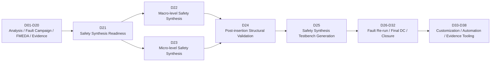

D22 is the first stage where protected RTL can be generated. It consumes the D21 readiness package and emits a macro-protected design package for post-insertion validation and fault campaign re-run.

---

## 3. Macro-level Safety Synthesis in One Engineering View

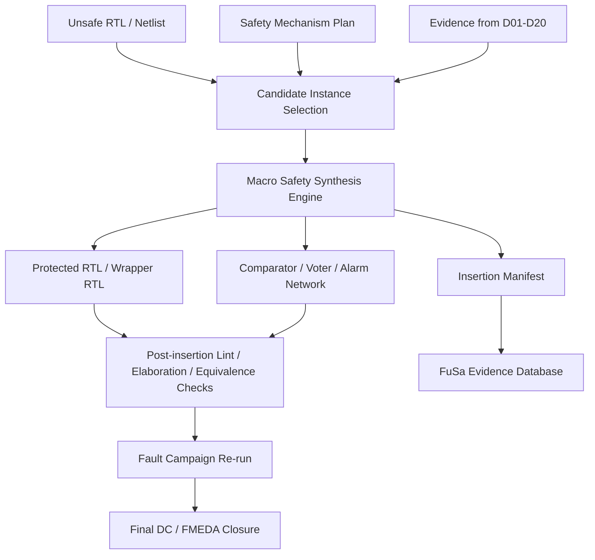

The key design principle is boundary control. The original function is placed inside a protected macro structure, and safety behavior is exposed through alarm, mismatch, voter, or correction outputs.

---

## 4. Key Terms

| Term | Engineering Meaning |
|---|---|
| Macro-level safety synthesis | Protection insertion at module, instance, subsystem, or wrapper level. |
| Unsafe design | Input design before the current safety synthesis stage. It may contain existing protections but has not yet passed this macro insertion cycle. |
| Protected RTL | Output RTL with inserted duplication, triplication, comparison, voting, alarms, wrappers, and trace attributes. |
| Instance duplication | Two copies of the same protected block run in parallel. A comparator detects mismatch. |
| Lockstep | A duplication architecture where redundant channels execute the same function in cycle alignment or controlled latency alignment. |
| Instance triplication | Three copies of the same block run in parallel. A voter determines the majority result and may also produce diagnostic alarms. |
| TMR | Triple Modular Redundancy. A correction-oriented protection style based on majority voting. |
| Comparator | Logic that checks whether redundant channels agree. It supports fail-safe detection. |
| Voter | Logic that selects the majority value among three channels. It supports fail-operational behavior. |
| Alarm | Diagnostic signal emitted when safety logic detects a mismatch, invalid state, or protection violation. |
| Safe design package | Protected RTL plus constraints, reports, manifest, traceability matrix, and evidence export. |

---

## 5. Macro-level vs. Micro-level Protection

| Dimension | Macro-level Safety Synthesis | Micro-level Safety Synthesis |
|---|---|---|
| Insertion granularity | Instance, module, subsystem, wrapper | Register, endpoint, cone, memory, state machine |
| Typical mechanism | Duplication, lockstep, TMR, boundary comparison, majority voting | Parity, ECC, register duplication, protocol checks, localized cone protection |
| Design knowledge required | Boundary-level knowledge is often enough | Internal structural knowledge is required |
| Area overhead | Usually high | Usually selective and lower |
| Verification focus | Boundary equivalence, synchronization, alarm/voter behavior | Local fault detection, endpoint coverage, state protection |
| Best use case | High-criticality block, black-box IP, generated RTL, subsystem-level fail-operational requirement | FIT hotspots, critical registers, state machines, localized coverage gaps |

Macro-level synthesis is usually selected when boundary-level protection is cleaner and safer than modifying internal logic.

---

## 6. Main Macro Protection Styles

### 6.1 Detection-oriented duplication

Detection-oriented duplication creates two equivalent channels and compares their outputs.

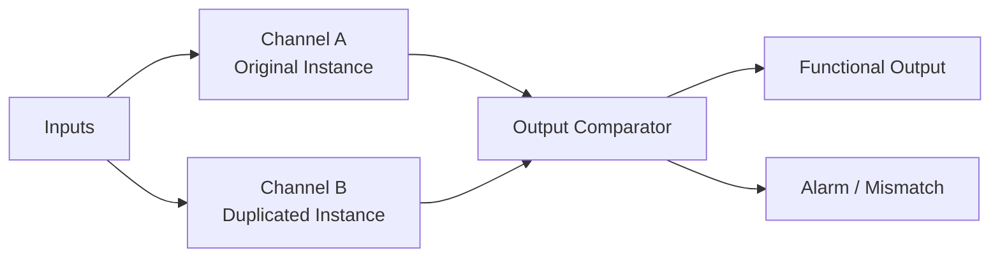

This style is appropriate when the system can enter a safe state after mismatch detection. It is a fail-safe strategy.

### 6.2 Correction-oriented triplication

Correction-oriented triplication creates three channels and uses majority voting.

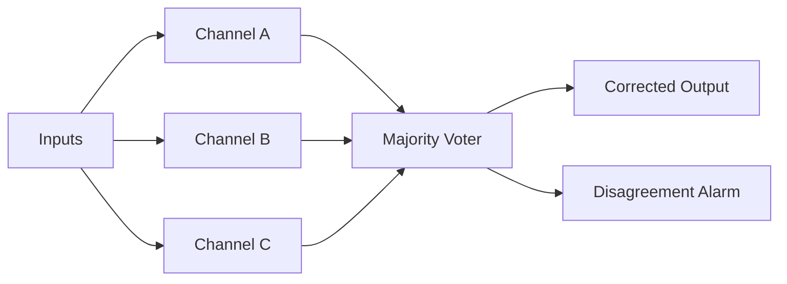

This style is appropriate when continued operation is required after a single-channel fault. It is a fail-operational strategy.

### 6.3 Lockstep with latency alignment

Some blocks need one or more delay stages before comparison. A lockstep controller ensures that redundant outputs are compared only when they represent the same architectural transaction.

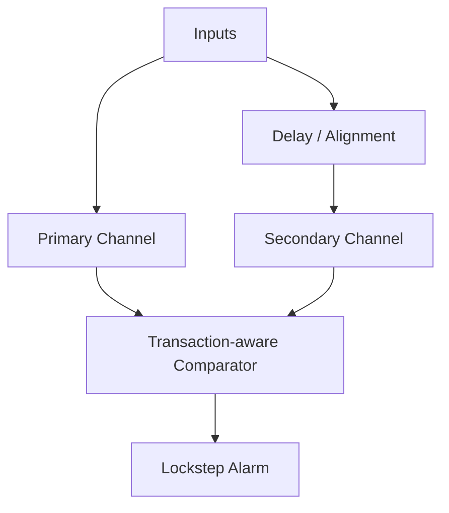

Latency alignment is critical for pipelines, bus interfaces, memory controllers, and configurable datapaths.

---

## 7. Input Contract of D22

D22 should start only when the D21 readiness gate is clean enough for controlled insertion.

| Input Category | Required Artifact | Engineering Use |
|---|---|---|
| Design package | RTL filelist, include directories, top module, clock/reset definition | Build and elaborate the unsafe design |
| Candidate instance list | block path, module name, protection type, priority | Select macro insertion targets |
| Safety mechanism plan | duplication, triplication, lockstep, voter/comparator policy | Drive transformation intent |
| Evidence package | FIT contribution, DC gap, failure mode mapping, ASIL target | Justify insertion decision |
| Boundary contract | input/output port list, handshake semantics, clock/reset domain | Generate wrapper and compare/vote points |
| Verification context | regression test, VCD/activity context, alarm list, observe points | Prepare post-insertion validation |
| Database context | evidence session, design revision, artifact manifest | Preserve traceability |

A macro synthesis run without these inputs may still generate RTL, but it will not create a defensible Safe-IC closure story.

---

## 8. Output Contract of D22

| Output Artifact | Purpose | Downstream Consumer |
|---|---|---|
| Protected RTL | RTL with macro-level safety mechanisms inserted | D24, D25, implementation flow |
| Wrapper RTL | Boundary wrapper around original and replicated instances | RTL integration and review |
| Comparator/voter modules | Safety logic implementing mismatch detection or correction | Verification and fault campaign |
| Alarm map | Mapping from inserted alarms to protected instances and failure modes | Fault Campaign Engine |
| Insertion manifest | Machine-readable record of every insertion | FuSa Evidence Database |
| Traceability matrix | Links evidence, candidate, mechanism, RTL output, verification plan | ISO 26262 closure package |
| Synthesis summary | Counts, warnings, limitations, assumptions | CI gate and review |
| Next-stage request | Required D24/D25/D26 actions | Flow orchestration |

The output must be treated as a new design baseline, not as a small RTL patch.

---

## 9. Evidence-driven Instance Selection

Macro-level insertion should not be selected based on intuition alone. It should be selected by combining structural and safety evidence.

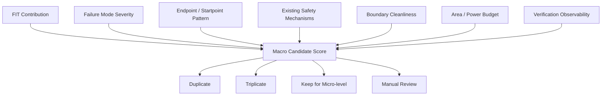

A block is a strong macro candidate when it has high safety contribution, clean boundaries, limited cross-domain complexity, and a verification context capable of observing the inserted protection.

---

## 10. Candidate Scoring Model

A practical scoring model should include both safety and implementation factors.

| Factor | High Score Means | Macro Implication |
|---|---|---|
| FIT contribution | The block dominates residual risk | Stronger candidate |
| Failure mode severity | Fault effect is dangerous or safety-goal relevant | Stronger candidate |
| Boundary clarity | Ports are stable and well understood | Easier insertion |
| Clock/reset simplicity | Single or well-partitioned domains | Easier lockstep |
| Internal RTL complexity | Hard to modify safely | Macro wrapper preferred |
| IP ownership | Third-party or generated design | Macro wrapper preferred |
| Verification observability | Outputs and alarms can be checked | Stronger candidate |
| Area/power budget | Replication overhead is acceptable | Stronger candidate |
| Timing margin | Added comparator/voter logic is manageable | Stronger candidate |

A candidate with high safety need but poor boundary clarity should not be blindly protected. It should move into a manual review queue or a micro-level protection plan.

---

## 11. Duplication Decision Rules

Instance duplication is appropriate when the target safety architecture requires detection and safe-state transition.

Typical conditions:

- one faulty channel must be detected;
- system-level recovery can be handled by reset, isolation, shutdown, or degraded mode;
- comparator mismatch can be routed to a safety controller;
- the block does not need to continue operating after mismatch;
- output comparison is meaningful and deterministic.

A duplication plan should specify:

| Field | Example |
|---|---|
| `instance_path` | `top.u_control.u_protocol_checker` |
| `module_name` | `protocol_checker` |
| `mechanism` | `instance_duplication` |
| `compare_scope` | `registered_outputs` |
| `alarm_name` | `safeic_alarm_protocol_checker_mismatch` |
| `latency_alignment` | `0_cycle` or `1_cycle` |
| `reset_policy` | `synchronous_reset_aligned` |
| `evidence_ref` | `D21_candidate_id` |

---

## 12. Triplication Decision Rules

Instance triplication is appropriate when fail-operational behavior is required.

Typical conditions:

- one channel can be faulty but function must continue;
- majority voting can produce a valid output;
- disagreement information can be reported for diagnostic action;
- output type supports voting or can be transformed into voteable signals;
- timing and area budgets allow three-channel implementation.

Triplication is more than three copies of a module. The voter must be treated as a safety-critical element itself. Its logic, fanout, and alarm behavior need review.

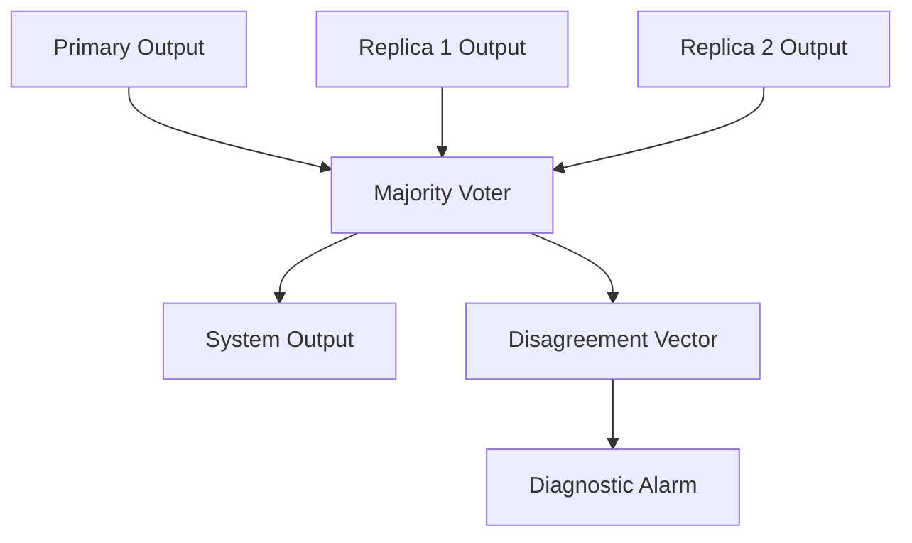

---

## 13. Lockstep Architecture Details

Lockstep is usually described as duplication, but an engineering-grade implementation needs more detail.

| Concern | Required Handling |
|---|---|
| Input alignment | Both channels must receive equivalent transactions |
| Reset release | Channels must leave reset in controlled alignment |
| Pipeline latency | Compare points must be aligned by architectural cycle |
| Non-determinism | Random seeds, counters, timers, and uninitialized state must be controlled |
| Interrupt/event inputs | Event sampling must be replicated deterministically |
| Comparator masking | Invalid cycles must be masked to avoid false alarms |
| Alarm latching | Mismatch alarms should be latched or captured according to safety policy |

A lockstep mismatch is only meaningful when the compared signals correspond to the same architectural event.

---

## 14. Comparator Design Principles

A comparator is a safety mechanism, not a debug helper.

A production comparator should support:

- bit-level mismatch detection;
- optional compare masking during reset, idle, invalid, or flush cycles;
- alarm generation with deterministic polarity;
- optional mismatch vector capture;
- optional first-fail timestamp or cycle counter;
- mapping to a safety controller or interrupt path;
- synthesis constraints preventing accidental optimization away;
- naming patterns that can be parsed by evidence tools.

Comparator outputs should become part of the alarm list and post-insertion validation plan.

---

## 15. Voter Design Principles

A voter can correct a single faulty channel only when the voted signal is stable, comparable, and semantically voteable.

Typical voter cases:

| Signal Type | Voting Strategy |
|---|---|
| Single-bit control | majority vote |
| Multi-bit status | bitwise majority plus consistency check |
| Encoded state | decode-aware vote or valid-code vote |
| Bus transaction | vote each field with protocol guard |
| Memory request | vote command/address/data/control together with transaction validity |
| Error/alarm output | usually OR/majority policy depending on architecture |

Blind bitwise voting can create illegal encodings. State, protocol, and bus signals may require semantic voting.

---

## 16. Boundary Selection and Compare-point Selection

Macro synthesis works best when protection boundaries are stable.

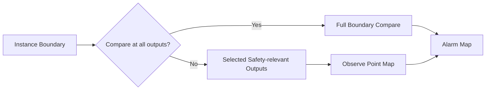

Compare points should be selected according to safety relevance, functional determinism, and observability. A boundary output that is not safety relevant may still be compared if it influences downstream safety behavior or helps identify latent mismatch conditions.

---

## 17. Handling Clock and Reset Domains

Macro insertion across clock and reset domains is a common source of subtle failure.

| Case | Recommended Strategy |
|---|---|
| Single clock, single reset | Direct duplication or triplication is usually straightforward |
| Multiple clocks inside instance | Protect at a higher-level wrapper or split by clock domain |
| Asynchronous reset | Normalize reset behavior before comparison |
| Reset domain crossing | Add reset synchronization and compare masking |
| Clock gating | Ensure both redundant channels see equivalent enable behavior |
| Generated clocks | Preserve generated clock relationship in the wrapper manifest |

The synthesis flow should emit a clock/reset audit report so that reviewers can confirm the protected architecture is deterministic.

---

## 18. Black-box IP and Third-party Blocks

Macro-level synthesis is valuable when a block cannot be modified internally.

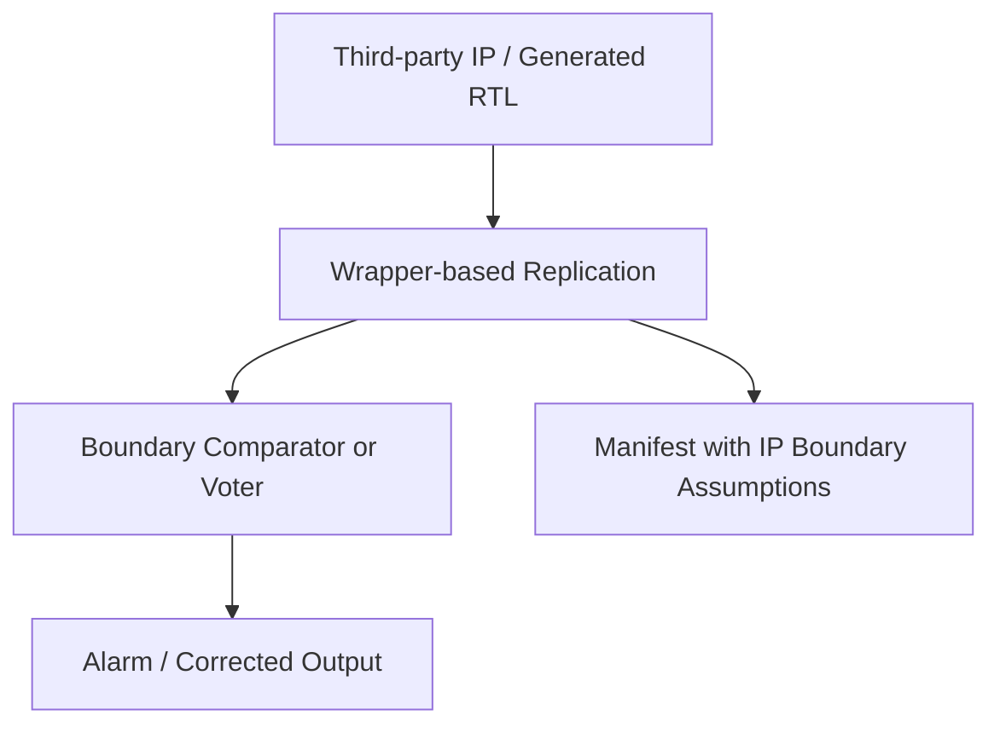

This approach does not require internal RTL transformation. It requires an accurate boundary contract:

- port direction and width;
- clock/reset semantics;
- handshake behavior;
- side-effect behavior;
- memory or bus access pattern;
- deterministic execution assumptions;
- compare/vote exclusions.

The wrapper becomes the integration point for safety evidence.

---

## 19. Memory, RAM, and Macro Wrapping

Memory-heavy blocks require special handling. Replicating a memory controller is not the same as protecting memory contents.

| Protection Target | Macro-level Strategy | Notes |
|---|---|---|
| Memory controller | duplicate/triplicate controller instance | compare/vote command and response behavior |
| Memory macro | use memory ECC/parity or external memory protection | macro synthesis may only wrap boundary |
| Register file | duplicate storage or protect outputs | area overhead must be reviewed |
| Cache-like structure | avoid blind duplication without coherency review | compare architectural outputs and error paths |

D22 should mark memory-related assumptions clearly so that D23 or later stages can apply micro-level ECC/parity where needed.

---

## 20. Alarm Architecture

Inserted macro protections must connect into a coherent alarm architecture.

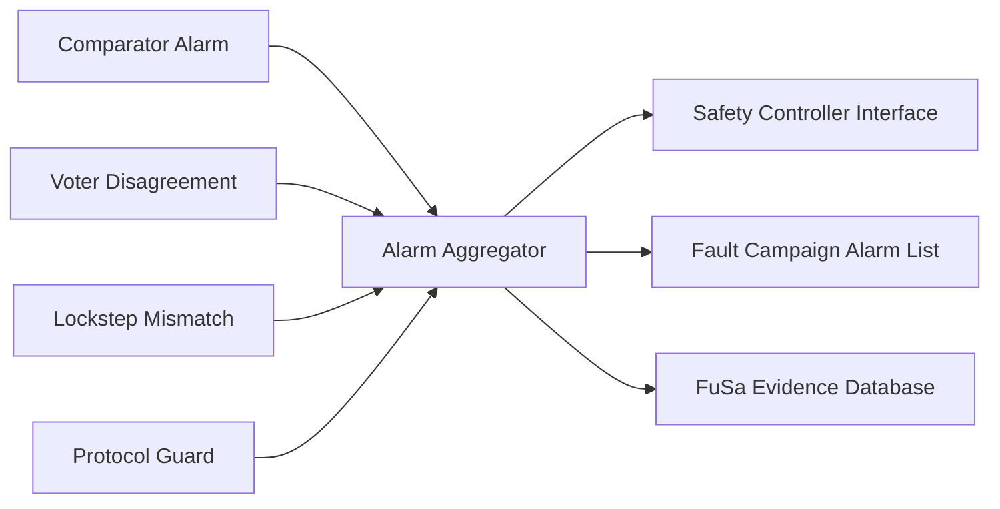

Alarm architecture should specify:

- alarm signal name;
- alarm polarity;
- latching behavior;
- reset behavior;
- aggregation hierarchy;
- mapping to protected instance;
- mapping to failure mode;
- mapping to observe point and fault campaign configuration.

An alarm without traceability is weak evidence. A traceable alarm is part of the closure argument.

---

## 21. Protected RTL Naming Convention

The generated RTL should be easy to inspect and parse.

Example naming scheme:

| Generated Object | Naming Pattern |
|---|---|
| Protected wrapper | `<module>__safeic_macro_wrap` |
| Primary channel | `<inst>__ch0` |
| Secondary channel | `<inst>__ch1` |
| Tertiary channel | `<inst>__ch2` |
| Comparator | `<inst>__safeic_cmp` |
| Voter | `<inst>__safeic_voter` |
| Alarm | `safeic_alarm__<candidate_id>__mismatch` |
| Manifest ID | `D22_MACRO_<nnnn>` |

A stable naming convention enables parsers, dashboards, CI gates, and evidence package generators to operate automatically.

---

## 22. Transformation Pipeline

A practical macro synthesis pipeline can be organized as follows:

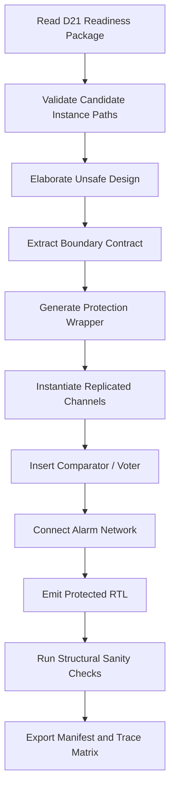

Each step should generate a machine-readable checkpoint. This makes the flow debuggable and repeatable.

---

## 23. Macro Synthesis Engine Configuration

A public demo should expose configurable environment variables rather than hard-coded internal paths.

Example configuration model:

```bash
export SAFEIC_FLOW_HOME=/path/to/automotive-safeic-practice
export SAFEIC_PREV_OUTPUTS=/path/to/D01_D21_outputs
export MACRO_SAFETY_SYNTHESIS_ENGINE=/path/to/macro_safety_synthesis_engine
export SAFEIC_TOP_MODULE=toy_safeic_top
export SAFEIC_D21_READINESS=outputs/d21/readiness_package.json
export SAFEIC_D22_OUT=outputs/d22_macro_synthesis
export SAFEIC_RUN_MODE=dry_run
```

The demo can run in two modes:

| Mode | Behavior |
|---|---|
| `dry_run` | Generates plans, manifests, wrapper templates, and CI gates without invoking the real engine |
| `engine` | Invokes the configured Macro Safety Synthesis Engine using the same artifact contract |

The same README can support learning, portfolio demonstration, and real internal flow hookup.

---

## 24. D22 Demo Directory Plan

```text
D22_macro_level_safety_synthesis/
├── README.md
├── config/
│   ├── macro_synthesis_policy.json
│   ├── alarm_policy.json
│   ├── wrapper_naming_policy.json
│   └── ci_rules.json
├── inputs/
│   ├── d21_readiness_package.json
│   ├── candidates_macro.csv
│   ├── rtl/
│   │   ├── toy_safeic_top.v
│   │   └── toy_control_block.v
│   └── evidence_exports/
│       ├── fit_contribution_summary.csv
│       ├── fault_campaign_summary.csv
│       └── fmeda_closure_snapshot.csv
├── scripts/
│   ├── setup_env.example.csh
│   ├── run_demo.csh
│   └── invoke_macro_engine_template.csh
├── tools/
│   ├── d22_macro_plan_builder.py
│   ├── d22_wrapper_template_generator.py
│   ├── d22_trace_matrix.py
│   └── d22_ci_gate.py
└── outputs/
    ├── macro_synthesis_plan.csv
    ├── protected_rtl_manifest.json
    ├── generated_wrappers/
    ├── alarm_map.csv
    ├── traceability_matrix.csv
    ├── ci_gate_report.md
    └── d22_summary.md
```

This structure keeps the demo useful even without access to a commercial engine. The scripts still demonstrate the flow owner capability: artifact contracts, evidence reuse, automation logic, and controlled insertion planning.

---

## 25. README Flow for the Demo

The README should describe the flow as an engineering pipeline.

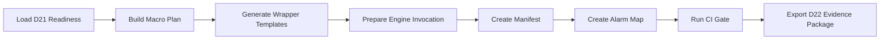

The README should include:

- objective;
- input artifacts;
- environment variables;
- dry-run mode;
- engine mode;
- generated outputs;
- CI pass/fail rules;
- how D22 feeds D24/D25/D26;
- how to replace toy inputs with D01-D21 project data.

---

## 26. Artifact Contract for Automation

The artifact contract is the most important engineering detail in D22.

Example candidate schema:

```json
{
  "candidate_id": "D22_MACRO_0001",
  "instance_path": "top.u_ctrl",
  "module_name": "toy_control_block",
  "mechanism": "instance_duplication",
  "compare_scope": "registered_outputs",
  "alarm_policy": "latched_mismatch_alarm",
  "clock_domain": "clk_main",
  "reset_domain": "rst_main_n",
  "evidence_refs": [
    "D21_CAND_0007",
    "D17_CLOSURE_GAP_0003",
    "D15_FMEDA_FM_0012"
  ]
}
```

A schema like this allows the flow to remain stable while the underlying engine, design, and safety policy evolve.

---

## 27. Traceability Matrix

Every macro insertion should be traceable.

| Candidate ID | Instance | Mechanism | Evidence Source | Generated RTL | Alarm | Validation Plan |
|---|---|---|---|---|---|---|
| D22_MACRO_0001 | `top.u_ctrl` | duplication | FIT hotspot + closure gap | `toy_control_block__safeic_macro_wrap.v` | `safeic_alarm__0001__mismatch` | D24 structural + D26 fault campaign |
| D22_MACRO_0002 | `top.u_bus_guard` | triplication | dangerous failure mode | `toy_bus_guard__safeic_macro_wrap.v` | `safeic_alarm__0002__vote_disagree` | D25 testbench + D26 fault campaign |

Traceability is not paperwork. It is how generated RTL becomes defensible safety evidence.

---

## 28. CI Gate for D22

D22 should not pass just because files are generated.

Recommended CI checks:

| Check | Pass Condition |
|---|---|
| Candidate path check | every candidate instance exists in design metadata |
| Mechanism support check | requested mechanism is supported by policy |
| Boundary check | ports, clocks, resets, and compare exclusions are resolved |
| Alarm check | every insertion has an alarm or correction status signal |
| Evidence check | every insertion links back to D21 or earlier evidence |
| Manifest check | protected RTL outputs are listed and checksummed |
| Next-stage check | D24/D25/D26 action items are emitted |

A generated design without a passing gate should be treated as an intermediate artifact, not a safe baseline.

---

## 29. Post-insertion Validation Strategy

Macro synthesis changes the design structure. Validation must confirm both functional preservation and safety behavior.

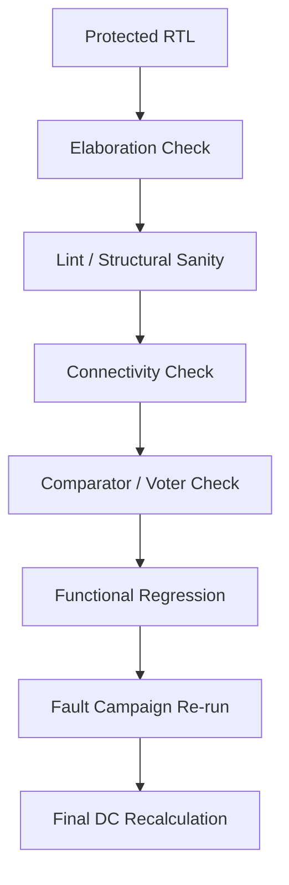

D22 prepares the design and evidence. D24 and later stages should validate:

- wrapper connectivity;
- channel equivalence;
- voter correctness;
- alarm observability;
- no broken clock/reset behavior;
- no accidental removal of protection logic;
- fault classification improvement.

---

## 30. Relationship to Fault Campaigns

Macro-level synthesis is not complete until fault campaigns validate the inserted safety behavior.

The expected chain is:

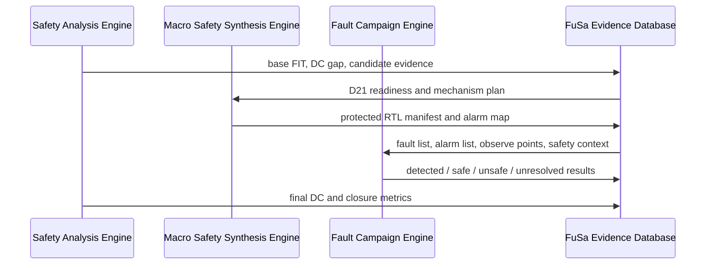

The most important D22 output for fault campaign re-run is the alarm map. Without it, the campaign may inject faults correctly but fail to interpret whether the macro protection reacted as intended.

---

## 31. ISO 26262 Closure View

In an ISO 26262-oriented flow, macro-level synthesis supports the safety case only when it contributes to measurable closure.

| Closure Question | D22 Evidence |
|---|---|
| Which safety gap was addressed? | link to D21 candidate and D17 closure gap |
| Which block was protected? | instance path and boundary contract |
| Which mechanism was inserted? | duplication, triplication, lockstep, voter, comparator |
| How is detection/correction observed? | alarm map and observe point map |
| How can the transformation be reproduced? | engine configuration and manifest |
| How will the claim be validated? | D24/D25/D26 action list |
| How will metrics be updated? | final DC and FMEDA re-run plan |

The closure argument becomes stronger when every generated artifact has a traceable reason and a downstream validation path.

---

## 32. Engineering Trade-offs

Macro-level synthesis creates strong protection but also introduces cost.

| Trade-off | Impact |
|---|---|
| Area | duplication roughly doubles target block logic; triplication can triple it plus voter overhead |
| Power | redundant channels increase dynamic and leakage power |
| Timing | comparators and voters may sit on critical output paths |
| Verification | more structure increases regression and fault campaign complexity |
| Integration | alarms and wrappers require system-level routing |
| Debug | mismatches require channel-level observability |

The correct macro strategy is not maximum protection everywhere. It is targeted protection where the safety value justifies the implementation cost.

---

## 33. Common Failure Patterns

| Failure Pattern | Symptom | Prevention |
|---|---|---|
| Blind duplication | area grows but DC does not improve enough | evidence-driven candidate selection |
| Wrong compare point | frequent false alarms or missed mismatches | boundary contract and compare mask review |
| Unaligned lockstep | mismatch after reset or pipeline event | latency alignment metadata |
| Untraceable alarm | fault campaign cannot classify detection | alarm map and observe point map |
| Voter on invalid encoding | illegal state produced after voting | semantic voter policy |
| Missing manifest | protected RTL cannot be audited | generated insertion manifest |
| No next-stage handoff | D24/D25/D26 cannot consume outputs | action list and artifact contract |

These failures are methodology failures more than tool failures.

---

## 34. Customization Points

D22 is also a strong demonstration of toolchain customization capability.

Customizable areas include:

- candidate scoring rules;
- macro/micro classification policy;
- duplication vs. triplication decision thresholds;
- wrapper naming style;
- comparator/voter templates;
- alarm aggregation style;
- clock/reset audit rules;
- evidence schema;
- CI gate thresholds;
- parser support for generated reports;
- customer-specific ISO 26262 evidence packaging.

A Safe-IC Flow Owner should be able to adapt these rules to different customers, IP architectures, and safety goals.

---

## 35. Example Macro Synthesis Plan

| Candidate | Instance | Mechanism | Reason | Expected Output |
|---|---|---|---|---|
| D22_MACRO_0001 | `top.u_ctrl` | duplication | high FIT contribution and safe-state recovery available | duplicated wrapper + mismatch alarm |
| D22_MACRO_0002 | `top.u_safety_guard` | triplication | fail-operational requirement | TMR wrapper + voter + disagreement alarm |
| D22_MACRO_0003 | `top.u_legacy_ip` | duplication | third-party IP boundary protection | wrapper-based lockstep compare |
| D22_MACRO_0004 | `top.u_bus_filter` | manual review | multi-clock boundary | split or defer to micro-level plan |

The plan should be readable by engineers and machine-readable by automation scripts.

---

## 36. Handoff to D23, D24, and D25

D22 does not replace micro-level protection. It divides the problem.

| Next Stage | Receives from D22 | Purpose |
|---|---|---|
| D23 Micro-level Safety Synthesis | candidates rejected or deferred by macro policy | protect endpoints, registers, cones, memories, or state machines |
| D24 Post-insertion Validation | protected RTL and manifest | validate structure, connectivity, and transformation quality |
| D25 Safety Synthesis Testbench Generation | alarm map, wrapper map, compare/voter metadata | generate safety-oriented testbench hooks |
| D26-D32 Fault Re-run and Closure | safe design package and updated evidence | validate detection/correction and update final metrics |

Macro synthesis is therefore a stage in a larger closure loop, not an isolated RTL generation task.

---

## 37. Minimal Public Demo Strategy

A public demo can avoid proprietary design data while preserving the engineering pattern.

The toy design can include:

- a control block;
- a small bus guard;
- a status generator;
- a simple alarm aggregator;
- a mock D21 readiness package;
- sample D01-D20 evidence exports;
- generated wrapper templates;
- CI gate reports;
- traceability matrix.

The demo should show how real project outputs can be dropped into the same directory contract.

---

## 38. Review Checklist

Before accepting D22 output as a safe design baseline, review these items:

| Review Item | Status |
|---|---|
| Candidate list is linked to safety evidence | required |
| Mechanism choice is justified | required |
| Protected RTL exists and is listed in manifest | required |
| Comparator/voter behavior is described | required |
| Alarms are mapped to candidate and failure mode | required |
| Clock/reset assumptions are documented | required |
| D24/D25/D26 actions are generated | required |
| CI gate passes | required |
| Manual review items are not hidden | required |

A safety synthesis output is acceptable only when design, verification, and evidence teams can all consume it.

---

## 39. Engineering Summary

D22 converts Safety Synthesis Readiness into the first protected RTL baseline. The main engineering value is not only generating duplicated or triplicated logic. The value is creating a repeatable, inspectable, and evidence-driven macro protection flow.

The stage should produce:

- a justified macro synthesis plan;
- protected RTL or wrapper templates;
- comparator/voter/alarm architecture;
- traceability from D01-D21 evidence to generated RTL;
- CI gate reports;
- downstream validation requests;
- closure-ready artifacts for FuSa Evidence Database integration.

Macro-level safety synthesis is one of the clearest places to demonstrate Safe-IC Flow Owner capability: understanding safety architecture, RTL transformation, verification impact, and ISO 26262 evidence closure as one connected engineering system.

---

## 40. Next Article

D23 continues with **Micro-level Safety Synthesis**. It moves from instance-level redundancy to finer-grained protection of endpoints, registers, cones, memories, and state-machine structures. The key theme becomes selective protection: improving diagnostic coverage with lower overhead while preserving traceability to the same evidence chain built in D01-D22.
