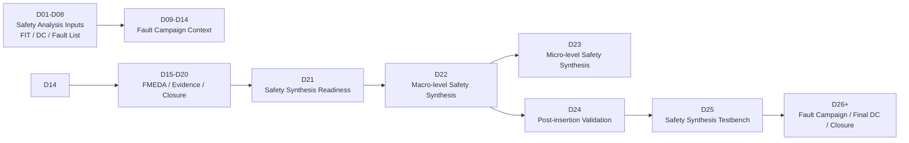
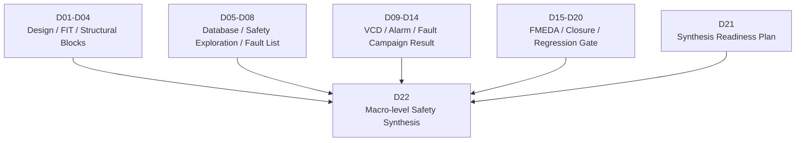
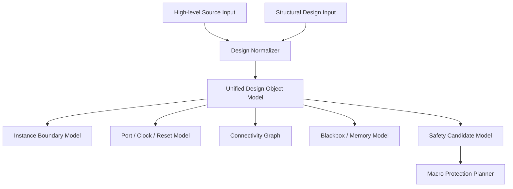
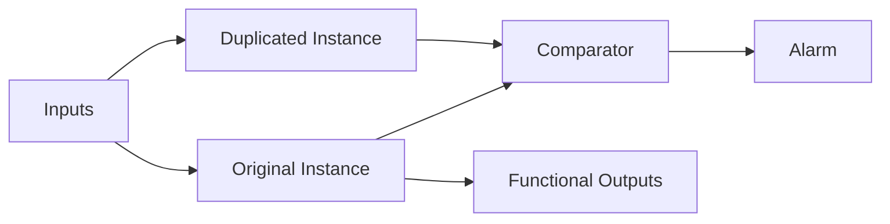
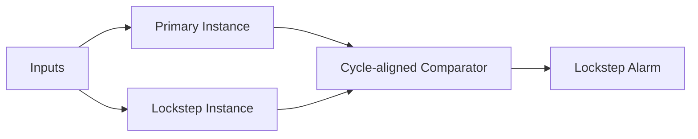
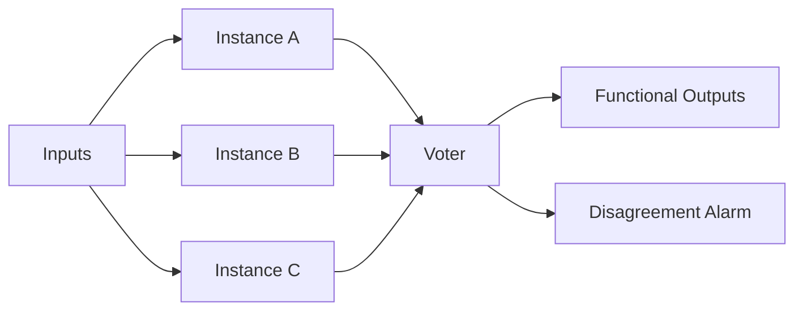
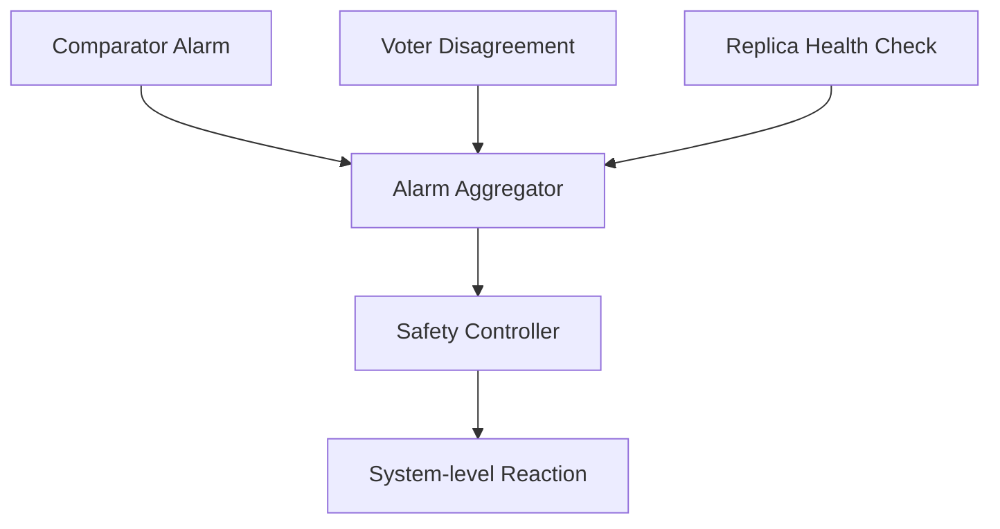
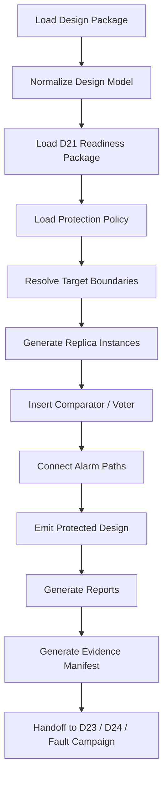
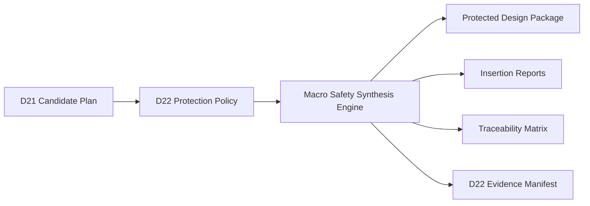

# [Automotive Safe-IC Practice 22] Macro-level Safety Synthesis: Instance Redundancy, Lockstep, and Evidence-driven Protected Design Generation

**Author**: Darren H. Chen  
**Direction**: Automotive Safe-IC / Functional Safety / EDA Automation / Safety Synthesis  
**Demo**: `D22_macro_level_safety_synthesis`  
**Tags**: `Automotive IC` `Functional Safety` `ISO 26262` `Safety Synthesis` `Lockstep` `TMR` `Fault Campaign` `FMEDA` `EDA Automation` `Evidence Closure`

---

## 01. Position of D22 in the Safe-IC Flow

D22 is the first implementation-oriented stage after the synthesis readiness package generated in D21.

D21 answers one question:

> Which modules, instances, subsystems, or IP boundaries are ready for safety mechanism insertion?

D22 turns that readiness result into an executable macro-level protection plan:

> How should instance-level redundancy, lockstep comparison, voting logic, and alarm connectivity be inserted so that the protected design remains traceable, verifiable, and reusable by later fault campaign and ISO 26262 closure steps?

The position of D22 in the complete flow is shown below.



D22 is not a simple code-generation step. It is a controlled engineering stage that connects previous safety analysis evidence with protected design generation, post-insertion validation, fault campaign preparation, and final safety case packaging.

---

## 02. Engineering Definition of Macro-level Safety Synthesis

**Macro-level Safety Synthesis** inserts safety mechanisms at a relatively coarse structural boundary.

In this context, **macro-level** does not mean physical memory macro or hard macro. It means protection at the level of:

| Protection Object | Description | Typical Mechanism |
|---|---|---|
| Module instance | A reusable logic block instance | Duplication, triplication |
| IP wrapper | An encapsulated IP boundary | Lockstep, comparator |
| Subsystem | A cluster of related instances | Redundant subsystem, lockstep cluster |
| Safety island | A safety-related region | Redundant island, alarm aggregation |
| Controller block | Control-dominant logic | Duplicate-and-compare |
| Datapath block | Critical computation path | Lockstep or TMR with voter |

The key idea is:

> Protect a functional boundary by structural replication, comparison, voting, alarm generation, or fault containment, rather than modifying every register or logic cone individually.

Macro-level protection is often the most practical starting point for a design that already has a clear hierarchy, existing IP boundaries, safety-critical subsystems, or customer-provided structural design data.

---

## 03. Input and Output Relationship

D22 must inherit the evidence produced by D01-D21. A macro-level insertion decision should be supported by safety analysis results, FIT contribution, failure mode mapping, fault campaign observations, and readiness checks.



### Main input categories

| Input Category | Example Artifact | Engineering Meaning |
|---|---|---|
| Design package | `filelist.f`, `top_name`, include paths | Design to be protected |
| Clock/reset definition | `clocks.json`, `resets.json` | Determines whether a region can be replicated safely |
| Target instance list | `protected_instances.csv` | Candidate instances selected by D21 |
| Safety mechanism plan | `safety_mechanism_plan.yaml` | Protection policy per target object |
| FIT contribution | `fit_contribution.csv` | Helps prioritize protection targets |
| Failure mode mapping | `failure_mode_map.csv` | Links protection action to safety concern |
| Alarm policy | `alarm_policy.json` | Defines alarm name, polarity, aggregation, and exposure |
| Existing campaign evidence | `fault_campaign_summary.csv` | Indicates unsafe, unresolved, or weakly covered areas |
| D21 readiness result | `synthesis_readiness_gate.json` | Entry gate for D22 |

### Main output categories

| Output Category | Example Artifact | Engineering Meaning |
|---|---|---|
| Protected design package | `protected_top.v`, `safety_wrapper.v` | Design after macro-level protection |
| Insertion report | `macro_insertion_plan.csv` | What was inserted and where |
| Boundary report | `lockstep_boundary_report.csv` | Protected boundary definition |
| Alarm report | `alarm_connectivity_report.csv` | Alarm signal topology |
| Change summary | `netlist_change_summary.md` or `design_change_summary.md` | Controlled modification record |
| Trace matrix | `safety_traceability_matrix.csv` | Evidence link from requirement to design change |
| Validation plan | `equivalence_check_plan.md` | Post-insertion verification intent |
| Handoff package | `d22_to_d23_handoff.json`, `d22_to_fault_campaign_handoff.json` | Downstream flow contract |

D22 is valuable only when these outputs are deterministic, reviewable, machine-readable, and reusable by the next stage.

---

## 04. Design Representation Differences in D22

D22 can operate on more than one design representation. The two most common input forms are:

- **RTL or high-level design source**, where module intent, hierarchy, naming, and clock/reset logic are relatively explicit;
- **structural netlist**, where the design has already been elaborated and synthesized into instances, cells, and structural connectivity.

The insertion strategy is similar at the safety concept level, but different at the implementation and verification level.

| Dimension | RTL / High-level Source | Structural Netlist |
|---|---|---|
| Design intent | Easier to infer from module names, always blocks, parameters, and hierarchy | Mostly represented by structural connectivity and library cell mapping |
| Customer sensitivity | Usually higher, because source code exposes architecture and behavior | Usually lower, because implementation is already transformed into structure |
| Insertion granularity | Module/wrapper transformation is readable | Instance/cell/wrapper transformation is closer to ECO style |
| Clock/reset handling | Easier to identify semantically | Requires structural recognition and constraint files |
| Comparator insertion | Can be emitted as readable wrapper logic | Often emitted as structural wrapper or post-synthesis safety ECO block |
| DFT/scan awareness | May be planned before scan insertion | Must respect scan cells, test mode pins, dont-touch regions, and existing constraints |
| Equivalence strategy | Source-to-source or source-to-structural comparison | Structural-to-structural comparison and connectivity checks are more important |
| Cooperation model | Better for internal design teams | Better for external collaboration where source code is not shared |

The practical conclusion is:

> Macro-level insertion should not be designed as a source-only flow. A robust Safe-IC platform should support both high-level source and structural netlist inputs through a unified internal abstraction.

---

## 05. Characteristics of High-level Source Input

When D22 receives RTL or another high-level design source, the insertion engine can use more semantic information.

Typical advantages include:

- module hierarchy is easier to preserve;
- clock and reset intent is clearer;
- wrapper generation is more readable;
- review by design engineers is easier;
- early design-space exploration is faster;
- generated protected source can be integrated before downstream synthesis.

A common pattern is:

```text
original_controller
    -> protected_controller_wrapper
        -> controller_main
        -> controller_redundant
        -> comparator
        -> alarm_output
```

This model is appropriate when the design owner controls the source tree and wants the protected design to remain readable during design review.

However, source-level insertion also exposes more design IP. In many customer-facing cooperation scenarios, high-level source is not the preferred exchange format.

---

## 06. Characteristics of Structural Design Input

When D22 receives a structural netlist, the flow becomes closer to a **post-synthesis safety hardening** or **safety ECO** process.

Typical advantages include:

- the customer does not need to disclose the full source design;
- the insertion stage works closer to the implementation view;
- protected output can be compared against the original structural design;
- instance duplication, wrapper insertion, comparator connection, and alarm aggregation can be performed around known instance boundaries;
- the flow is easier to position as an external engineering service or partner-deliverable toolchain.

Typical challenges include:

| Challenge | Engineering Treatment |
|---|---|
| Flattened hierarchy | Require hierarchy preservation, mapping file, or target boundary specification |
| Renamed instances | Use D21 candidate IDs, name-map files, and structural fingerprints |
| Library dependency | Require cell mapping, FF/latch recognition, and blackbox model definition |
| Clock/reset recognition | Use explicit clock/reset JSON instead of relying only on names |
| Scan/DFT interaction | Respect scan enable, test mode, scan chain, and dont-touch constraints |
| Memory boundary | Treat memories and hard macros as protected or excluded regions |
| Equivalence | Generate structural change summary and comparison-ready package |

For external collaboration, the structural design input model is often more acceptable. The customer can provide the design structure, library models, constraints, blackbox definitions, and target instance list without exposing the original source implementation.

---

## 07. Unified Internal Abstraction

A scalable D22 implementation should not split into two unrelated flows. Both high-level source and structural design input should be normalized into the same internal model.



The internal abstraction should represent:

| Internal Object | Purpose |
|---|---|
| `DesignUnit` | Module, entity, or structural unit |
| `Instance` | Candidate protection object |
| `Port` | Boundary connection point |
| `ClockDomain` | Clock grouping and timing context |
| `ResetDomain` | Reset behavior and initialization context |
| `ConnectivityEdge` | Connection between instances and ports |
| `BlackboxBoundary` | Region that should not be modified internally |
| `SafetyCandidate` | D21-selected protection target |
| `ProtectionIntent` | Requested mechanism and expected evidence |

This abstraction allows D22 to remain stable even when the customer input format changes.

---

## 08. Macro-level Safety Mechanism Taxonomy

D22 mainly focuses on redundancy-oriented safety mechanisms.

| Mechanism | Basic Idea | Typical Goal |
|---|---|---|
| Duplication | Instantiate a redundant copy and compare outputs | Fault detection |
| Lockstep | Run two equivalent instances in synchronized cycles | Fault detection with temporal alignment |
| Triplication | Instantiate three copies | Fault tolerance |
| TMR voter | Vote among three outputs | Fault correction / masking |
| Comparator | Compare outputs or selected state points | Alarm generation |
| Alarm aggregation | Combine multiple safety alerts | System-level safety response |
| Protected wrapper | Encapsulate protected region and safety logic | Integration control |

Macro-level mechanisms are attractive because they can protect large regions with a limited number of transformation rules. Their cost is area, power, timing, routing, verification effort, and integration complexity.

---

## 09. Duplication

Duplication creates a redundant copy of a target instance and compares selected outputs.



The original instance continues to drive the functional outputs. The duplicated instance acts as a checker. If output mismatch is detected, an alarm is raised.

Duplication is appropriate when:

- fail-safe detection is sufficient;
- the system can transition to a safe state after alarm;
- output comparison is meaningful;
- area overhead is acceptable;
- latency introduced by comparison is manageable.

D22 must record which outputs are compared, which outputs are excluded, and whether excluded outputs are justified by safety analysis or integration constraints.

---

## 10. Lockstep

Lockstep is a synchronized redundancy pattern. Two equivalent instances execute the same function in the same or intentionally shifted time window.



Lockstep is commonly used for CPU cores, control engines, protocol controllers, and safety-critical state machines.

D22 must handle:

- clock alignment;
- reset release consistency;
- input distribution;
- output comparison timing;
- optional delay alignment;
- alarm stabilization;
- false mismatch avoidance during reset or initialization;
- excluded debug/test paths.

A lockstep implementation without explicit clock/reset and initialization policy is not safe enough for closure. It may create false alarms or miss real mismatches.

---

## 11. Triplication and TMR

Triplication creates three equivalent instances and uses a voter to select the majority value.



TMR is stronger than duplication because it can mask a single faulty replica if the voter and common-mode assumptions remain valid.

D22 must describe:

- which signals are voted;
- whether the voter itself requires protection;
- whether outputs are safety-critical or non-safety observability signals;
- how disagreement alarms are exposed;
- how common-cause failure risk is handled;
- whether physical implementation should separate replicas.

TMR is powerful, but it is expensive. It should be applied only when the safety requirement justifies area and power overhead.

---

## 12. Comparator Architecture

A comparator is not merely an equality operator. It is a safety observation point.

A comparator should define:

| Comparator Field | Meaning |
|---|---|
| Compared signal set | Outputs, status, selected internal state, or protocol fields |
| Masking rule | Signals ignored during reset, test mode, or invalid cycles |
| Latency rule | Same-cycle or delayed comparison |
| Alarm polarity | Active high or active low |
| Alarm persistence | Pulse, sticky, or clear-on-read |
| Diagnostic mapping | Link to safety mechanism and failure mode |

A robust comparator is a small safety monitor with its own policy. D22 should generate comparator metadata together with the protected design.

---

## 13. Voter Architecture

A voter is used when the protected design must continue operating after one replica becomes faulty.

For each voted signal group, D22 should specify:

- signal width;
- voting function;
- disagreement detection;
- alarm output;
- voter reset behavior;
- voter placement boundary;
- whether the voter is protected by parity, duplication, or design review.

A simplified majority vote expression is:

```text
vote = (a & b) | (a & c) | (b & c)
```

For buses, the voting logic is applied bit by bit or according to protocol-level grouping. Safety closure should explain whether bit-wise voting is sufficient or whether transaction-level consistency is required.

---

## 14. Alarm Connectivity

Macro-level protection is incomplete without a clear alarm path.



D22 should generate an alarm connectivity report containing:

| Field | Description |
|---|---|
| `alarm_name` | Generated or mapped alarm signal |
| `source_instance` | Protected instance or safety logic source |
| `alarm_type` | Comparator mismatch, voter disagreement, wrapper error |
| `polarity` | Active high or active low |
| `sticky` | Whether the alarm is latched |
| `clear_condition` | Reset or software clear behavior |
| `destination` | Safety controller or top-level port |
| `failure_mode_id` | Associated failure mode |
| `sm_id` | Associated safety mechanism ID |

This report is critical for fault campaign setup and FMEDA evidence.

---

## 15. Boundary Selection

A macro-level boundary should be selected by engineering evidence, not naming convenience.

Typical selection criteria include:

| Criterion | Explanation |
|---|---|
| FIT contribution | Higher contribution deserves priority |
| Safety relevance | The block can contribute to a hazardous event |
| Observability | Fault effect can be compared or alarmed |
| Controllability | Inputs can be distributed consistently |
| Clock/reset stability | Replica behavior can be synchronized |
| Integration cost | Area, timing, and routing impact is acceptable |
| Verification feasibility | Post-insertion validation can be completed |
| Customer boundary | The boundary is available in provided design data |

D22 should reject or defer a candidate when the boundary is unclear, the output comparison is meaningless, or the reset behavior cannot be made deterministic.

---

## 16. Candidate Planning from D21

D22 should consume D21 output rather than rediscovering candidates from scratch.

A typical D21-to-D22 handoff looks like:

```json
{
  "candidate_id": "CAND_CPU_CTRL_001",
  "hier_path": "u_top.u_cpu_ctrl",
  "protection_class": "macro",
  "recommended_mechanism": "lockstep",
  "fit_contribution_rank": 2,
  "failure_modes": ["FM_CTRL_STUCK", "FM_CTRL_TRANSIENT"],
  "readiness_status": "ready",
  "required_evidence": [
    "clock_reset_defined",
    "boundary_ports_resolved",
    "alarm_policy_defined"
  ]
}
```

D22 should preserve this ID in every output artifact. This is the foundation of traceability.

---

## 17. Protection Policy File

A protection policy file converts safety intent into deterministic tool behavior.

Example:

```yaml
top_module: demo_top
input_model: structural_or_source
protection_targets:
  - candidate_id: CAND_CPU_CTRL_001
    instance_path: u_top.u_cpu_ctrl
    mechanism: lockstep
    compare_outputs:
      - ctrl_state
      - fault_response
      - bus_cmd_valid
    exclude_outputs:
      - debug_status
    alarm:
      name: alarm_cpu_ctrl_lockstep
      polarity: active_high
      sticky: true
  - candidate_id: CAND_DMA_002
    instance_path: u_top.u_dma
    mechanism: duplication
    compare_outputs:
      - dma_req
      - dma_addr
      - dma_error
    alarm:
      name: alarm_dma_dup_mismatch
      polarity: active_high
      sticky: true
```

The policy should be version-controlled, reviewed, and included in the evidence package.

---

## 18. Transformation Pipeline

The D22 transformation pipeline can be modeled as follows.



Each step should be deterministic. The same input package should generate the same protected design package and the same evidence reports.

---

## 19. Protected Wrapper Pattern

A protected wrapper is a controlled integration shell around the target instance.

```text
protected_wrapper
  ├── original_instance
  ├── redundant_instance_0
  ├── optional_redundant_instance_1
  ├── comparator_or_voter
  ├── alarm_logic
  └── integration_ports
```

The wrapper should preserve the functional interface when possible and add safety outputs in a controlled manner.

A protected wrapper report should include:

- original instance path;
- new wrapper name;
- replica names;
- compared ports;
- excluded ports;
- alarm ports;
- modified connections;
- downstream verification requirements.

---

## 20. Clock and Reset Considerations

Macro-level redundancy is meaningful only when replicas are initialized and driven consistently.

D22 must verify:

| Check | Required Result |
|---|---|
| Clock availability | All replicas receive intended clock |
| Reset availability | All replicas receive equivalent reset |
| Reset polarity | Polarity is explicit |
| Reset release timing | No uncontrolled mismatch window |
| Clock domain crossing | Comparison across domains is avoided or synchronized |
| Test mode | Comparator masking during scan/test is defined |

A common mistake is to duplicate logic without defining reset masking. This may generate mismatch alarms during normal initialization and pollute fault campaign results.

---

## 21. Blackbox, Memory, and Third-party IP Handling

Macro-level insertion often touches IP or memory boundaries.

| Object Type | Recommended Treatment |
|---|---|
| Blackbox IP | Protect at wrapper boundary, do not modify internals |
| Memory macro | Compare ECC/parity outputs or protect controller boundary |
| Analog/mixed-signal block | Use safety monitor or status output, not internal replication |
| Encrypted IP | Use boundary-level duplication only if integration contract allows |
| Generated IP | Preserve generator metadata and avoid manual edits |

D22 should generate explicit notes for every excluded object. Exclusion without evidence is not acceptable in a safety closure context.

---

## 22. DFT and Test Interaction

Macro-level safety insertion affects test architecture.

D22 should record:

- whether replicas are scan-enabled;
- whether comparator outputs are controllable or observable during test;
- whether test mode should suppress alarm logic;
- whether redundant instances need identical or independent scan chains;
- whether inserted logic violates existing dont-touch constraints;
- whether scan stitching must be re-run after D22.

A production-oriented Safe-IC flow must treat functional safety insertion and DFT as interacting flows, not isolated domains.

---

## 23. Physical Implementation Awareness

Macro-level redundancy can increase area, congestion, timing pressure, and power.

D22 does not need to solve final physical placement, but it should emit physical-awareness metadata:

| Metadata | Use |
|---|---|
| Replica group ID | Keeps redundant instances traceable |
| Placement separation hint | Reduces common-cause physical risk |
| Clock group | Helps clock tree planning |
| Critical output group | Helps timing review |
| Safety logic group | Helps floorplanning and ECO review |

For TMR, physical separation may become part of the safety argument. The evidence package should capture this requirement early.

---

## 24. Evidence Traceability Matrix

The traceability matrix is the most important D22 output after the protected design itself.

Example columns:

| Column | Description |
|---|---|
| `candidate_id` | Stable ID from D21 |
| `requirement_id` | Safety requirement or derived technical requirement |
| `failure_mode_id` | Failure mode being mitigated |
| `instance_path` | Original target instance |
| `mechanism` | Duplication, lockstep, triplication, voter |
| `inserted_block` | Generated comparator, voter, wrapper, or alarm logic |
| `alarm_name` | Generated or connected alarm |
| `expected_diagnostic_effect` | Detection, correction, containment |
| `verification_artifact` | D24/D25/D26 report reference |
| `closure_status` | Planned, inserted, validated, closed |

This matrix is how D22 becomes part of the ISO 26262 safety case rather than only a design transformation.

---

## 25. Post-insertion Validation Strategy

D22 should generate a validation plan together with the protected design.

Validation should include:

| Validation Type | Purpose |
|---|---|
| Structural connectivity check | Confirm replicas, comparator, voter, and alarm paths are connected |
| Interface preservation check | Confirm functional ports remain compatible |
| Clock/reset check | Confirm replicas are driven correctly |
| Equivalence preparation | Prepare source-to-source or structural-to-structural comparison |
| Lint/static check | Detect unconnected ports, multiple drivers, width mismatch |
| Alarm observability check | Confirm alarm reaches top-level or safety controller |
| Fault campaign readiness check | Confirm insertion metadata can drive fault injection campaign setup |

For structural inputs, netlist-to-netlist comparison and connectivity auditing become especially important. For source inputs, source-level review and downstream synthesis reproducibility are also important.

---

## 26. Handoff to D23

D23 handles micro-level safety synthesis. D22 should not consume all protection opportunities.

D22 should pass unresolved or fine-grained candidates to D23:

```json
{
  "handoff_stage": "D22_to_D23",
  "items": [
    {
      "candidate_id": "CAND_STATUS_REG_007",
      "reason": "macro_boundary_too_large",
      "recommended_next_action": "micro_level_parity_or_ecc",
      "related_instance": "u_top.u_ctrl.u_status_regs"
    }
  ]
}
```

This prevents overusing macro-level redundancy when register-level parity, ECC, or targeted protection is more efficient.

---

## 27. Handoff to Fault Campaign

D22 should prepare later fault campaign re-runs.

Required handoff information includes:

- protected instance paths;
- replica instance paths;
- comparator and voter paths;
- alarm signal names;
- comparison points;
- excluded signals;
- expected fault outcome behavior;
- mapping to candidate ID and failure mode ID.

A fault campaign should be able to answer:

> After macro-level insertion, do previously unsafe or unresolved fault classes become detected, safe, corrected, or still unresolved?

D22 should make that answer measurable.

---

## 28. ISO 26262 Closure Value

D22 supports ISO 26262 closure by providing implementation evidence for safety mechanisms.

The closure value includes:

| Closure Area | D22 Contribution |
|---|---|
| Safety requirement implementation | Maps protection intent to actual design changes |
| Diagnostic coverage improvement | Creates mechanism expected to improve detection or correction |
| FMEDA update | Provides mechanism and alarm evidence for residual FIT calculation |
| Fault campaign setup | Provides protected design and observation points |
| Tool automation evidence | Provides repeatable scripts, configuration files, and reports |
| Reviewability | Provides deterministic artifacts and change summaries |

D22 alone does not close the safety case. It creates the implementation evidence required by later validation, fault simulation, FMEDA update, and final metric closure.

---

## 29. Demo21 to Demo22 Continuity

Demo22 should reuse Demo21 outputs. It should not create isolated sample data that breaks the evidence chain.

Expected upstream artifacts:

```text
D21_safety_synthesis_readiness/
  outputs/
    candidate_protection_plan.csv
    readiness_gate.json
    safety_traceability_seed.csv
    d21_to_d22_handoff.json
    evidence_manifest.json
```

Demo22 consumes these artifacts and generates a macro-level protected design plan.



---

## 30. Demo22 Directory Plan

The corresponding demo should use the following structure.

```text
D22_macro_level_safety_synthesis/
  README.md
  scripts/
    run_demo.csh
    setup_env.example.csh
    execute_macro_synthesis_template.csh
  tools/
    d22_macro_synthesis_planner.py
  config/
    artifact_contract.json
    macro_protection_policy.yaml
    insertion_rules.json
    report_schema.json
  inputs/
    previous_outputs/
      D21_safety_synthesis_readiness/
    design/
      source_or_structural_design/
        filelist.f
        demo_top.v
      optional_source_notes/
        README.md
    constraints/
      clocks.json
      resets.json
      blackbox_instances.csv
      protected_instances.csv
      alarm_policy.json
    library/
      cell_mapping.json
      stdcell.lib.placeholder
  outputs/
    protected_design/
      protected_top.v
      safety_wrapper.v
      comparator_blocks.v
      voter_blocks.v
      alarm_aggregation.v
    reports/
      macro_insertion_plan.csv
      instance_duplication_report.csv
      lockstep_boundary_report.csv
      port_mapping_report.csv
      alarm_connectivity_report.csv
      design_representation_handling_notes.md
      design_change_summary.md
      equivalence_check_plan.md
      synthesis_readiness_gate.json
      safety_traceability_matrix.csv
    evidence/
      d22_evidence_manifest.json
      d22_closure_notes.md
      d22_to_d23_handoff.json
      d22_to_fault_campaign_handoff.json
```

The demo should be runnable without the real commercial engine in dry-run mode, while still keeping the command interface ready for a real engine.

---

## 31. Configurable Environment Variables

The demo README should use configurable environment variables.

```csh
setenv SAFEIC_FLOW_HOME /path/to/safeic-flow
setenv MACRO_SAFETY_SYNTHESIS_ENGINE /path/to/macro_safety_synthesis_engine
setenv SAFEIC_PREVIOUS_OUTPUTS /path/to/D01_D21_outputs
setenv SAFEIC_INPUT_DESIGN ./inputs/design/source_or_structural_design/filelist.f
setenv SAFEIC_TOP_MODULE demo_top
setenv SAFEIC_PROTECTION_POLICY ./config/macro_protection_policy.yaml
setenv SAFEIC_RUN_MODE dryrun
```

The environment design supports two modes:

| Mode | Behavior |
|---|---|
| `dryrun` | Generate plans, reports, wrappers, and evidence files without invoking a real engine |
| `engine` | Invoke `Macro Safety Synthesis Engine` through a configurable command template |

This keeps the public demo reproducible and the private tool integration practical.

---

## 32. README Execution Flow

The README should present a short and clear execution sequence.

```csh
cd D22_macro_level_safety_synthesis
source scripts/setup_env.example.csh
csh scripts/run_demo.csh
```

Expected output:

```text
outputs/
  protected_design/
  reports/
  evidence/
```

The README should explain that the demo continues from D21 and expects previous evidence artifacts to be available through `SAFEIC_PREVIOUS_OUTPUTS`.

---

## 33. CI Gate for D22

D22 should produce a machine-readable CI gate.

Example:

```json
{
  "stage": "D22_macro_level_safety_synthesis",
  "status": "PASS",
  "checks": {
    "d21_handoff_found": "PASS",
    "protection_policy_valid": "PASS",
    "target_instances_resolved": "PASS",
    "clock_reset_defined": "PASS",
    "alarm_policy_defined": "PASS",
    "protected_design_generated": "PASS",
    "traceability_matrix_generated": "PASS",
    "fault_campaign_handoff_generated": "PASS"
  }
}
```

A CI gate allows the Safe-IC flow to run as an engineering platform instead of a one-time manual experiment.

---

## 34. Tool Customization Points

D22 is a strong demonstration of toolchain customization capability.

Important customization points include:

| Customization Point | Purpose |
|---|---|
| Naming convention adapter | Match customer hierarchy and instance naming style |
| Library cell recognizer | Support different standard-cell libraries |
| Clock/reset classifier | Support customer-specific clock/reset definitions |
| Alarm policy generator | Match system-level safety controller interface |
| Comparator template | Generate protocol-aware comparison logic |
| Voter template | Support bit-level or transaction-level voting |
| Blackbox policy | Protect around encrypted IP or hard macro boundaries |
| Report schema adapter | Match customer evidence package format |
| CI rule adapter | Match internal release gates |

This is where a Safe-IC Flow Owner provides real value: not by running a single command, but by making the toolchain fit design data, customer constraints, and safety evidence requirements.

---

## 35. Engineering Review Checklist

Before accepting D22 output, the review should cover:

| Review Item | Expected Answer |
|---|---|
| Candidate source | Is every protected target derived from D21 evidence? |
| Mechanism choice | Is duplication, lockstep, or TMR justified? |
| Input representation | Is the source/structural handling strategy documented? |
| Boundary resolution | Are all protected instance boundaries explicit? |
| Clock/reset | Are replica clocks and resets deterministic? |
| Alarm path | Does every protection mechanism expose a safety alarm or voted output? |
| Exclusions | Are excluded signals and blocks justified? |
| DFT impact | Are scan/test interactions documented? |
| Validation plan | Is post-insertion validation defined? |
| Traceability | Can every design change be traced to a safety objective? |

A protected design without this review package is not closure-ready.

---

## 36. Common Anti-patterns

D22 should avoid the following anti-patterns.

| Anti-pattern | Risk |
|---|---|
| Duplicating a block without alarm connectivity | No measurable diagnostic effect |
| Comparing all outputs blindly | False alarms on debug, X-sensitive, or invalid signals |
| Ignoring reset windows | Spurious mismatch after initialization |
| Replicating across clock domains | Unstable comparison result |
| Not recording exclusions | Weak audit trail |
| Treating structural input as source input | Broken naming, missing mapping, invalid assumptions |
| Generating protected design without trace matrix | No ISO 26262 closure value |
| Ignoring DFT/test mode | Test failure or false safety alarm |
| No downstream fault campaign handoff | Cannot prove diagnostic effect |

The purpose of D22 is controlled safety synthesis, not uncontrolled design mutation.

---

## 37. Practical Engineering Value

D22 creates value in four dimensions.

First, it transforms safety intent into actual protected design artifacts. The flow moves from analysis and planning into implementation.

Second, it provides a customer-friendly cooperation model. When high-level design source is unavailable, the structural design path still enables safety hardening, insertion reporting, and validation planning.

Third, it creates evidence. The protected design is accompanied by insertion reports, traceability matrix, alarm connectivity report, validation plan, and handoff package.

Fourth, it prepares final closure. The output can be consumed by post-insertion validation, safety synthesis testbench generation, fault campaign re-run, FMEDA update, and final diagnostic coverage review.

---

## 38. Summary

D22 is the implementation bridge between safety analysis evidence and protected design generation.

A mature macro-level safety synthesis flow should:

- consume D01-D21 evidence;
- support both high-level source and structural design input;
- normalize design data into a unified internal abstraction;
- insert duplication, lockstep, triplication, comparator, voter, and alarm logic under policy control;
- generate protected design artifacts;
- emit reviewable insertion reports;
- maintain traceability from safety requirement to design change;
- prepare downstream validation and fault campaign re-run;
- support ISO 26262 closure through deterministic evidence packaging.

The key engineering position is clear:

> Macro-level safety synthesis is not just redundant logic insertion. It is an evidence-driven transformation stage that links safety requirement, design structure, protection mechanism, alarm observability, verification readiness, and final functional safety closure.

D22 therefore establishes the foundation for D23 micro-level insertion, D24 post-insertion validation, D25 safety synthesis testbench generation, and the later closure stages of the Safe-IC flow.
